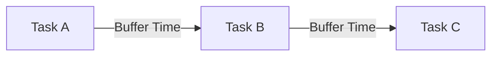
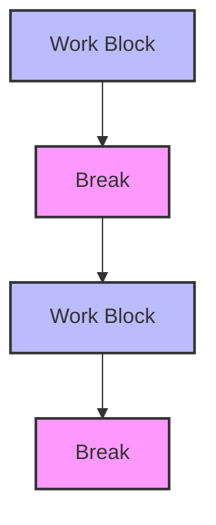

To maximize your productivity, time blocking has emerged as a powerful technique. It involves scheduling your day into fixed, uninterrupted blocks of time dedicated to specific tasks. However, like any productivity method, its effectiveness depends on how well you implement it. In this article, we'll delve into common mistakes people make when using time blocking and provide actionable strategies to overcome them.

## Introduction to Time Blocking
Time blocking is a time management technique where you divide your day into blocks of time. Each block is dedicated to a specific task or group of tasks. This approach helps you prioritize your work, minimize distractions, and maintain a healthy work-life balance. 


## Understanding Time Blocking Mistakes
Before we dive into the mistakes, it's essential to understand the core principles of time blocking. The technique is based on dedicating uninterrupted time to tasks, allowing you to focus without distractions. However, several common mistakes can undermine its effectiveness.

### Mistake 1: Overcommitting
One of the most common mistakes is overcommitting your time. This happens when you allocate more tasks to your time blocks than you can realistically complete. 


> **Note:** Overcommitting leads to frustration and burnout. It's crucial to be realistic about what you can accomplish in a given time frame.

### Mistake 2: Lack of Flexibility
Another mistake is being too rigid with your time blocks. Life is unpredictable, and sometimes tasks take longer than expected, or unexpected tasks arise. 


> **Tip:** Build some flexibility into your schedule. Leave some buffer time between tasks or have a block dedicated to unexpected tasks.

### Mistake 3: Not Prioritizing Tasks
Failing to prioritize tasks is a significant mistake. Time blocking works best when you prioritize your most important tasks and allocate them the largest, most focused blocks of time.


> **Warning:** Not prioritizing tasks can lead to spending too much time on less important activities, reducing overall productivity.

### Mistake 4: Ignoring Breaks
Ignoring the need for breaks is another common mistake. Continuous work without rest can lead to burnout and decreased productivity.


> **Interview:** According to productivity experts, regular breaks can refresh your mind and help you approach tasks with renewed energy and focus.

## Implementing Effective Time Blocking
To avoid these mistakes, you need to implement time blocking effectively. This involves several key strategies:

### Step 1: Set Realistic Goals
Set realistic goals for what you can accomplish in each time block. Consider the complexity of the task, your skill level, and any potential obstacles.
```markdown
| Task | Estimated Time | Actual Time |
|------|---------------|-------------|
| Task A | 2 hours      |             |
| Task B | 1 hour       |             |
```

### Step 2: Prioritize Tasks
Prioritize your tasks based on their importance and urgency. Use the Eisenhower Matrix to categorize tasks into urgent vs. important and focus on the most critical ones first.
```markdown
# Eisenhower Matrix
- Urgent & Important: Do First
- Important but Not Urgent: Schedule
- Urgent but Not Important: Delegate
- Not Urgent or Important: Eliminate
```

### Step 3: Leave Space for Flexibility
Leave some buffer time between tasks for unexpected interruptions or tasks that take longer than expected.


### Step 4: Include Breaks
Include regular breaks to rest your mind and avoid burnout. Use this time to do something enjoyable or relaxing.


## Visual Insights Gallery
Below are some visual insights to further illustrate the concept of time blocking and its effective implementation.


## Summary and Conclusion
Time blocking is a powerful technique for maximizing productivity, but its effectiveness depends on avoiding common mistakes such as overcommitting, lacking flexibility, not prioritizing tasks, and ignoring breaks. By setting realistic goals, prioritizing tasks, leaving space for flexibility, and including regular breaks, you can implement time blocking effectively and achieve your goals.

## FAQ
- Q: What is time blocking?
  A: Time blocking is a time management technique where you divide your day into fixed, uninterrupted blocks of time dedicated to specific tasks.
- Q: Why is prioritization important in time blocking?
  A: Prioritization is crucial because it ensures that you focus on the most important tasks first, maximizing the impact of your time.
- Q: How often should I take breaks when using time blocking?
  A: The frequency of breaks depends on your work style and the complexity of your tasks. Generally, taking a short break every 60-90 minutes can help maintain focus and productivity.