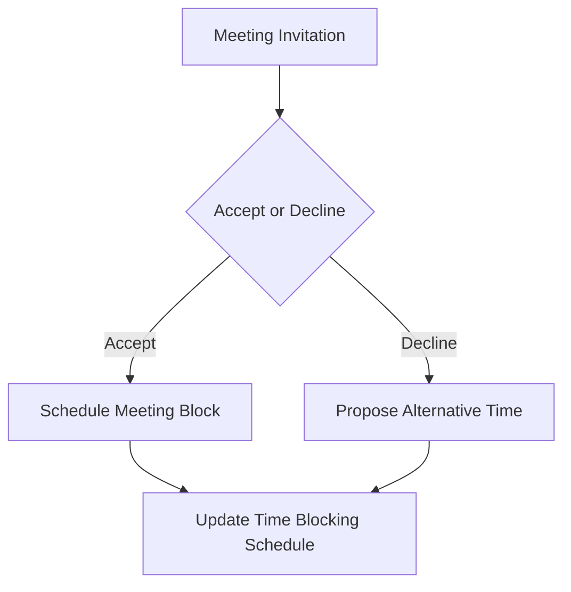
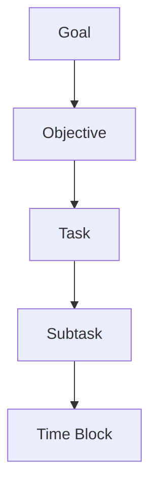
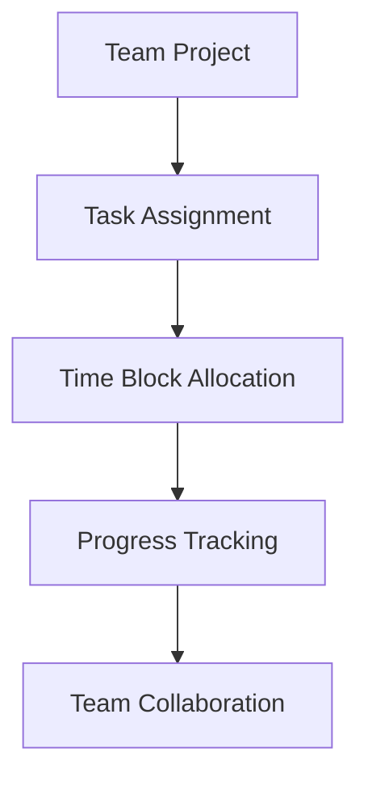

## Introduction to Advanced Time Blocking
In the first part of this series, we explored the fundamentals of time blocking, common mistakes, and strategies to overcome them. In this advanced guide, we'll delve into edge cases, architecture, and real-world applications of time blocking to help you maximize your productivity.

## Edge Cases in Time Blocking
As you implement time blocking, you'll encounter unique situations that require adaptability and creativity. Let's examine some edge cases and how to address them.

### Edge Case 1: Meetings and Collaborations
When working with teams or clients, meetings and collaborations are inevitable. To incorporate these into your time blocking schedule, consider the following:

In this flowchart, we illustrate the decision-making process for handling meeting invitations. By accepting or declining meetings and scheduling them accordingly, you can maintain control over your time blocks.

### Edge Case 2: Task Dependencies and Priority
When dealing with complex projects, tasks often have dependencies and varying priorities. To manage these effectively, use the following approach:

> **Tip:** Identify critical tasks, break them down into smaller chunks, and allocate time blocks accordingly. This ensures that you're making progress on high-priority tasks while considering dependencies.

## Advanced Time Blocking Architecture
To take your time blocking to the next level, consider implementing a hierarchical structure:

In this architecture, goals are broken down into objectives, which are further divided into tasks, subtasks, and finally, time blocks. This hierarchical structure enables you to maintain a clear understanding of how your time blocks contribute to your overall goals.

### Implementing Automation and Tools
To streamline your time blocking process, leverage automation and tools:

> **Recommendation:** Explore tools like calendar apps, project management software, and time tracking platforms to find the best fit for your needs. Automation can help you schedule time blocks, set reminders, and track progress.

## Real-World Applications of Time Blocking
Time blocking is not limited to personal productivity; it can also be applied in various professional settings:

In this example, time blocking is used to manage team projects. By assigning tasks, allocating time blocks, and tracking progress, teams can work together more effectively and efficiently.

## Visual Insights Gallery
Here are some additional visual insights to help you deepen your understanding of advanced time blocking:
* 
* 
* 