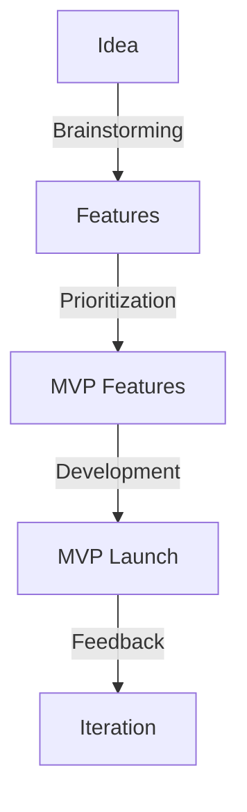
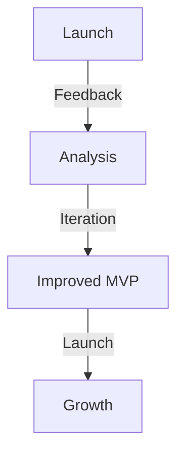

Building a profitable Minimum Viable Product (MVP) is a crucial step for startups and entrepreneurs looking to validate their business ideas and attract investors. However, many founders make critical mistakes during the MVP development process that can lead to wasted resources, delayed launch, and even business failure. In this article, we will explore the common mistakes in profitable MVP development and provide actionable tips on how to avoid them.

## Understanding the Importance of MVP

Before we dive into the common mistakes, it's essential to understand the importance of MVP in the startup ecosystem. An MVP is a product with just enough features to satisfy early customers and provide feedback for future development. The primary goal of an MVP is to validate assumptions, reduce product failures, and create a solid foundation for future growth.

## Mistake 1: Poor Market Research and Validation
Many founders assume they know what their target audience wants without conducting proper market research. This can lead to building an MVP that doesn't meet the needs of the market, resulting in low adoption rates and poor customer engagement.
```markdown
| Research Method | Description |
| --- | --- |
| Surveys | Online or offline surveys to gather information about target audience |
| Customer Interviews | In-depth interviews with potential customers to understand their needs and pain points |
| Competitor Analysis | Analyzing competitors' strengths, weaknesses, and market strategies |
```
To avoid this mistake, conduct thorough market research and validation using techniques such as surveys, customer interviews, and competitor analysis.

## Mistake 2: Over-Engineering and Feature Creep
Over-engineering and feature creep can lead to delayed launch, increased development costs, and a complex product that's difficult to maintain.

To avoid this mistake, prioritize features using techniques such as MoSCoW method or Kano model, and focus on building a simple, functional MVP that can be launched quickly.

## Mistake 3: Ignoring Feedback and Iteration
Many founders ignore feedback from early customers or fail to iterate on their MVP, leading to a product that doesn't meet the evolving needs of the market.

To avoid this mistake, establish a feedback loop with early customers, analyze feedback data, and iterate on the MVP to create a better product.

## Mistake 4: Inadequate Resource Allocation
Inadequate resource allocation can lead to delayed launch, poor product quality, and burnout of the development team.
> **Tip:** Allocate resources effectively by prioritizing tasks, using agile development methodologies, and outsourcing non-core activities.

## Mistake 5: Lack of Metrics and Analytics
Many founders fail to establish metrics and analytics to measure the success of their MVP, making it difficult to make data-driven decisions.
```markdown
| Metric | Description |
| --- | --- |
| Customer Acquisition Cost (CAC) | Cost of acquiring a new customer |
| Customer Lifetime Value (CLV) | Total value of a customer over their lifetime |
| Retention Rate | Percentage of customers retained over time |
```
To avoid this mistake, establish key metrics and analytics to measure MVP success, such as customer acquisition cost, customer lifetime value, and retention rate.

## Visual Insights Gallery
## Visual Insights Gallery


## Summary and Conclusion
Building a profitable MVP requires careful planning, execution, and iteration. By avoiding common mistakes such as poor market research, over-engineering, ignoring feedback, inadequate resource allocation, and lack of metrics and analytics, founders can create a successful MVP that validates their business idea and attracts investors. Remember to prioritize features, establish a feedback loop, and allocate resources effectively to create a solid foundation for future growth.

## FAQ
Q: What is the primary goal of an MVP?
A: The primary goal of an MVP is to validate assumptions, reduce product failures, and create a solid foundation for future growth.
Q: How can I prioritize features for my MVP?
A: Use techniques such as MoSCoW method or Kano model to prioritize features and focus on building a simple, functional MVP.
Q: What metrics should I use to measure MVP success?
A: Establish key metrics and analytics such as customer acquisition cost, customer lifetime value, and retention rate to measure MVP success.