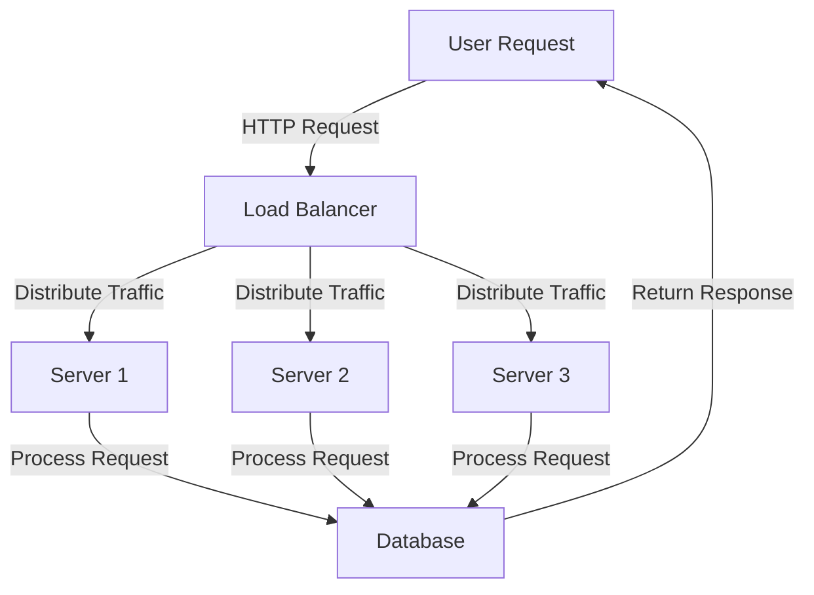
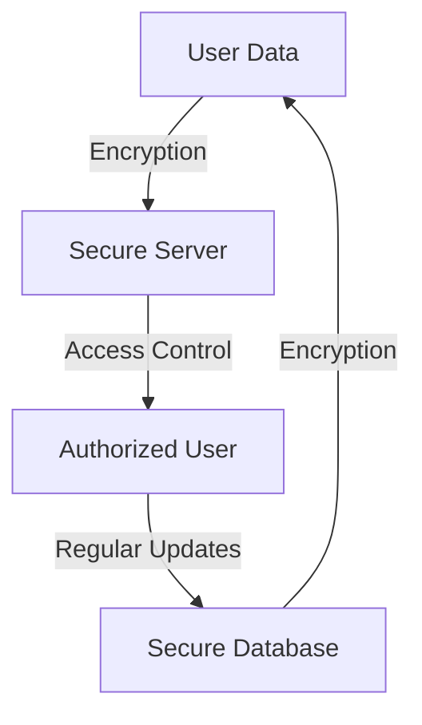

## Part 2: Advanced MVP Development - Edge Cases and Architecture

In the first part of this series, we explored the common mistakes in profitable MVP development and provided actionable tips on how to avoid them. In this advanced guide, we will delve deeper into the edge cases and architecture of MVP development, providing a comprehensive overview of the technical and strategic considerations that can make or break a startup.

## Edge Case 1: Handling Scalability and High Traffic
One of the biggest challenges that MVPs face is handling scalability and high traffic. As the user base grows, the infrastructure must be able to handle the increased load without compromising performance. This can be achieved by:
```markdown
| Scalability Strategy | Description |
| --- | --- |
| Horizontal Scaling | Adding more servers to handle increased traffic |
| Vertical Scaling | Increasing the power of existing servers to handle increased traffic |
| Load Balancing | Distributing traffic across multiple servers to ensure efficient use of resources |
```
To illustrate this, let's consider a Mermaid.js diagram that shows the flow of traffic in a scalable MVP architecture:

This diagram shows how a load balancer can distribute traffic across multiple servers, ensuring that no single server is overwhelmed and that the user experience remains seamless.

## Edge Case 2: Integrating Third-Party Services
Another edge case that MVPs must consider is integrating third-party services. This can include payment gateways, social media platforms, and other external services that enhance the user experience. To integrate these services effectively, MVPs must:

* Use standardized APIs and protocols
* Implement robust error handling and logging
* Ensure compliance with relevant regulations and standards

## Edge Case 3: Ensuring Security and Compliance
Finally, MVPs must ensure that they are secure and compliant with relevant regulations and standards. This includes:
```markdown
| Security Measure | Description |
| --- | --- |
| Encryption | Protecting sensitive data with encryption algorithms |
| Access Control | Controlling access to sensitive data and systems |
| Regular Updates | Regularly updating software and systems to prevent vulnerabilities |
```
To illustrate this, let's consider a Mermaid.js diagram that shows the flow of data in a secure MVP architecture:

This diagram shows how user data can be encrypted and protected with access control, ensuring that sensitive information remains secure.

## Visual Insights Gallery
Here are some additional visual insights that can help MVPs navigate the complexities of edge cases and architecture:
* 
* 
* 