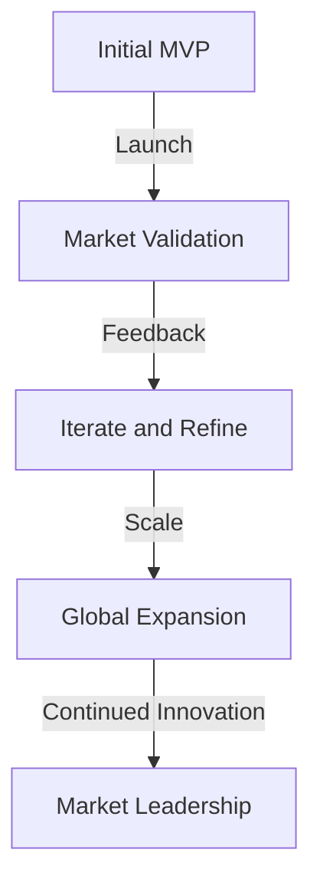

Part 2: Advanced Strategies for Profitable MVP Development and Real-World Case Studies
====================================================================================
### Introduction to Advanced MVP Development

In the first part of this series, we explored the common mistakes in profitable MVP development and provided actionable tips on how to avoid them. In this article, we will delve deeper into advanced strategies for building a successful MVP, including real-world case studies and edge-cases.

### Edge-Case 1: Handling Uncertainty in Market Demand
When developing an MVP, it's essential to consider the uncertainty in market demand. This can be achieved by using techniques such as:
```markdown
| Technique | Description |
| --- | --- |
| A/B Testing | Comparing two or more versions of a product to determine which one performs better |
| Multivariate Testing | Testing multiple variables to determine their impact on the product |
| Customer Development | Engaging with customers to understand their needs and pain points |
```
These techniques can help founders make data-driven decisions and reduce the risk of launching an MVP that doesn't meet the needs of the market.

### Advanced Architecture for Scalability
To ensure the MVP can scale with the growing demand, it's crucial to design an advanced architecture that can handle increased traffic and user engagement. This can be achieved by using:
```markdown
| Architecture | Description |
| --- | --- |
| Microservices | Breaking down the application into smaller, independent services |
| Containerization | Using containers to deploy and manage applications |
| Serverless Computing | Using cloud-based services to handle compute tasks |
```
By using these architectures, founders can build an MVP that can handle increased traffic and user engagement, without compromising on performance.

### Real-World Case Study: Airbnb

Airbnb is a great example of a company that successfully developed an MVP and scaled it to become a global brand. The company started by offering a simple platform for booking apartments and rooms, and then expanded to include more features and services.

By following a similar approach, founders can develop an MVP that meets the needs of their target audience and scales to become a successful business.

### Handling Technical Debt
As the MVP grows and evolves, it's essential to handle technical debt to ensure the application remains maintainable and scalable. This can be achieved by:
```markdown
| Technique | Description |
| --- | --- |
| Code Refactoring | Improving the structure and organization of the code |
| Automated Testing | Using automated tests to ensure the application works as expected |
| Continuous Integration | Integrating code changes into the main branch regularly |
```
By using these techniques, founders can reduce the risk of technical debt and ensure their MVP remains maintainable and scalable.

## Visual Insights Gallery
The following images provide a visual representation of the concepts discussed in this article:
* 
* 
* 