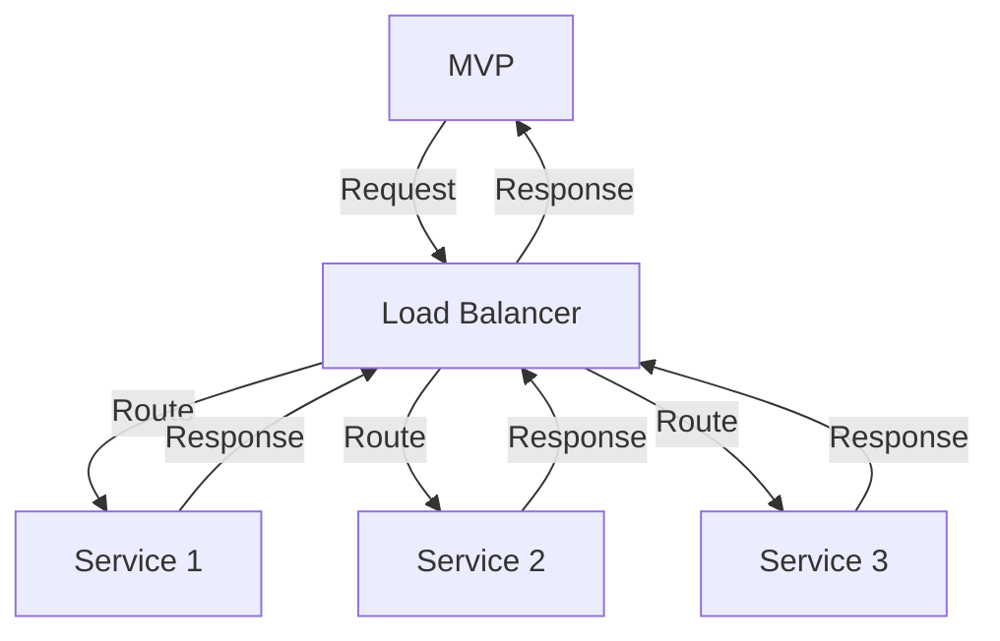

Part 3: Mastering Advanced Edge-Cases and Architecture for Scalable MVP Development
====================================================================================
### Introduction to Mastering Advanced MVP Development

In the previous parts of this series, we explored common mistakes in profitable MVP development, advanced strategies, and real-world case studies. In this article, we will dive deeper into mastering advanced edge-cases and architecture for scalable MVP development, including expert techniques and in-depth analysis.

### Edge-Case 2: Managing Technical Debt and Code Quality
As the MVP grows, technical debt and code quality become increasingly important. It's essential to implement strategies to manage technical debt and maintain high code quality, such as:
```markdown
| Strategy | Description |
| --- | --- |
| Code Refactoring | Restructuring code to improve maintainability and readability |
| Continuous Integration | Automating testing and deployment to ensure code quality |
| Code Review | Regularly reviewing code to detect and fix issues |
```
These strategies can help founders ensure the MVP remains maintainable, scalable, and efficient.

### Advanced Architecture for Microservices
To achieve greater scalability and flexibility, it's crucial to design an advanced architecture based on microservices. This can be represented using the following Mermaid.js diagram:

This architecture allows for greater flexibility, scalability, and fault tolerance, making it ideal for large-scale MVP development.

### Edge-Case 3: Ensuring Security and Compliance
As the MVP handles sensitive user data, it's essential to ensure security and compliance with relevant regulations. This can be achieved by implementing strategies such as:
```markdown
| Strategy | Description |
| --- | --- |
| Encryption | Protecting data with encryption algorithms |
| Access Control | Restricting access to sensitive data and systems |
| Regular Audits | Conducting regular security audits to detect and fix vulnerabilities |
```
These strategies can help founders ensure the MVP remains secure and compliant, protecting user data and maintaining trust.

### Advanced Deployment Strategies
To ensure seamless deployment and minimize downtime, it's crucial to implement advanced deployment strategies, such as:

```markdown
| Strategy | Description |
| --- | --- |
| Blue-Green Deployment | Deploying a new version of the MVP alongside the existing version |
| Canary Release | Deploying a new version of the MVP to a small subset of users |
| Rolling Update | Deploying a new version of the MVP incrementally, replacing old instances with new ones |
```
These strategies can help founders ensure the MVP remains available and responsive, even during deployment.

## Visual Insights Gallery
* [MVP Development Lifecycle](https://picsum.photos/seed/mvp-development-lifecycle/800/400)
* [Advanced Microservices Architecture](https://picsum.photos/seed/advanced-microservices-architecture/800/400)
* [Security and Compliance Strategies](https://picsum.photos/seed/security-and-compliance-strategies/800/400)