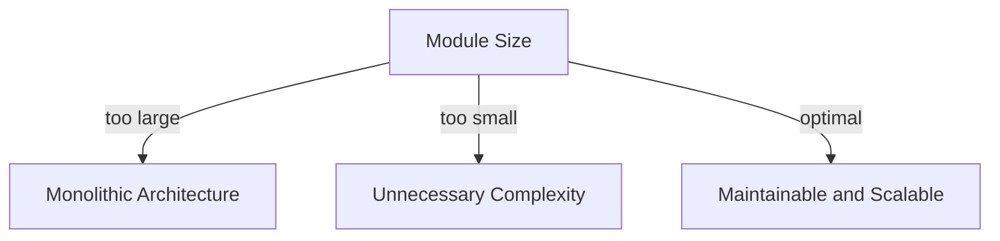
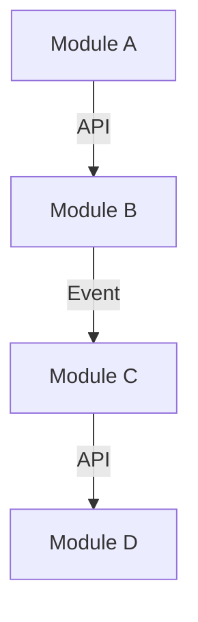

Real-time micro-frontend architecture has become increasingly popular in recent years due to its ability to provide a seamless and personalized user experience. However, as with any complex system, there are common mistakes that can lead to performance issues, scalability problems, and maintainability concerns. In this article, we will explore the most common mistakes in real-time micro-frontend and provide actionable advice on how to avoid them.

## Table of Contents
1. [Introduction to Micro-frontend Architecture](#introduction-to-micro-frontend-architecture)
2. [Mistake 1: Insufficient Module Granularity](#mistake-1-insufficient-module-granularity)
3. [Mistake 2: Poor Communication Between Modules](#mistake-2-poor-communication-between-modules)
4. [Mistake 3: Inadequate Error Handling](#mistake-3-inadequate-error-handling)
5. [Mistake 4: Ignoring Scalability and Performance](#mistake-4-ignoring-scalability-and-performance)
6. [Best Practices for Real-time Micro-frontend](#best-practices-for-real-time-micro-frontend)

## Introduction to Micro-frontend Architecture

Micro-frontend architecture is a design pattern that structures an application as a collection of smaller, independent modules. Each module, or micro-frontend, is responsible for a specific feature or functionality and can be developed, tested, and deployed independently. This approach allows for greater flexibility, scalability, and maintainability, making it an attractive choice for complex and dynamic applications.

## Mistake 1: Insufficient Module Granularity

One of the most common mistakes in micro-frontend architecture is insufficient module granularity. When modules are too large, they can become cumbersome and difficult to maintain, leading to a monolithic architecture. On the other hand, modules that are too small can result in unnecessary complexity and overhead. To avoid this mistake, it's essential to strike a balance between module size and complexity.
```markdown

## Mistake 2: Poor Communication Between Modules

Poor communication between modules is another common mistake in micro-frontend architecture. When modules are not designed to communicate effectively, it can lead to data inconsistencies, errors, and performance issues. To avoid this mistake, it's essential to establish a robust communication mechanism between modules, such as API-based communication or event-driven architecture.
```markdown

## Mistake 3: Inadequate Error Handling

Inadequate error handling is a critical mistake in micro-frontend architecture. When errors are not handled properly, it can lead to a poor user experience, data loss, and security vulnerabilities. To avoid this mistake, it's essential to implement a robust error handling mechanism, such as try-catch blocks, error logging, and user-friendly error messages.
> **Note:** Error handling should be implemented at both the module and application levels.

## Mistake 4: Ignoring Scalability and Performance

Ignoring scalability and performance is a common mistake in micro-frontend architecture. When applications are not designed to scale, it can lead to performance issues, downtime, and revenue loss. To avoid this mistake, it's essential to design applications with scalability and performance in mind, such as using load balancers, caching, and content delivery networks (CDNs).
```markdown
| Scalability | Performance |
| --- | --- |
| Load Balancers | Caching |
| Auto-Scaling | CDNs |
| Distributed Architecture | Optimize Code |

## Best Practices for Real-time Micro-frontend
To ensure a successful real-time micro-frontend architecture, it's essential to follow best practices, such as:
* Establishing a robust communication mechanism between modules
* Implementing a robust error handling mechanism
* Designing applications with scalability and performance in mind
* Using agile development methodologies
* Continuously monitoring and optimizing application performance

## Visual Insights Gallery


## Summary/Conclusion
Real-time micro-frontend architecture is a powerful design pattern that can provide a seamless and personalized user experience. However, it's essential to avoid common mistakes, such as insufficient module granularity, poor communication between modules, inadequate error handling, and ignoring scalability and performance. By following best practices and avoiding common mistakes, developers can create scalable, maintainable, and high-performance real-time micro-frontend applications.

## FAQ
Q: What is real-time micro-frontend architecture?
A: Real-time micro-frontend architecture is a design pattern that structures an application as a collection of smaller, independent modules.
Q: What are the benefits of real-time micro-frontend architecture?
A: The benefits of real-time micro-frontend architecture include greater flexibility, scalability, and maintainability.
Q: What are the common mistakes in real-time micro-frontend architecture?
A: The common mistakes in real-time micro-frontend architecture include insufficient module granularity, poor communication between modules, inadequate error handling, and ignoring scalability and performance.