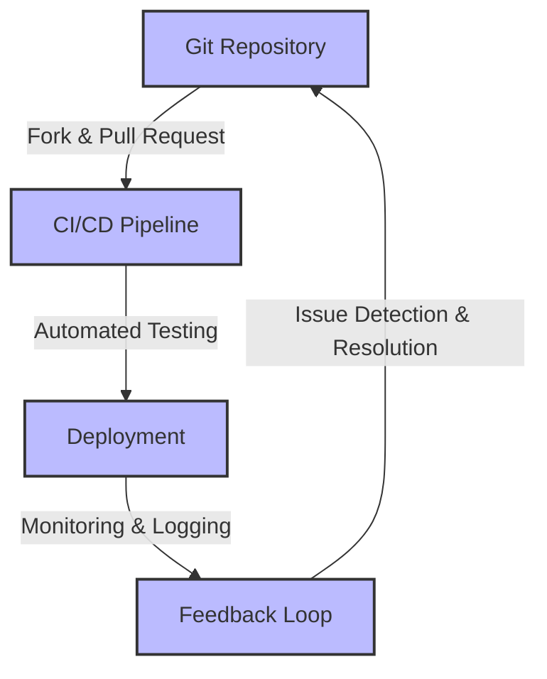
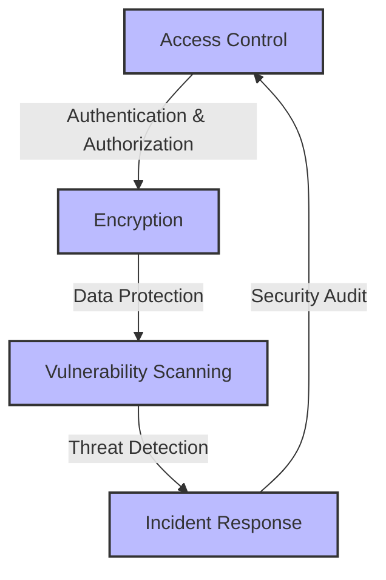

As organizations increasingly adopt GitOps for their cloud-native applications, ensuring the resilience of these workflows is crucial for minimizing downtime and maximizing productivity. However, several common mistakes can compromise the efficacy and reliability of GitOps workflows. In this article, we will delve into these pitfalls and explore strategies for avoiding them, thereby fostering a more robust and efficient DevOps environment.

## Introduction to GitOps and Its Importance
GitOps is a operational model that uses Git as a single source of truth for declarative configuration and automation. It provides a collaborative approach to infrastructure management, application deployment, and monitoring, making it easier to manage complex systems. The importance of GitOps lies in its ability to enhance collaboration, reduce errors, and improve the overall speed and reliability of software delivery pipelines.

## Understanding Common Mistakes in GitOps Workflows
Several mistakes can undermine the resilience and effectiveness of GitOps workflows. These include inadequate monitoring and logging, insufficient testing, poor security practices, and lack of automation in recovery processes.

### Inadequate Monitoring and Logging
Inadequate monitoring and logging can make it difficult to identify and respond to issues in a timely manner, leading to prolonged downtime and decreased system reliability.

> **Note:** Implementing comprehensive monitoring tools that provide real-time insights into system performance and health is essential for maintaining resilient GitOps workflows.

### Insufficient Testing
Insufficient testing can lead to the deployment of faulty configurations or applications, compromising the stability of the system.

> **Tip:** Adopting a robust testing strategy that includes automated unit tests, integration tests, and end-to-end tests can significantly reduce the risk of errors in GitOps workflows.

## Architecture for Resilient GitOps
Designing a resilient GitOps architecture involves several key components, including version control systems, continuous integration and continuous deployment (CI/CD) pipelines, and monitoring and logging tools. The following Mermaid.js diagram illustrates a basic architecture for resilient GitOps:

## Implementing Automation in Recovery Processes
Automation plays a critical role in minimizing downtime and ensuring the swift recovery of GitOps workflows. By leveraging tools such as Kubernetes and AWS, organizations can automate rollbacks, self-healing, and other recovery processes.

> **Warning:** Manual intervention in recovery processes can lead to delays and human errors, highlighting the importance of automation in maintaining resilient GitOps workflows.

## Security Considerations in GitOps
Security is a paramount concern in GitOps, as it involves the management of sensitive infrastructure and application configurations. Implementing robust security practices, such as access control, encryption, and vulnerability scanning, is essential for protecting GitOps workflows from potential threats.

## Best Practices for Resilient GitOps Workflows
Several best practices can help organizations avoid common mistakes and ensure the resilience of their GitOps workflows. These include:

| Best Practice | Description |
| --- | --- |
| Implement Comprehensive Monitoring | Use monitoring tools to gain real-time insights into system performance and health. |
| Adopt Robust Testing Strategies | Implement automated testing to reduce the risk of errors in GitOps workflows. |
| Automate Recovery Processes | Leverage automation to minimize downtime and ensure swift recovery of GitOps workflows. |
| Implement Robust Security Practices | Protect GitOps workflows from potential threats by implementing access control, encryption, and vulnerability scanning. |

## Visual Insights Gallery
The following images provide additional insights into the concepts and strategies discussed in this article:

## Summary and Conclusion
In conclusion, avoiding common mistakes in GitOps workflows is crucial for maintaining their resilience and effectiveness. By understanding these pitfalls and implementing strategies such as comprehensive monitoring, robust testing, automation in recovery processes, and robust security practices, organizations can foster a more reliable and efficient DevOps environment. As the complexity of cloud-native applications continues to evolve, the importance of resilient GitOps workflows will only continue to grow.

## FAQ
1. **What is GitOps?**
GitOps is an operational model that uses Git as a single source of truth for declarative configuration and automation.
2. **Why is monitoring important in GitOps?**
Monitoring is essential in GitOps for identifying and responding to issues in a timely manner, thereby minimizing downtime and maximizing system reliability.
3. **How can automation improve GitOps workflows?**
Automation can improve GitOps workflows by minimizing downtime, ensuring swift recovery, and reducing the risk of human errors in recovery processes.