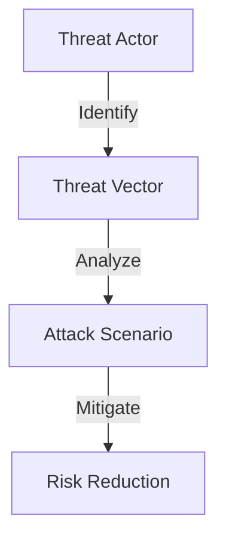
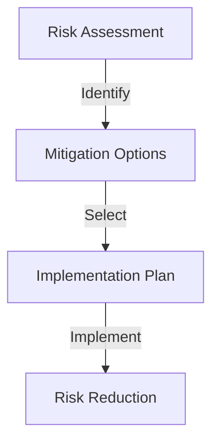
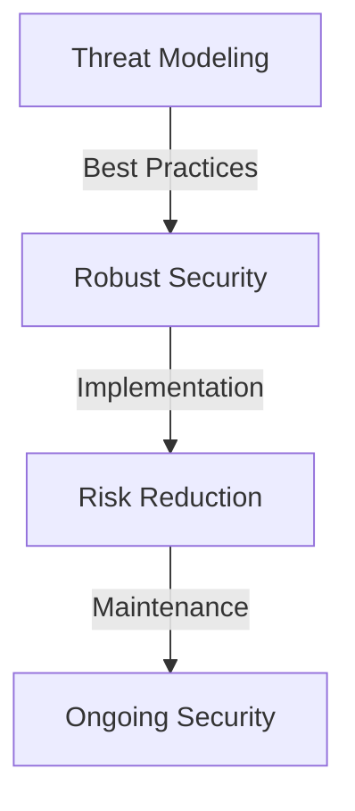

In the ever-evolving landscape of cybersecurity, threat modeling has become an essential tool for organizations to identify, assess, and mitigate potential security risks. However, even with the best intentions, many organizations fall prey to common mistakes that can undermine the effectiveness of their threat models. In this article, we will delve into the most common mistakes in robust threat modeling and provide actionable advice on how to avoid them.

## Table of Contents
1. [Introduction to Threat Modeling](#introduction-to-threat-modeling)
2. [Mistake 1: Inadequate Asset Identification](#mistake-1-inadequate-asset-identification)
3. [Mistake 2: Insufficient Threat Analysis](#mistake-2-insufficient-threat-analysis)
4. [Mistake 3: Failure to Implement Mitigations](#mistake-3-failure-to-implement-mitigations)
5. [Mistake 4: Inadequate Model Maintenance](#mistake-4-inadequate-model-maintenance)
6. [Best Practices for Robust Threat Modeling](#best-practices-for-robust-threat-modeling)
7. [Visual Insights Gallery](#visual-insights-gallery)
8. [Conclusion](#conclusion)
9. [FAQ](#faq)

## Introduction to Threat Modeling
Threat modeling is a systematic approach to identifying, analyzing, and mitigating potential security threats to an organization's assets. It involves a thorough understanding of the organization's assets, threats, and vulnerabilities, as well as the implementation of mitigations to reduce the risk of a security breach.


## Mistake 1: Inadequate Asset Identification
One of the most common mistakes in threat modeling is inadequate asset identification. Assets can include data, systems, networks, and personnel, and failing to identify all relevant assets can leave an organization vulnerable to unknown threats.
```markdown
| Asset Type | Description |
| --- | --- |
| Data | Sensitive customer information |
| Systems | Critical infrastructure systems |
| Networks | Internal and external networks |
| Personnel | Employees with access to sensitive information |
```
> **Tip:** Use a comprehensive asset identification framework to ensure that all relevant assets are identified and included in the threat model.

## Mistake 2: Insufficient Threat Analysis
Insufficient threat analysis is another common mistake in threat modeling. Threat analysis involves identifying potential threats to an organization's assets, including threat actors, threat vectors, and attack scenarios.

> **Note:** Use a threat analysis framework to identify and analyze potential threats, and prioritize mitigation efforts based on risk severity.

## Mistake 3: Failure to Implement Mitigations
Failing to implement mitigations is a critical mistake in threat modeling. Mitigations can include security controls, policies, and procedures, and failing to implement them can leave an organization vulnerable to security breaches.

> **Warning:** Failing to implement mitigations can have severe consequences, including financial loss, reputational damage, and regulatory penalties.

## Mistake 4: Inadequate Model Maintenance
Inadequate model maintenance is another common mistake in threat modeling. Threat models must be regularly reviewed and updated to ensure that they remain effective and relevant.
```markdown
| Maintenance Activity | Frequency |
| --- | --- |
| Model Review | Quarterly |
| Threat Analysis | Annually |
| Mitigation Review | Bi-Annually |
```
> **Tip:** Establish a regular maintenance schedule to ensure that the threat model remains up-to-date and effective.

## Best Practices for Robust Threat Modeling
To avoid common mistakes in threat modeling, organizations should follow best practices, including:
* Conducting regular threat assessments and risk analyses
* Implementing comprehensive security controls and mitigations
* Establishing a regular model maintenance schedule
* Providing training and awareness programs for employees

## Visual Insights Gallery


## Conclusion
Threat modeling is a critical component of an organization's cybersecurity strategy, and avoiding common mistakes is essential to ensuring the effectiveness of the threat model. By following best practices and avoiding common mistakes, organizations can reduce the risk of security breaches and protect their assets.

## FAQ
Q: What is threat modeling?
A: Threat modeling is a systematic approach to identifying, analyzing, and mitigating potential security threats to an organization's assets.
Q: What are the common mistakes in threat modeling?
A: Common mistakes in threat modeling include inadequate asset identification, insufficient threat analysis, failure to implement mitigations, and inadequate model maintenance.
Q: How can organizations avoid common mistakes in threat modeling?
A: Organizations can avoid common mistakes by following best practices, including conducting regular threat assessments and risk analyses, implementing comprehensive security controls and mitigations, and establishing a regular model maintenance schedule.