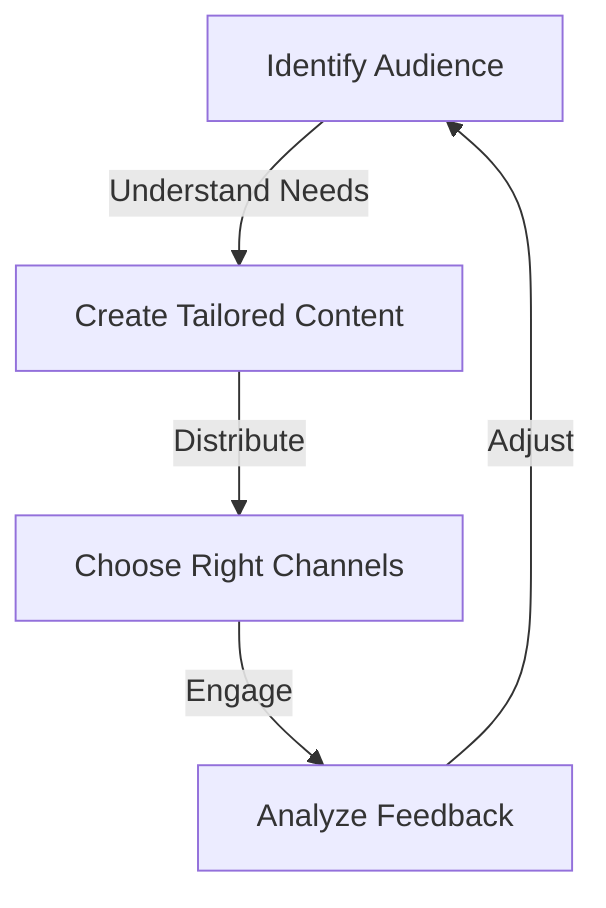
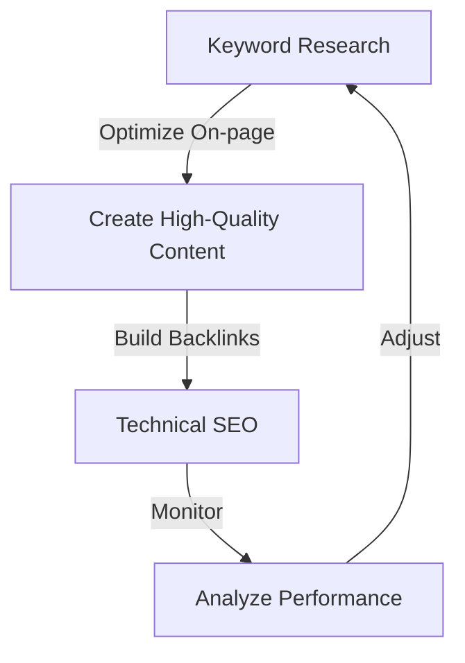

In the ever-evolving landscape of digital marketing, establishing a strong brand authority is crucial for businesses aiming to stand out and thrive. However, many companies, especially those in the B2B, SEO, and SaaS sectors, often fall into common pitfalls that hinder their ability to scale their brand authority effectively. This article delves into these mistakes, providing actionable strategies and insights on how to avoid them, ensuring your brand not only establishes a strong presence but also scales with resilience and impact.

## Understanding Brand Authority
Brand authority refers to the level of trust, credibility, and influence your brand commands within your industry. It's built over time through consistent, high-quality content, customer satisfaction, and strategic marketing efforts. However, understanding what undermines this authority is just as important as knowing how to build it.


## Common Mistakes in Building Scalable Brand Authority
Several mistakes can derail efforts to build scalable brand authority. These include:
- **Lack of Consistency**: Inconsistent branding and messaging can confuse your audience and dilute your brand's impact.
- **Insufficient Content Strategy**: Failing to have a well-planned content strategy can lead to disjointed and ineffective content marketing.
- **Neglecting Customer Experience**: Poor customer service and experience can severely harm your brand's reputation and authority.
- **Inadequate SEO Practices**: Not optimizing your content and website for search engines can significantly reduce your brand's visibility.

## Crafting a Consistent Brand Image
Consistency is key to building a strong brand. This includes maintaining a uniform visual identity across all platforms, using a consistent tone of voice in your communications, and ensuring that all marketing materials align with your brand's mission and values.

```markdown
### Brand Consistency Checklist
- Uniform Visual Identity
- Consistent Tone of Voice
- Aligned Marketing Materials
- Regular Brand Audits
```


## Developing an Effective Content Strategy
An effective content strategy is tailored to your target audience's needs and preferences. It involves understanding your audience, creating high-quality and relevant content, and distributing it through the right channels.



## Prioritizing Customer Experience
Customer experience is at the heart of brand authority. It's about ensuring that every interaction with your brand, from the initial visit to post-purchase support, is positive and memorable.

> **Tip:** Implementing a customer relationship management (CRM) system can help track interactions and improve customer service.


## Optimizing for SEO
SEO is crucial for increasing your brand's visibility and authority. This involves optimizing your website and content for search engines, creating high-quality backlinks, and staying up-to-date with the latest SEO trends and best practices.



## Visual Insights Gallery
Below are visual insights into brand authority and marketing strategies:


## Summary and Conclusion
Building scalable brand authority requires a multifaceted approach that includes maintaining consistency, developing an effective content strategy, prioritizing customer experience, and optimizing for SEO. By avoiding common mistakes and focusing on these key areas, businesses can establish a strong foundation for their brand and scale with confidence and resilience.

## FAQ
- **Q: What is brand authority, and why is it important?**
  A: Brand authority refers to the trust, credibility, and influence your brand holds within its industry. It's crucial for standing out, attracting customers, and achieving long-term success.
- **Q: How can I improve my brand's consistency?**
  A: Improving consistency involves regular brand audits, maintaining a uniform visual identity, using a consistent tone of voice, and ensuring all marketing materials align with your brand's mission and values.
- **Q: What role does customer experience play in brand authority?**
  A: Customer experience is vital as it directly impacts how customers perceive your brand. Positive experiences enhance brand reputation and authority, while negative ones can harm it.