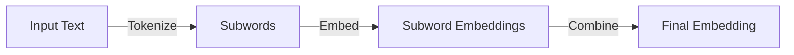
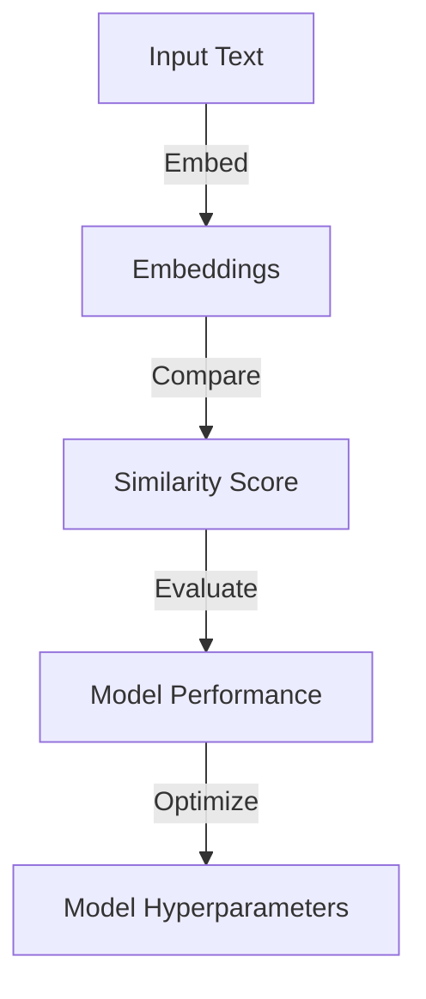

Semantic embedding models have revolutionized the field of natural language processing (NLP) and artificial intelligence (AI). These models enable machines to understand the meaning and context of words, phrases, and sentences, allowing for more accurate and efficient language processing. However, like any complex technology, semantic embedding models can be prone to mistakes if not implemented correctly. In this article, we will explore common mistakes in semantic embedding models and provide guidance on how to avoid them.

## Introduction to Semantic Embedding Models

Semantic embedding models are a type of machine learning model that maps words, phrases, or sentences to dense vectors in a high-dimensional space. These vectors, called embeddings, capture the semantic meaning of the input text, allowing for similarity measurements, clustering, and other downstream tasks. The most popular semantic embedding models include Word2Vec, GloVe, and BERT.

## Mistake 1: Insufficient Training Data
> **Note:** One of the most common mistakes in semantic embedding models is using insufficient training data. This can lead to poor model performance, overfitting, and limited generalizability.
To avoid this mistake, it is essential to collect a large, diverse, and high-quality dataset that represents the intended use case. The dataset should include a wide range of texts, genres, and styles to ensure that the model learns to generalize well.
```markdown
| Dataset Size | Model Performance |
| --- | --- |
| Small (<100k) | Poor |
| Medium (100k-1M) | Fair |
| Large (1M-10M) | Good |
| Extra Large (>10M) | Excellent |
```
## Mistake 2: Inadequate Hyperparameter Tuning

> **Warning:** Inadequate hyperparameter tuning can significantly impact the performance of semantic embedding models. Hyperparameters, such as embedding size, batch size, and learning rate, need to be carefully tuned to optimize model performance.
To avoid this mistake, use techniques such as grid search, random search, or Bayesian optimization to find the optimal hyperparameters for your model.
```python
import numpy as np
from sklearn.model_selection import GridSearchCV

# Define hyperparameter grid
param_grid = {
    'embedding_size': [100, 200, 300],
    'batch_size': [32, 64, 128],
    'learning_rate': [0.001, 0.01, 0.1]
}

# Perform grid search
grid_search = GridSearchCV(model, param_grid, cv=5)
grid_search.fit(X_train, y_train)
```
## Mistake 3: Failure to Handle Out-of-Vocabulary (OOV) Words
> **Tip:** OOV words can significantly impact the performance of semantic embedding models. To avoid this mistake, use techniques such as subword modeling or character-level embeddings to handle OOV words.
Subword modeling involves breaking down words into subwords, such as word pieces or character n-grams, to capture the meaning of OOV words.

## Mistake 4: Neglecting to Evaluate Model Performance

> **Interview:** Evaluating model performance is crucial to ensure that the semantic embedding model is working as expected. To avoid this mistake, use metrics such as cosine similarity, precision, recall, and F1-score to evaluate model performance.

## Visual Insights Gallery
## Visual Insights Gallery


## Summary and Conclusion
In conclusion, semantic embedding models are powerful tools for natural language processing, but they can be prone to mistakes if not implemented correctly. By avoiding common mistakes such as insufficient training data, inadequate hyperparameter tuning, failure to handle OOV words, and neglecting to evaluate model performance, you can ensure that your semantic embedding model performs optimally. Remember to use techniques such as subword modeling, character-level embeddings, and careful hyperparameter tuning to optimize model performance.

## FAQ
Q: What is semantic embedding?
A: Semantic embedding is a technique used in natural language processing to map words, phrases, or sentences to dense vectors in a high-dimensional space.
Q: What is the difference between Word2Vec and GloVe?
A: Word2Vec and GloVe are both popular semantic embedding models, but they differ in their architecture and training objectives. Word2Vec uses a neural network to learn word embeddings, while GloVe uses a matrix factorization approach.
Q: How do I handle out-of-vocabulary words in semantic embedding models?
A: You can handle OOV words using techniques such as subword modeling or character-level embeddings.