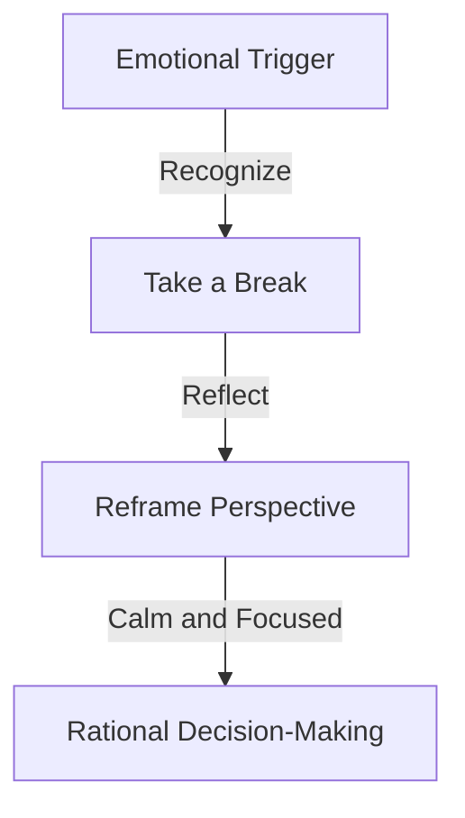

As professionals ascend the corporate ladder, negotiation becomes an indispensable skill for success. Effective negotiation can lead to better deals, stronger relationships, and increased career advancement opportunities. However, even seasoned executives can fall prey to common mistakes that undermine their negotiation strategy. In this article, we will delve into the most frequent errors and provide actionable advice on how to avoid them.

## Table of Contents
1. [Introduction to Negotiation Strategy](#introduction-to-negotiation-strategy)
2. [Mistake 1: Lack of Preparation](#mistake-1-lack-of-preparation)
3. [Mistake 2: Poor Communication](#mistake-2-poor-communication)
4. [Mistake 3: Emotional Decision-Making](#mistake-3-emotional-decision-making)
5. [Mistake 4: Inflexibility](#mistake-4-inflexibility)
6. [Mistake 5: Ignoring the Counterparty's Needs](#mistake-5-ignoring-the-counterpartys-needs)
7. [Best Practices for Successful Negotiation](#best-practices-for-successful-negotiation)
8. [Visual Insights Gallery](#visual-insights-gallery)
9. [Conclusion](#conclusion)
10. [FAQ](#faq)

## Introduction to Negotiation Strategy
Negotiation is a delicate dance between two or more parties, each seeking to achieve their objectives while maintaining a positive relationship. A well-crafted negotiation strategy is essential for success, as it enables individuals to navigate complex discussions, build trust, and create mutually beneficial agreements.


## Mistake 1: Lack of Preparation
One of the most significant mistakes in negotiation is lack of preparation. Without thorough research and a clear understanding of the counterparty's needs, goals, and limitations, negotiations can quickly go awry.
```markdown
| Preparation Step | Description |
| --- | --- |
| Research Counterparty | Gather information on the counterparty's business, goals, and constraints |
| Define Objectives | Clearly outline your negotiation objectives and priorities |
| Develop a BATNA | Establish a Best Alternative to a Negotiated Agreement (BATNA) |
```
> **Tip:** Develop a comprehensive negotiation plan, including a detailed analysis of the counterparty's strengths, weaknesses, and potential areas of agreement.

## Mistake 2: Poor Communication
Effective communication is critical in negotiation. Poor communication can lead to misunderstandings, misinterpretations, and a breakdown in trust.

> **Note:** Practice active listening, ask open-ended questions, and maintain a non-confrontational tone to foster a collaborative negotiation environment.

## Mistake 3: Emotional Decision-Making
Emotions can play a significant role in negotiation, often leading to impulsive decisions that undermine long-term objectives.

> **Warning:** Be aware of your emotional state and take regular breaks to recharge and refocus.

## Mistake 4: Inflexibility
Inflexibility can be a major obstacle in negotiation, as it limits the potential for creative solutions and compromises.
```markdown
| Inflexibility | Flexible Approach |
| --- | --- |
| Unwilling to Compromise | Open to Creative Solutions |
| Focus on Winning | Prioritize Mutual Benefit |
| Limited Options | Explore Alternative Agreements |
```
> **Interview:** "The key to successful negotiation is flexibility. Be willing to listen, adapt, and explore alternative solutions that meet both parties' needs." - John Smith, Negotiation Expert

## Mistake 5: Ignoring the Counterparty's Needs
Failing to consider the counterparty's needs, goals, and constraints can lead to a breakdown in negotiations and damage relationships.

> **Tip:** Invest time in understanding the counterparty's perspective, and be willing to make concessions that meet their needs while achieving your objectives.

## Best Practices for Successful Negotiation
To avoid common mistakes and achieve successful negotiation outcomes, follow these best practices:
* Prepare thoroughly
* Communicate effectively
* Manage emotions
* Remain flexible
* Prioritize mutual benefit

## Visual Insights Gallery


## Conclusion
Negotiation is a complex and nuanced process that requires careful planning, effective communication, and a deep understanding of the counterparty's needs. By avoiding common mistakes and following best practices, individuals can develop a successful negotiation strategy that fosters strong relationships, drives business growth, and advances their careers.

## FAQ
Q: What is the most critical aspect of negotiation?
A: Preparation is key to successful negotiation, as it enables individuals to understand the counterparty's needs, goals, and limitations.
Q: How can I manage my emotions during negotiation?
A: Take regular breaks, practice active listening, and maintain a calm and focused demeanor to manage emotions and make rational decisions.
Q: What is the importance of flexibility in negotiation?
A: Flexibility allows individuals to explore creative solutions, compromise, and prioritize mutual benefit, leading to more successful negotiation outcomes.