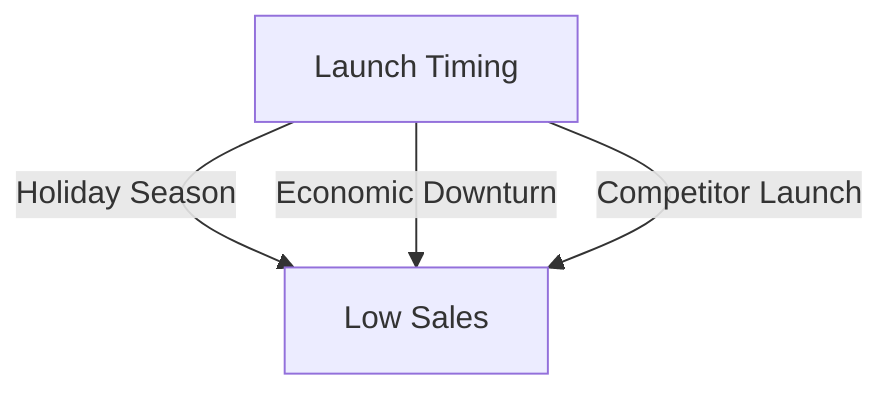

In the fast-paced world of SaaS and B2B marketing, a strategic product launch can be the difference between success and failure. However, many companies fall into common pitfalls that can hinder the launch's effectiveness. In this article, we will explore these mistakes and provide actionable advice on how to avoid them.

## Table of Contents
1. [Introduction to Strategic Product Launch](#introduction-to-strategic-product-launch)
2. [Mistake 1: Lack of Market Research](#mistake-1-lack-of-market-research)
3. [Mistake 2: Inadequate Pre-Launch Hype](#mistake-2-inadequate-pre-launch-hype)
4. [Mistake 3: Insufficient Content Creation](#mistake-3-insufficient-content-creation)
5. [Mistake 4: Poor Launch Timing](#mistake-4-poor-launch-timing)
6. [Mistake 5: Ineffective Post-Launch Evaluation](#mistake-5-ineffective-post-launch-evaluation)
7. [Conclusion and Summary](#conclusion-and-summary)
8. [Visual Insights Gallery](#visual-insights-gallery)
9. [FAQ](#faq)

## Introduction to Strategic Product Launch
A well-planned product launch is crucial for the success of any SaaS or B2B company. It involves a series of strategic steps that aim to create buzz, generate leads, and ultimately drive sales. However, many companies make critical mistakes that can derail the entire process. 


## Mistake 1: Lack of Market Research
One of the most common mistakes companies make is launching a product without conducting thorough market research. This can lead to a product that does not meet the needs of the target audience, resulting in low adoption rates and poor sales. 
```markdown
| Research Area | Description |
| --- | --- |
| Target Audience | Identify demographics, needs, and pain points |
| Competitor Analysis | Analyze competitors' strengths, weaknesses, and market share |
| Market Trends | Identify current and emerging trends in the market |
```
To avoid this mistake, companies should invest in market research, gathering data on their target audience, competitors, and market trends. This information can be used to create a product that meets the needs of the market and stands out from the competition.


## Mistake 2: Inadequate Pre-Launch Hype
Another mistake companies make is failing to create adequate pre-launch hype. This can result in a lack of interest and excitement around the product launch, leading to poor sales and low adoption rates. 

To avoid this mistake, companies should create a pre-launch campaign that generates buzz and excitement around the product. This can include social media promotions, email marketing, and influencer partnerships.

## Mistake 3: Insufficient Content Creation
Insufficient content creation is another common mistake companies make during a product launch. This can result in a lack of information and resources available to potential customers, leading to confusion and mistrust. 
```markdown
> **Tip:** Create a content calendar that outlines the type and timing of content to be created during the launch phase.
```
To avoid this mistake, companies should create a content strategy that includes a variety of content types, such as blog posts, videos, and social media posts. This content should provide valuable information and insights to potential customers, helping to build trust and credibility.

## Mistake 4: Poor Launch Timing
Poor launch timing is another critical mistake companies make. Launching a product at the wrong time can result in low sales and poor adoption rates. 

To avoid this mistake, companies should carefully plan the launch timing, taking into account factors such as holiday seasons, economic downturns, and competitor launches.

## Mistake 5: Ineffective Post-Launch Evaluation
Finally, companies often make the mistake of not evaluating the launch effectively after it has taken place. This can result in a lack of insight into what worked and what didn't, making it difficult to improve future launches. 
```markdown
| Evaluation Metric | Description |
| --- | --- |
| Sales Revenue | Total revenue generated during the launch phase |
| Customer Acquisition | Number of new customers acquired during the launch phase |
| Customer Satisfaction | Level of satisfaction among customers who purchased the product |
```
To avoid this mistake, companies should establish clear evaluation metrics and track them during and after the launch. This information can be used to refine and improve future launches.

## Conclusion and Summary
In conclusion, a strategic product launch is critical for the success of any SaaS or B2B company. However, many companies make common mistakes that can hinder the launch's effectiveness. By avoiding these mistakes, companies can create a successful product launch that drives sales, generates leads, and builds a strong brand.

## Visual Insights Gallery


## FAQ
1. **Q: What is the most critical aspect of a strategic product launch?**
   A: The most critical aspect of a strategic product launch is market research. It helps companies understand their target audience, competitors, and market trends, enabling them to create a product that meets the needs of the market.
2. **Q: How can companies create pre-launch hype?**
   A: Companies can create pre-launch hype through social media promotions, email marketing, and influencer partnerships.
3. **Q: What is the importance of evaluating a product launch?**
   A: Evaluating a product launch is crucial as it provides insight into what worked and what didn't, enabling companies to refine and improve future launches.