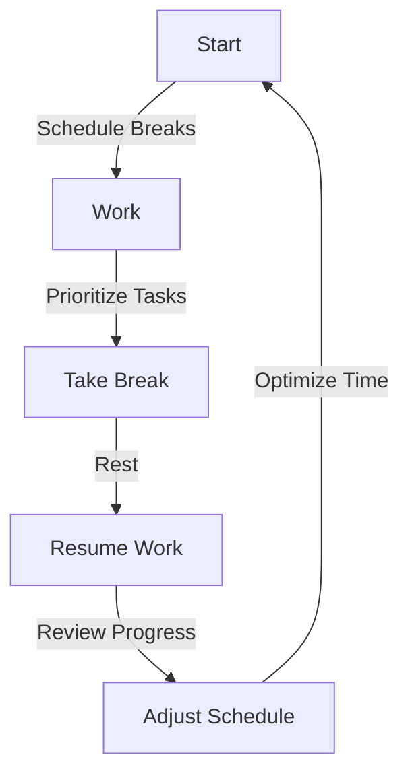
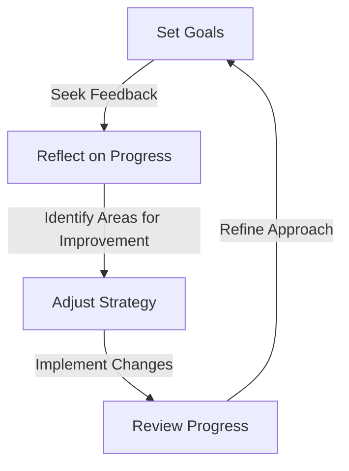

In today's fast-paced world, maintaining productivity while ensuring mental well-being is a delicate balance. Supportive deep work sessions are designed to help individuals achieve a state of flow, enhancing their focus and efficiency. However, several common mistakes can hinder the effectiveness of these sessions. In this article, we will explore these mistakes and provide actionable strategies to avoid them, ensuring that you get the most out of your supportive deep work sessions.

## Introduction to Deep Work
Deep work refers to the ability to focus without distraction on a cognitively demanding task. It's a skill that allows individuals to achieve a state of flow, leading to higher productivity and better work quality. Supportive deep work sessions involve creating an environment that fosters this state of flow, free from distractions and interruptions.


## Mistake 1: Inadequate Preparation
One of the most common mistakes in supportive deep work sessions is inadequate preparation. This can include not setting clear goals, failing to eliminate distractions, and not having the necessary resources.

```markdown
### Preparation Checklist
- Set specific, measurable, achievable, relevant, and time-bound (SMART) goals
- Identify and eliminate potential distractions
- Ensure all necessary resources are available
```

## Mistake 2: Poor Time Management
Poor time management is another mistake that can significantly impact the effectiveness of supportive deep work sessions. This includes not scheduling regular breaks, working for extended periods without rest, and failing to prioritize tasks.



## Mistake 3: Lack of Self-Care
Neglecting self-care is a critical mistake that can undermine the benefits of supportive deep work sessions. This includes failing to maintain a healthy diet, not exercising regularly, and neglecting mental health.


## Mistake 4: Insufficient Feedback and Reflection
Failing to seek feedback and reflect on progress is another common mistake. This can lead to stagnation, as individuals may not be aware of areas that need improvement.



## Strategies for Avoiding Common Mistakes
To avoid these common mistakes, it's essential to develop strategies that promote preparation, effective time management, self-care, and continuous improvement.

> **Tip:** Establish a routine that includes regular breaks, self-care activities, and time for reflection and feedback.

| Strategy | Description |
| --- | --- |
| Prioritize Tasks | Focus on the most critical tasks first |
| Schedule Breaks | Take regular breaks to maintain productivity and reduce burnout |
| Seek Feedback | Regularly seek feedback from colleagues, mentors, or peers |
| Reflect on Progress | Schedule time to reflect on progress and identify areas for improvement |

## Visual Insights Gallery
Supportive deep work sessions require a combination of preparation, effective time management, self-care, and continuous improvement. The following images illustrate the importance of these elements.


## Summary and Conclusion
Supportive deep work sessions are a powerful tool for enhancing productivity and mental well-being. However, common mistakes such as inadequate preparation, poor time management, lack of self-care, and insufficient feedback and reflection can hinder their effectiveness. By developing strategies that address these mistakes, individuals can create an environment that fosters a state of flow, leading to greater productivity and overall well-being.

## Frequently Asked Questions
1. **What is deep work?**
Deep work refers to the ability to focus without distraction on a cognitively demanding task.
2. **Why is preparation important in supportive deep work sessions?**
Preparation is essential for setting clear goals, eliminating distractions, and ensuring the necessary resources are available.
3. **How can I prioritize tasks effectively?**
Prioritize tasks based on their importance and deadlines, focusing on the most critical tasks first.
4. **What are the benefits of regular breaks?**
Regular breaks can help maintain productivity, reduce burnout, and improve overall well-being.
5. **Why is self-care important in supportive deep work sessions?**
Self-care is essential for maintaining physical and mental health, reducing stress, and improving focus and productivity.