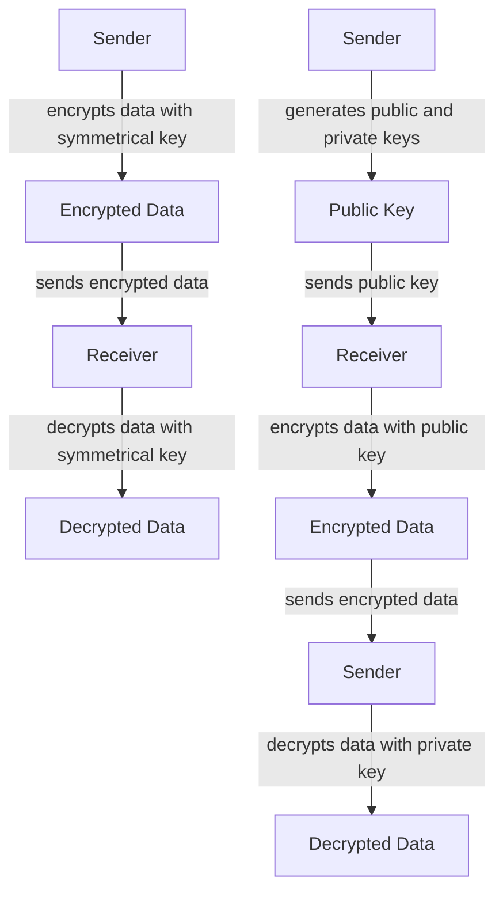
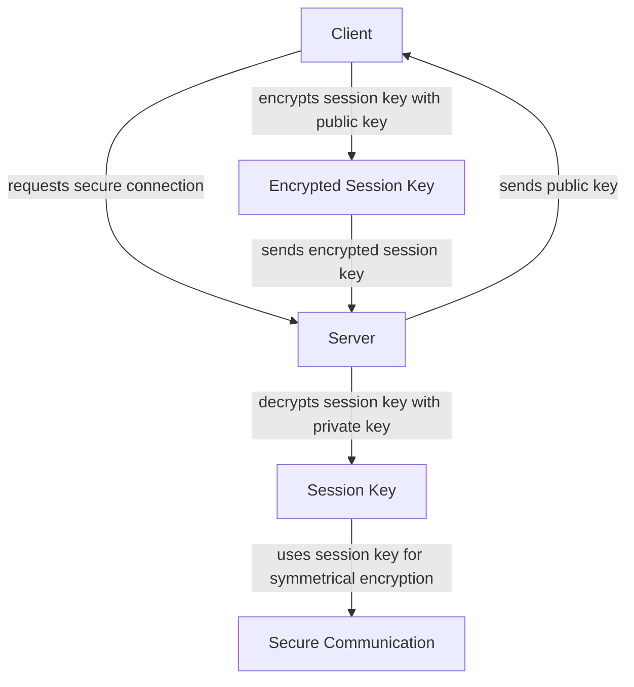

Cryptography is the backbone of secure communication over the internet, enabling confidential and authentic data exchange between parties. At its core, cryptography relies on two primary types of encryption: symmetrical and asymmetrical. Understanding the differences between these two methods is crucial for developers, security professionals, and anyone interested in cybersecurity. In this article, we'll delve into the fundamentals of symmetrical and asymmetrical cryptography, exploring their architectures, use cases, and the role they play in securing our digital world.

## Introduction to Symmetrical Cryptography
Symmetrical cryptography, also known as secret-key cryptography, uses the same secret key for both encryption and decryption. This method is fast and efficient, making it ideal for encrypting large volumes of data. The process involves the sender and receiver agreeing on a shared secret key before any data exchange occurs.

The benefits of symmetrical cryptography include high speed and low computational overhead, which are essential for real-time applications. However, managing and securely distributing the shared secret key can be challenging, especially in large-scale or public environments.

## Introduction to Asymmetrical Cryptography
Asymmetrical cryptography, or public-key cryptography, uses a pair of keys: a public key for encryption and a private key for decryption. This method allows for secure data exchange without the need for a shared secret key, making it particularly useful for authentication and digital signatures.

Asymmetrical cryptography provides a solution to the key distribution problem faced by symmetrical methods. It enables secure communication over an insecure channel without prior key exchange. However, it is computationally intensive and slower than symmetrical cryptography, which can impact performance in certain applications.

## Comparing Symmetrical and Asymmetrical Cryptography
To better understand the differences between symmetrical and asymmetrical cryptography, let's examine their key characteristics and use cases.

| **Characteristics** | **Symmetrical Cryptography** | **Asymmetrical Cryptography** |
| --- | --- | --- |
| **Key Usage** | Same key for encryption and decryption | Different keys for encryption (public) and decryption (private) |
| **Speed** | Fast | Slow due to high computational overhead |
| **Key Distribution** | Requires secure key distribution | No need for shared secret key |
| **Security** | Vulnerable to key exchange attacks | More secure due to separate keys for encryption and decryption |
| **Use Cases** | Bulk data encryption, real-time applications | Authentication, digital signatures, secure key exchange |

## Cryptographic Flow: Symmetrical and Asymmetrical Cryptography
The following Mermaid.js diagram illustrates the cryptographic flow for both symmetrical and asymmetrical methods:

## Real-World Applications and Architectures
Both symmetrical and asymmetrical cryptography are used in various real-world applications, including secure web browsing (HTTPS), virtual private networks (VPNs), and digital signatures. The choice between these methods depends on the specific requirements of the application, such as speed, security, and key management.

## Best Practices for Implementing Cryptography
When implementing cryptography in your applications, consider the following best practices:
- **Use established cryptographic libraries and frameworks** to ensure the correct implementation of algorithms and protocols.
- **Choose the appropriate cryptographic method** based on your application's requirements and constraints.
- **Manage keys securely**, using secure key storage and distribution mechanisms.
- **Regularly update and patch** your cryptographic libraries and frameworks to address known vulnerabilities.

> **Note:** Cryptography is a complex and constantly evolving field. Staying up-to-date with the latest developments, guidelines, and best practices is essential for ensuring the security of your applications.

## Visual Insights Gallery
The following images provide additional insights into the world of cryptography:

## Summary and Conclusion
Symmetrical and asymmetrical cryptography are the foundations of secure communication over the internet. Understanding their differences, advantages, and use cases is crucial for developers, security professionals, and anyone interested in cybersecurity. By applying the principles and best practices outlined in this article, you can ensure the security and integrity of your applications and data.

## Frequently Asked Questions (FAQ)
1. **What is the primary difference between symmetrical and asymmetrical cryptography?**
   - Symmetrical cryptography uses the same key for encryption and decryption, while asymmetrical cryptography uses a pair of keys: a public key for encryption and a private key for decryption.
2. **Which method is faster, symmetrical or asymmetrical cryptography?**
   - Symmetrical cryptography is generally faster due to its lower computational overhead.
3. **What are the primary use cases for symmetrical and asymmetrical cryptography?**
   - Symmetrical cryptography is often used for bulk data encryption and real-time applications, while asymmetrical cryptography is used for authentication, digital signatures, and secure key exchange.