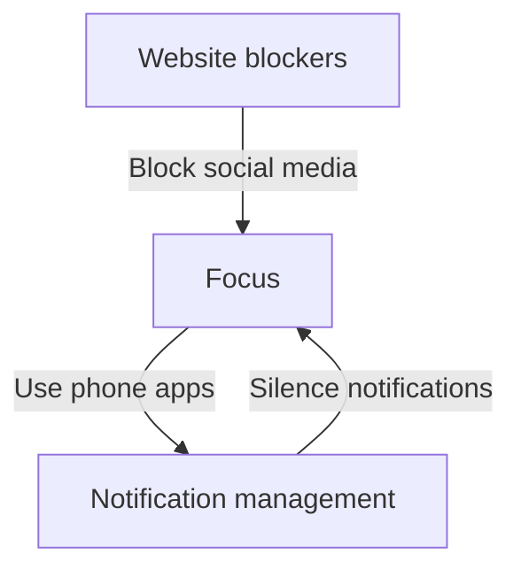

# Deep Work for Engineers: Building a Bulletproof Concentration Habit
In today's fast-paced, technology-driven world, the ability to focus without distraction is a highly valued skill, particularly for engineers who require intense concentration to solve complex problems. However, with the constant influx of notifications, emails, and meetings, it's becoming increasingly challenging to cultivate deep work habits. In this article, we'll delve into the concept of deep work, its benefits, and provide actionable strategies for engineers to build a bulletproof concentration habit.

## Introduction to Deep Work

Deep work refers to the ability to focus without distraction on a cognitively demanding task. It requires a state of flow, where one is fully immersed in the work, and their skills and knowledge are being utilized to the fullest. This concept was first introduced by Cal Newport in his book "Deep Work: Rules for Focused Success in a Distracted World." According to Newport, deep work is essential for producing high-quality work, especially in fields that require complex problem-solving, such as engineering.

## Benefits of Deep Work for Engineers

Deep work offers numerous benefits for engineers, including:
* Improved productivity: By minimizing distractions, engineers can complete tasks more efficiently and effectively.
* Enhanced problem-solving skills: Deep work allows engineers to fully engage with complex problems, leading to more innovative and effective solutions.
* Better work-life balance: By being more productive during work hours, engineers can avoid the need to work long hours or take work home, leading to a better balance between work and personal life.

## Strategies for Building a Deep Work Habit

To build a deep work habit, engineers can follow these strategies:
* **Schedule deep work sessions**: Set aside dedicated blocks of time for deep work, free from meetings and distractions.
* **Create a conducive work environment**: Eliminate or minimize distractions by turning off notifications, finding a quiet workspace, or using noise-cancelling headphones.
* **Use the Pomodoro Technique**: Work in focused 25-minute increments, followed by a 5-minute break, to stay focused and avoid burnout.

## Managing Distractions and Minimizing Interruptions

To minimize distractions and interruptions, engineers can:
* **Use website blockers**: Tools like Freedom or SelfControl can block social media, email, or other distracting websites during deep work sessions.
* **Implement notification management**: Turn off notifications for non-essential apps or use a tool like Notification Manager to silence notifications during focus time.
* **Communicate with team members**: Establish clear boundaries and expectations with colleagues to minimize interruptions during deep work sessions.

## Sustaining Deep Work Habits

To sustain deep work habits, engineers can:
* **Track progress**: Use a habit tracker or journal to monitor progress and identify areas for improvement.
* **Celebrate milestones**: Reward oneself for reaching deep work milestones, such as completing a challenging project or achieving a certain number of deep work hours.
* **Continuously evaluate and adjust**: Regularly assess the effectiveness of deep work habits and make adjustments as needed to ensure continued productivity and focus.

## Visual Insights Gallery
## Visual Insights Gallery

## Summary and Conclusion
In conclusion, deep work is a valuable skill for engineers, offering numerous benefits, including improved productivity, enhanced problem-solving skills, and a better work-life balance. By implementing strategies such as scheduling deep work sessions, creating a conducive work environment, and managing distractions, engineers can build a bulletproof concentration habit. Remember to track progress, celebrate milestones, and continuously evaluate and adjust deep work habits to ensure sustained productivity and focus.

## FAQ
Q: How long does it take to develop a deep work habit?
A: The time it takes to develop a deep work habit varies from person to person, but with consistent practice, most people can develop a deep work habit within 2-3 weeks.
Q: Can I do deep work in a noisy environment?
A: While it's possible to do deep work in a noisy environment, it's generally more challenging. Using noise-cancelling headphones or finding a quiet workspace can help minimize distractions.
Q: How can I stay motivated to continue practicing deep work?
A: Tracking progress, celebrating milestones, and reminding oneself of the benefits of deep work can help stay motivated and engaged in the practice.