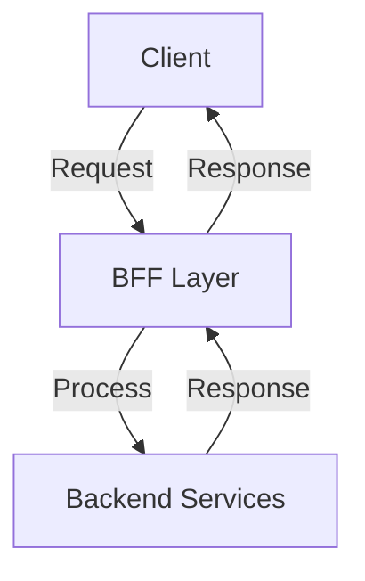
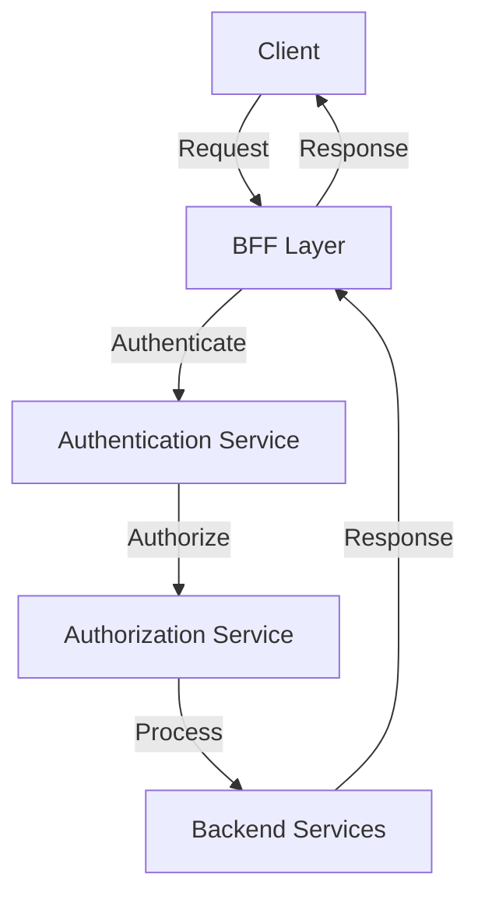

A well-designed BFF layer can significantly improve the performance, security, and maintainability of your application. In this article, we will delve into the world of BFF API layers, exploring their benefits, architecture, and best practices for implementation.

## Introduction to BFF API Layers
The Backend-for-Frontend (BFF) pattern is an architectural approach that involves creating a dedicated backend layer for each client or frontend application. This layer acts as an intermediary between the client and the backend services, providing a tailored API for the specific needs of the client.


## Benefits of BFF API Layers
The BFF pattern offers several benefits, including:
* Improved performance: By providing a dedicated API for each client, the BFF layer can optimize data transfer and reduce latency.
* Enhanced security: The BFF layer can implement security measures tailored to the specific needs of each client, such as authentication and authorization.
* Increased flexibility: The BFF pattern allows for easier maintenance and updates, as changes can be made at the BFF layer without affecting the underlying backend services.
```markdown
| Benefit | Description |
| --- | --- |
| Performance | Optimized data transfer and reduced latency |
| Security | Tailored security measures for each client |
| Flexibility | Easier maintenance and updates |
```

## Architecture of BFF API Layers
The architecture of a BFF API layer typically involves the following components:
* Client: The frontend application that interacts with the BFF layer.
* BFF Layer: The dedicated backend layer that provides a tailored API for the client.
* Backend Services: The underlying services that provide the necessary data and functionality.


## Implementing BFF API Layers
When implementing a BFF API layer, consider the following best practices:
* Keep the BFF layer thin and focused on its specific responsibilities.
* Use a standardized API framework to ensure consistency and ease of maintenance.
* Implement robust security measures, such as authentication and authorization.


## Common Challenges and Considerations
When designing and implementing a BFF API layer, be aware of the following common challenges and considerations:
* Complexity: The BFF pattern can add complexity to the overall architecture.
* Scalability: The BFF layer must be designed to scale with the client and backend services.
* Maintenance: The BFF layer requires regular maintenance and updates to ensure consistency and security.
> **Note:** A well-designed BFF layer can help mitigate these challenges and provide a robust and scalable architecture.

## Visual Insights Gallery
The following images provide additional insights into the design and implementation of BFF API layers:


## Summary and Conclusion
In conclusion, the BFF API layer is a powerful architectural pattern that can significantly improve the performance, security, and maintainability of your application. By understanding the benefits, architecture, and best practices for implementation, you can design and implement a robust and scalable BFF API layer that meets the specific needs of your clients and backend services.

## FAQ
* Q: What is the primary purpose of a BFF API layer?
A: The primary purpose of a BFF API layer is to provide a dedicated backend layer for each client or frontend application, acting as an intermediary between the client and the backend services.
* Q: What are the benefits of using a BFF API layer?
A: The benefits of using a BFF API layer include improved performance, enhanced security, and increased flexibility.
* Q: How do I implement a BFF API layer?
A: To implement a BFF API layer, consider keeping the layer thin and focused, using a standardized API framework, and implementing robust security measures.