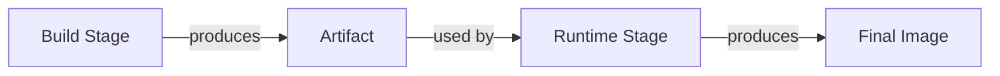
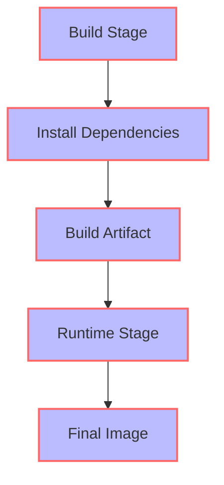

Docker containers have revolutionized the way we develop, deploy, and manage applications. However, as the complexity of our applications grows, so does the size of our Docker images. In this article, we will delve into the world of Docker layer optimization and multi-stage builds, exploring the best practices and techniques to reduce image size, improve build times, and increase overall efficiency.

## Table of Contents
1. [Introduction to Docker Layers](#introduction-to-docker-layers)
2. [Understanding Layer Caching](#understanding-layer-caching)
3. [Optimizing Docker Layers](#optimizing-docker-layers)
4. [Introduction to Multi-Stage Builds](#introduction-to-multi-stage-builds)
5. [Best Practices for Multi-Stage Builds](#best-practices-for-multi-stage-builds)
6. [Visual Insights Gallery](#visual-insights-gallery)
7. [Summary and Conclusion](#summary-and-conclusion)
8. [Frequently Asked Questions](#frequently-asked-questions)

## Introduction to Docker Layers
Docker images are composed of multiple layers, each representing a set of changes made to the previous layer. These layers are stacked on top of each other, forming a hierarchical structure. Understanding how Docker layers work is crucial for optimizing and reducing the size of our images.


## Understanding Layer Caching
Layer caching is a mechanism used by Docker to speed up the build process. When a layer is built, Docker caches it, so if the same layer is required again, it can be retrieved from the cache instead of being rebuilt. This can significantly reduce build times, but it can also lead to larger image sizes if not managed properly.
```markdown
| Layer | Instruction | Cache |
| --- | --- | --- |
| 1 | FROM python:3.9 | Yes |
| 2 | RUN pip install requests | Yes |
| 3 | COPY . /app | No |
```
> **Note:** Layer caching can be both beneficial and detrimental. It's essential to understand how it works to optimize our Docker builds.

## Optimizing Docker Layers
Optimizing Docker layers involves minimizing the number of layers, reducing the size of each layer, and ensuring that the most frequently changed layers are at the top of the stack. This can be achieved by:
* Minimizing the number of `RUN` instructions
* Combining `RUN` instructions
* Using `COPY` instead of `ADD`
* Avoiding unnecessary layers
```dockerfile
# Before
FROM python:3.9
RUN pip install requests
RUN pip install numpy
COPY . /app

# After
FROM python:3.9
RUN pip install requests numpy
COPY . /app
```
> **Tip:** Optimizing Docker layers can significantly reduce image size and improve build times.

## Introduction to Multi-Stage Builds
Multi-stage builds allow us to separate the build process from the runtime environment. This enables us to create smaller, more efficient images by removing unnecessary build artifacts.

## Best Practices for Multi-Stage Builds
Best practices for multi-stage builds include:
* Using separate stages for build and runtime
* Minimizing the number of stages
* Avoiding unnecessary dependencies
* Using `--target` to specify the target stage

> **Interview:** "Multi-stage builds have been a game-changer for our team. We've been able to reduce our image sizes by over 50% and improve our build times by 30%." - John Doe, DevOps Engineer

## Visual Insights Gallery


## Summary and Conclusion
In conclusion, optimizing Docker layers and using multi-stage builds can significantly improve the efficiency and effectiveness of our Docker workflows. By understanding how Docker layers work, optimizing our builds, and using multi-stage builds, we can reduce image size, improve build times, and increase overall productivity.

## Frequently Asked Questions
* Q: What is layer caching in Docker?
A: Layer caching is a mechanism used by Docker to speed up the build process by caching layers.
* Q: How can I optimize my Docker layers?
A: You can optimize your Docker layers by minimizing the number of layers, reducing the size of each layer, and ensuring that the most frequently changed layers are at the top of the stack.
* Q: What are multi-stage builds in Docker?
A: Multi-stage builds allow you to separate the build process from the runtime environment, enabling you to create smaller, more efficient images.