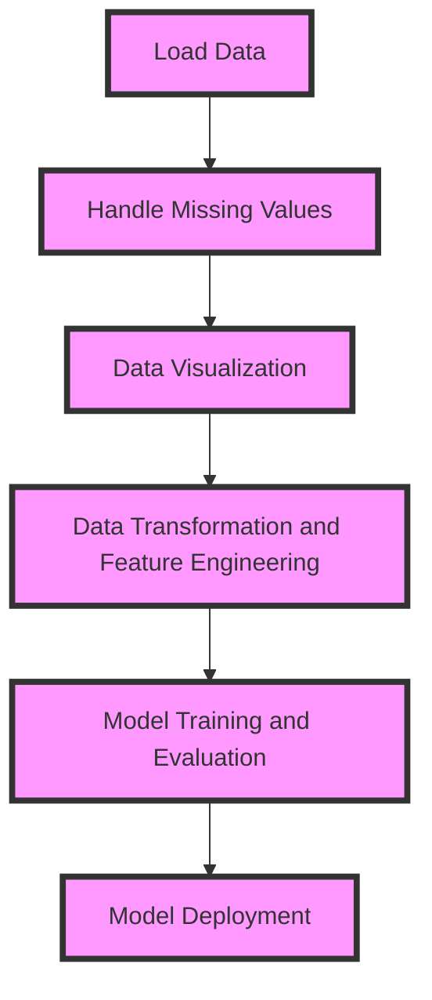
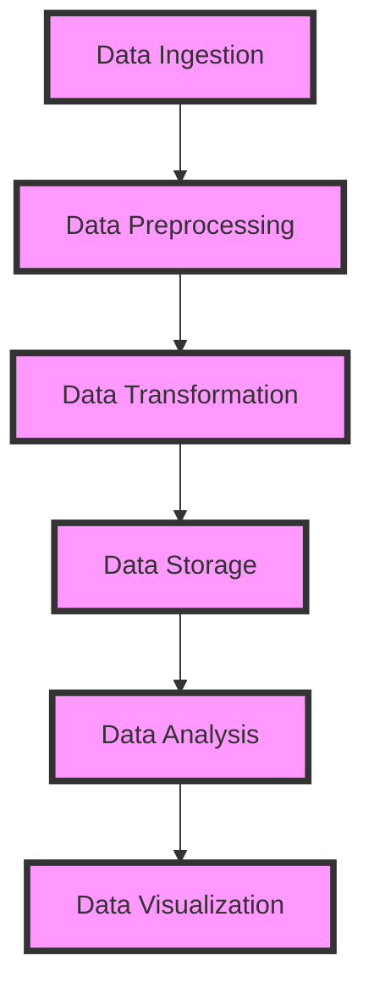

A comprehensive guide to mastering Exploratory Data Analysis (EDA) using Pandas for data science and machine learning applications.

## Introduction to Exploratory Data Analysis
Exploratory Data Analysis (EDA) is a crucial step in the data science workflow that involves visually and statistically examining data to understand its underlying patterns, relationships, and structure. In this article, we will delve into the best practices for performing EDA using Pandas, a popular Python library for data manipulation and analysis.


## Importing Libraries and Loading Data
To start with EDA, you need to import the necessary libraries and load your dataset. The following code snippet demonstrates how to import Pandas and load a sample dataset:
```python
import pandas as pd
import numpy as np
import matplotlib.pyplot as plt

# Load the sample dataset
data = pd.read_csv('sample_data.csv')
```
> **Tip:** Always verify the integrity of your data by checking for missing values, data types, and data ranges.

## Understanding Data Structure and Content
Understanding the structure and content of your data is essential for effective EDA. You can use the `head()`, `info()`, and `describe()` methods to get an overview of your data:
```python
# Display the first few rows of the data
print(data.head())

# Get information about the data
print(data.info())

# Calculate summary statistics
print(data.describe())
```


## Handling Missing Values
Missing values can significantly impact the accuracy of your analysis. You can use the `isnull()` method to identify missing values and the `dropna()` or `fillna()` methods to handle them:
```python
# Identify missing values
missing_values = data.isnull().sum()

# Drop rows with missing values
data.dropna(inplace=True)

# Fill missing values with a specific value
data.fillna(0, inplace=True)
```
> **Warning:** Be cautious when handling missing values, as it can introduce bias into your analysis.

## Data Visualization
Data visualization is a powerful tool for EDA, allowing you to identify patterns, relationships, and outliers. You can use libraries like Matplotlib and Seaborn to create a variety of visualizations:
```python
# Create a histogram
plt.hist(data['column_name'], bins=10)

# Create a scatter plot
plt.scatter(data['column_name1'], data['column_name2'])
```


## Data Transformation and Feature Engineering
Data transformation and feature engineering are critical steps in EDA, enabling you to extract relevant features and transform your data into a suitable format for analysis:
```python
# Scale numerical features
from sklearn.preprocessing import StandardScaler
scaler = StandardScaler()
data[['column_name1', 'column_name2']] = scaler.fit_transform(data[['column_name1', 'column_name2']])

# Encode categorical features
from sklearn.preprocessing import OneHotEncoder
encoder = OneHotEncoder()
data[['column_name3', 'column_name4']] = encoder.fit_transform(data[['column_name3', 'column_name4']])
```
> **Note:** Feature engineering requires domain knowledge and expertise to extract relevant features from your data.

## Mermaid.js Diagram: EDA Workflow

## Mermaid.js Diagram: Data Pipeline

## Visual Insights Gallery
### Image 1: Data Visualization

### Image 2: Data Transformation

### Image 3: Feature Engineering


## Summary and Conclusion
In this article, we have covered the best practices for performing Exploratory Data Analysis (EDA) using Pandas. By following these guidelines, you can ensure that your data is properly cleaned, transformed, and visualized, enabling you to extract valuable insights and make informed decisions.

## FAQ
1. **What is Exploratory Data Analysis (EDA)?**
Exploratory Data Analysis (EDA) is a process of visually and statistically examining data to understand its underlying patterns, relationships, and structure.
2. **Why is EDA important?**
EDA is essential for understanding the characteristics of your data, identifying potential issues, and informing the development of predictive models.
3. **What are the key steps in EDA?**
The key steps in EDA include data loading, handling missing values, data visualization, data transformation, and feature engineering.
4. **What tools can I use for EDA?**
You can use libraries like Pandas, Matplotlib, and Seaborn for EDA, as well as interactive visualization tools like Jupyter Notebooks and Tableau.