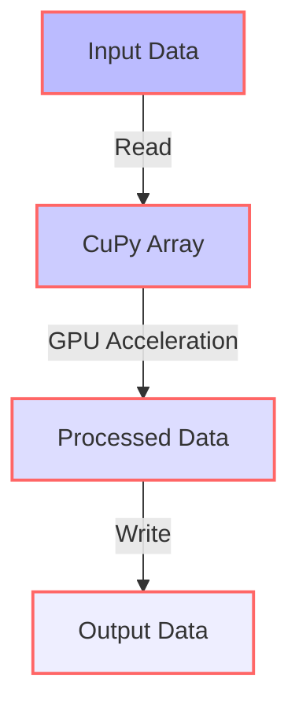
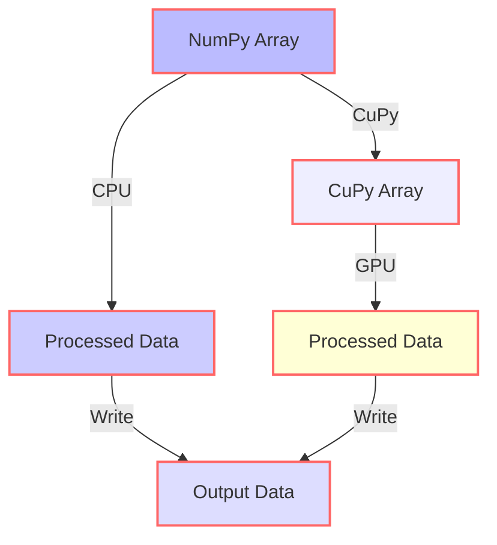

A compelling exploration of NumPy and CuPy for GPU acceleration in machine learning, providing a comprehensive overview of their strengths, weaknesses, and applications.

## Introduction
Machine learning has become a crucial aspect of modern data science, and its applications are diverse, ranging from image recognition to natural language processing. However, the computational requirements of machine learning algorithms can be substantial, making them time-consuming and resource-intensive. To address this challenge, GPU acceleration has emerged as a viable solution, enabling faster processing and reduced training times. In this article, we will delve into the world of GPU acceleration for machine learning, focusing on two popular libraries: NumPy and CuPy.

## Table of Contents
1. [Introduction to NumPy and CuPy](#introduction-to-numpy-and-cupy)
2. [GPU Acceleration with CuPy](#gpu-acceleration-with-cupy)
3. [Comparison of NumPy and CuPy](#comparison-of-numpy-and-cupy)
4. [Real-World Applications](#real-world-applications)
5. [Mermaid.js Diagrams for Architecture and Flow](#mermaidjs-diagrams-for-architecture-and-flow)
6. [Visual Insights Gallery](#visual-insights-gallery)
7. [Conclusion and FAQ](#conclusion-and-faq)

## Introduction to NumPy and CuPy

NumPy (Numerical Python) is a library for working with arrays and mathematical operations in Python. It is a fundamental package for scientific computing and data analysis. CuPy, on the other hand, is a GPU-accelerated version of NumPy, allowing users to perform computations on NVIDIA GPUs. CuPy's API is designed to be compatible with NumPy, making it easy to transition from CPU-based computations to GPU-accelerated ones.

## GPU Acceleration with CuPy

CuPy provides a significant performance boost for machine learning workloads by leveraging the massive parallel processing capabilities of GPUs. With CuPy, users can perform various operations, including matrix multiplications, element-wise operations, and reductions, all on the GPU. This leads to substantial speedups compared to traditional CPU-based computations.

```python
import cupy as cp

# Create a CuPy array
x = cp.array([1, 2, 3])

# Perform element-wise operation
y = x * 2

print(y)  # Output: [2 4 6]
```

## Comparison of NumPy and CuPy

While both libraries provide similar functionality, there are key differences between NumPy and CuPy. The primary distinction lies in their underlying architecture: NumPy operates on the CPU, whereas CuPy utilizes the GPU. This fundamental difference affects their performance, memory usage, and compatibility.

|  | NumPy | CuPy |
| --- | --- | --- |
| **Architecture** | CPU | GPU |
| **Performance** | Limited by CPU | Accelerated by GPU |
| **Memory** | Host memory | Device memory |
| **Compatibility** | Wide compatibility | Limited to NVIDIA GPUs |

## Real-World Applications

The benefits of GPU acceleration with CuPy can be seen in various real-world applications, including:

* **Deep learning**: CuPy can be used to accelerate the training of deep neural networks, leading to faster convergence and improved model performance.
* **Scientific simulations**: CuPy can be employed to simulate complex phenomena, such as fluid dynamics, climate modeling, and materials science.
* **Data analysis**: CuPy can be used to accelerate data processing and analysis tasks, including data cleaning, filtering, and visualization.

## Mermaid.js Diagrams for Architecture and Flow




## Visual Insights Gallery
## Visual Insights Gallery


## Conclusion and FAQ
In conclusion, CuPy offers a powerful solution for GPU acceleration in machine learning, providing a significant performance boost compared to traditional CPU-based computations. By leveraging the parallel processing capabilities of GPUs, CuPy enables faster training times, improved model performance, and increased productivity.

> **FAQ:**
> Q: What is the primary difference between NumPy and CuPy?
> A: The primary difference lies in their underlying architecture: NumPy operates on the CPU, whereas CuPy utilizes the GPU.
> Q: Can I use CuPy with any GPU?
> A: No, CuPy is currently limited to NVIDIA GPUs.
> Q: How do I transition from NumPy to CuPy?
> A: CuPy's API is designed to be compatible with NumPy, making it easy to transition from CPU-based computations to GPU-accelerated ones.