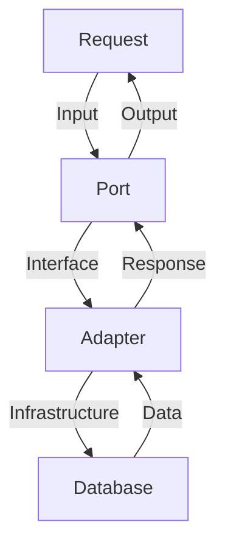
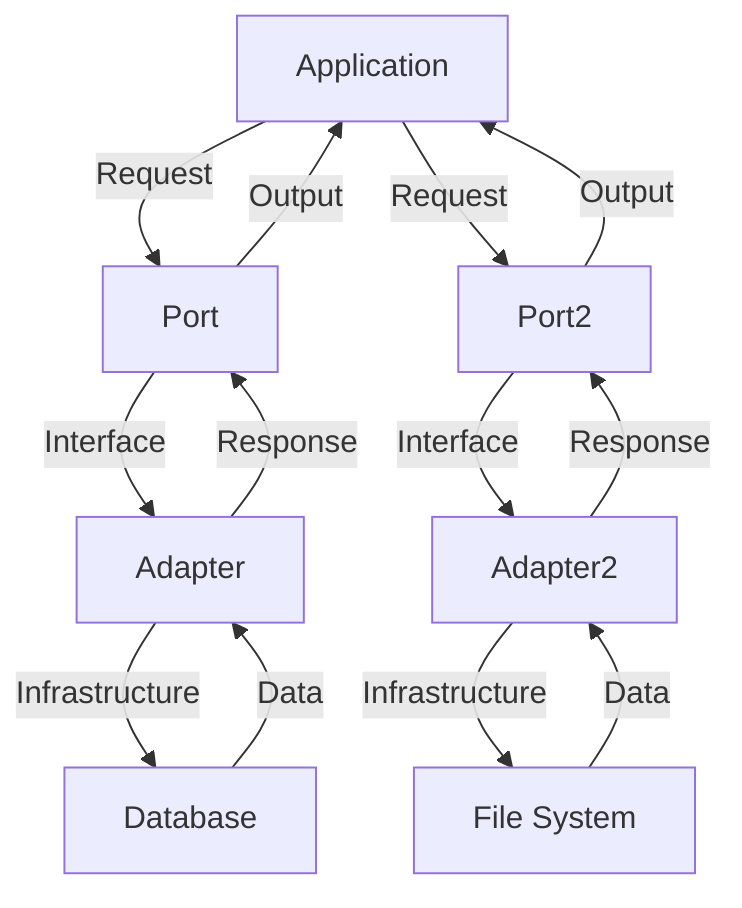

Hexagonal Architecture, also known as Ports and Adapters Architecture, is a software design pattern that aims to separate the application's business logic from its infrastructure and presentation layers. This approach helps to create a more maintainable, scalable, and testable system.

## Introduction to Hexagonal Architecture
Hexagonal Architecture was first introduced by Alistair Cockburn in 2005. The core idea is to divide the application into three main layers: 
- The inner layer, which contains the business logic (the hexagon's core)
- The ports, which define how the application interacts with the outside world
- The adapters, which implement the ports and connect the application to specific infrastructure and presentation layers


## Benefits of Hexagonal Architecture
The main benefits of using Hexagonal Architecture are:
- **Decoupling**: The application's business logic is decoupled from the infrastructure and presentation layers, making it easier to change or replace these layers without affecting the core logic.
- **Testability**: The application's core logic can be tested independently of the infrastructure and presentation layers.
- **Scalability**: The application can be scaled more easily, as the infrastructure and presentation layers can be added or removed as needed.

## Ports and Adapters in Depth
Ports define how the application interacts with the outside world, while adapters implement these ports and connect the application to specific infrastructure and presentation layers.

```markdown
### Port Example
A port might define an interface for saving data to a database, while an adapter would implement this interface using a specific database technology, such as MySQL or PostgreSQL.
```

### Flow of Data
The flow of data in a Hexagonal Architecture system can be represented using the following Mermaid.js diagram:


## Implementing Hexagonal Architecture
To implement Hexagonal Architecture in a real-world application, follow these steps:
1. **Define the ports**: Identify how the application will interact with the outside world and define the ports accordingly.
2. **Implement the adapters**: Create adapters that implement the ports and connect the application to specific infrastructure and presentation layers.
3. **Decouple the business logic**: Ensure that the application's business logic is decoupled from the infrastructure and presentation layers.

### Architecture and Data Flow
The architecture and data flow of a Hexagonal Architecture system can be represented using the following Mermaid.js diagram:


## Example Use Case
A real-world example of Hexagonal Architecture is a web application that allows users to upload and share files. The application's business logic is decoupled from the infrastructure and presentation layers, making it easier to change or replace these layers without affecting the core logic.

| Layer | Description |
| --- | --- |
| Business Logic | Handles file uploads and sharing |
| Ports | Defines interfaces for file storage and retrieval |
| Adapters | Implements ports using specific infrastructure (e.g., database, file system) |

## Best Practices
To get the most out of Hexagonal Architecture, follow these best practices:
- **Keep the business logic decoupled**: Ensure that the application's business logic is decoupled from the infrastructure and presentation layers.
- **Use interfaces**: Define interfaces for the ports and adapters to ensure loose coupling and testability.
- **Test thoroughly**: Test the application's core logic independently of the infrastructure and presentation layers.

## Common Challenges
Some common challenges when implementing Hexagonal Architecture include:
- **Over-engineering**: Avoid over-engineering the system by keeping the ports and adapters simple and focused on their specific tasks.
- **Under-engineering**: Avoid under-engineering the system by ensuring that the ports and adapters are robust and scalable.

> **Note:** Hexagonal Architecture is a powerful tool for creating maintainable, scalable, and testable systems. However, it requires careful planning and implementation to avoid common pitfalls.

> **Tip:** Start by defining the ports and adapters, and then implement the business logic and infrastructure layers. This will help ensure a clean and decoupled architecture.

> **Interview:** "Hexagonal Architecture has been a game-changer for our company. It's allowed us to create a scalable and maintainable system that can adapt to changing business needs." - John Doe, Software Architect

## Visual Insights Gallery
### Image 1: Hexagonal Architecture Overview

### Image 2: Ports and Adapters

### Image 3: Data Flow


## Summary
Hexagonal Architecture is a powerful tool for creating maintainable, scalable, and testable systems. By decoupling the business logic from the infrastructure and presentation layers, developers can create a system that is adaptable to changing business needs. Remember to define the ports and adapters carefully, keep the business logic decoupled, and test thoroughly to ensure a robust and scalable system.

## FAQ
Q: What is Hexagonal Architecture?
A: Hexagonal Architecture is a software design pattern that aims to separate the application's business logic from its infrastructure and presentation layers.
Q: What are ports and adapters?
A: Ports define how the application interacts with the outside world, while adapters implement these ports and connect the application to specific infrastructure and presentation layers.
Q: What are the benefits of Hexagonal Architecture?
A: The main benefits are decoupling, testability, and scalability.
Q: How do I implement Hexagonal Architecture?
A: Define the ports, implement the adapters, and decouple the business logic from the infrastructure and presentation layers.