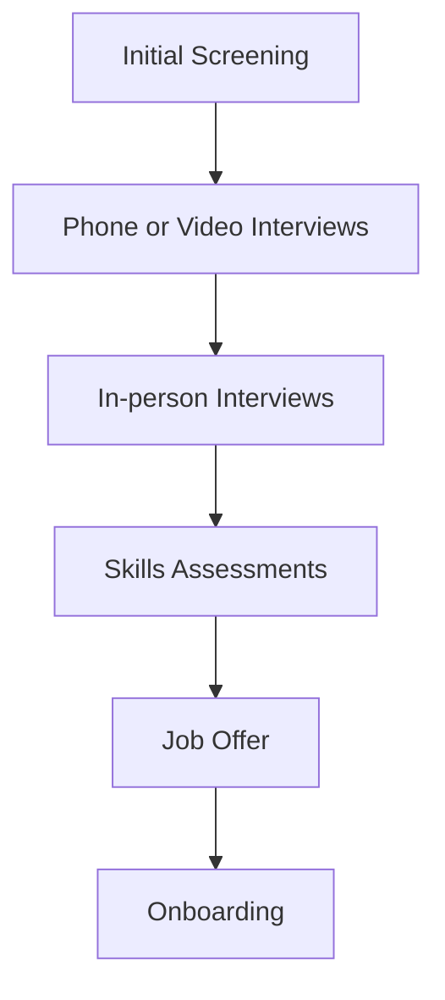
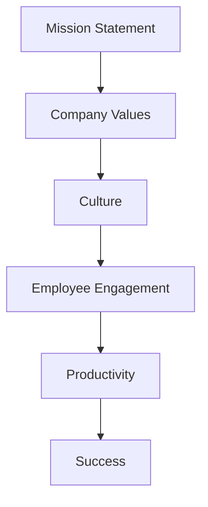

As a solo founder, reaching the point where you need to hire your first employee is a significant milestone. It indicates that your business is growing and requires more hands to manage the workload. However, hiring the right person can be a daunting task, especially if you have no prior experience in human resources or leadership. In this article, we will provide a comprehensive guide on how to hire your first employee, including the preparation, recruitment process, and post-hiring considerations.

## Preparation is Key
Before you start looking for your first employee, it's essential to prepare your business for the new hire. This includes defining the role, creating a job description, and determining the compensation package. 


You should also consider the company culture and values you want to establish. As a solo founder, you may have been used to working independently, but with an employee on board, you need to create a positive and productive work environment.

## Defining the Role and Job Description
Defining the role and creating a job description are critical steps in the hiring process. You need to identify the key responsibilities and skills required for the position. This will help you attract the right candidates and ensure that you hire someone who can perform the tasks efficiently.
```markdown
### Job Description Template
- Job Title: 
- Company: 
- Location: 
- Job Type: 
- About the Company: 
- Job Description: 
- Responsibilities: 
- Requirements: 
```
You can use the above template as a starting point to create your job description. Make sure to tailor it to your business needs and the specific role you are hiring for.

## Recruitment Process
The recruitment process can be time-consuming, but with a clear plan, you can find the right candidate for the job. You can use various channels to advertise the position, such as:
- Social media
- Job boards
- Employee referrals
- Professional networks


You should also consider the interview process and how you will evaluate the candidates. This may include:
- Initial screening
- Phone or video interviews
- In-person interviews
- Skills assessments

### Interview Process Flow

This flowchart illustrates the interview process, from initial screening to onboarding. You can customize it according to your business needs and the role you are hiring for.

## Post-Hiring Considerations
After hiring your first employee, you need to consider several factors to ensure a smooth transition and a productive work environment. This includes:
- Onboarding process
- Training and development
- Performance management
- Company culture and values


You should also establish clear communication channels and set expectations for the employee's role and responsibilities.

### Company Culture and Values

This graph illustrates the importance of company culture and values in achieving success. As a solo founder, it's essential to establish a positive and productive work environment that aligns with your business goals.

## Visual Insights Gallery
## Visual Insights Gallery


## Summary and Conclusion
Hiring your first employee is a significant milestone for any solo founder. It requires careful preparation, a well-planned recruitment process, and post-hiring considerations to ensure a smooth transition and a productive work environment. By following the guidelines outlined in this article, you can find the right candidate for the job and set your business up for success.

## FAQ
- Q: What is the most important factor to consider when hiring my first employee?
  A: The most important factor is to define the role and create a clear job description that outlines the key responsibilities and skills required for the position.
- Q: How do I establish a positive company culture and values?
  A: You can establish a positive company culture and values by creating a mission statement, defining your company values, and promoting a culture that aligns with your business goals.
- Q: What is the best way to evaluate candidates during the interview process?
  A: The best way to evaluate candidates is to use a combination of initial screening, phone or video interviews, in-person interviews, and skills assessments to get a comprehensive understanding of their skills and fit for the role.