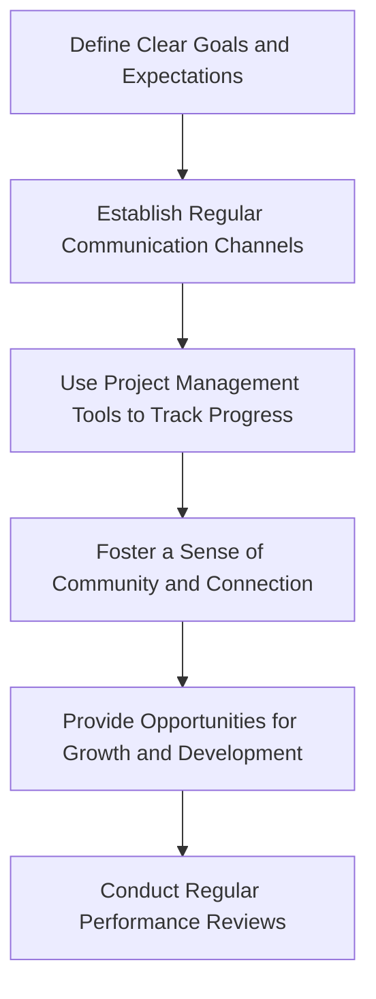

## Part 2: Advanced Hiring Strategies for Solo Founders
Hiring your first employee is a significant milestone for any solo founder, marking a new chapter in the growth and development of your business. However, as your company expands, so do the complexities of managing a team. In this article, we will delve into advanced hiring strategies, exploring edge cases, and providing a deeper dive into the architecture of building a high-performing team.

### Beyond the Basics: Advanced Recruitment Techniques
As your business grows, you'll need to adapt your recruitment strategy to attract top talent. This includes leveraging social media, employee referrals, and niche job boards to reach a wider audience.


You can also consider partnering with recruitment agencies or utilizing AI-powered recruitment tools to streamline the hiring process.

### Building a Diverse and Inclusive Team
Creating a diverse and inclusive team is crucial for driving innovation and growth. As a solo founder, it's essential to recognize the importance of diversity and take steps to build a team that reflects your company's values.
```markdown
### Diversity and Inclusion Checklist
- Develop a diversity and inclusion policy
- Provide training on unconscious bias
- Create a safe and respectful work environment
- Encourage open communication and feedback
- Celebrate different cultures and perspectives
```
By prioritizing diversity and inclusion, you can foster a positive and productive work environment that attracts and retains top talent.

### Managing Remote Teams: Strategies for Success
With the rise of remote work, many solo founders are opting to hire remote employees to expand their talent pool. However, managing a remote team requires a different set of skills and strategies.

By following these strategies, you can effectively manage a remote team and ensure that your employees are productive, motivated, and engaged.

### Navigating Complex HR Issues
As your team grows, you'll inevitably encounter complex HR issues that require careful navigation. This includes managing conflicts, handling employee complaints, and ensuring compliance with labor laws.


It's essential to develop a comprehensive HR strategy that includes policies and procedures for addressing these issues.

### Measuring Success: Key Performance Indicators (KPIs) for Your Team
To evaluate the success of your hiring strategy, you need to establish key performance indicators (KPIs) that measure the performance of your team. This includes metrics such as employee satisfaction, retention rates, and productivity.
```markdown
### KPI Template
- Employee Satisfaction: 
- Retention Rate: 
- Productivity: 
- Time-to-Hire: 
- Cost-per-Hire: 
```
By tracking these KPIs, you can identify areas for improvement and make data-driven decisions to optimize your hiring strategy.

## Visual Insights Gallery
Here are some additional visual insights to help you deepen your understanding of advanced hiring strategies:
- [Recruitment Funnel](https://picsum.photos/seed/recruitment-funnel/800/400)
- [Diversity and Inclusion Infographic](https://picsum.photos/seed/diversity-and-inclusion-infographic/800/400)
- [Remote Team Management Dashboard](https://picsum.photos/seed/remote-team-management-dashboard/800/400)