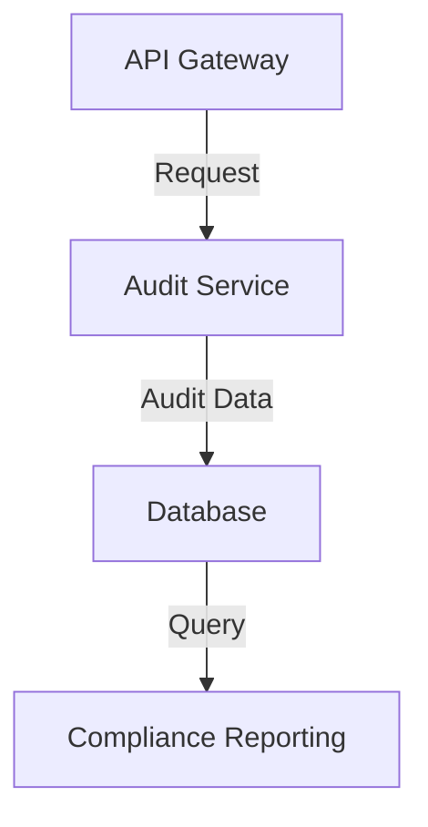
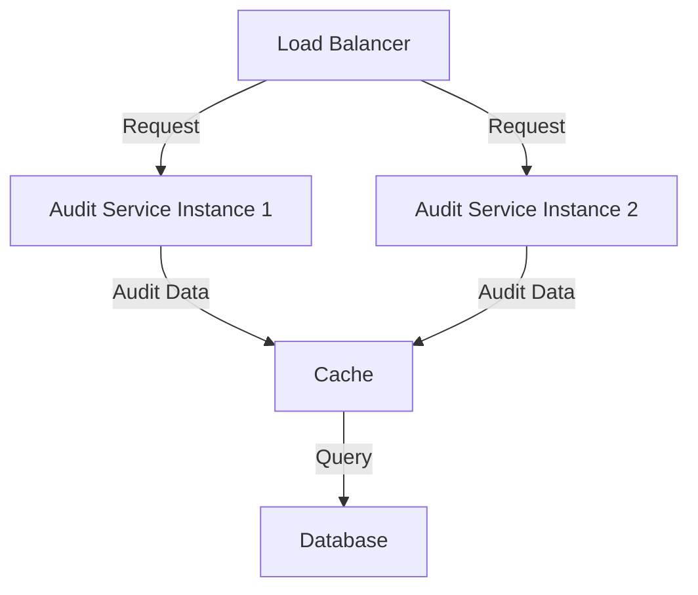

In the finance and fintech industry, maintaining a robust audit trail is crucial for compliance and risk management. As our company grew, we faced the challenge of scaling our audit trail to support millions of requests. In this article, we will share our journey, the strategies we employed, and the technologies we used to achieve this goal.

## Table of Contents
1. [Introduction to Audit Trails](#introduction-to-audit-trails)
2. [Challenges of Scaling](#challenges-of-scaling)
3. [Designing a Scalable Architecture](#designing-a-scalable-architecture)
4. [Implementing a Distributed Database](#implementing-a-distributed-database)
5. [Handling High Traffic](#handling-high-traffic)
6. [Visual Insights Gallery](#visual-insights-gallery)
7. [Summary and Conclusion](#summary-and-conclusion)
8. [FAQ](#faq)

## Introduction to Audit Trails
An audit trail is a record of all changes made to a system, including user interactions, data modifications, and system events. It provides a clear picture of what happened, when, and who was involved. In the finance and fintech industry, audit trails are essential for compliance with regulations such as SOX, PCI-DSS, and GDPR.

## Challenges of Scaling
As our company grew, our audit trail faced several challenges:
- **High volume of requests**: Our system handled millions of requests per day, generating a large amount of audit data.
- **Data storage**: Storing and managing this vast amount of data became a significant challenge.
- **Performance**: Our audit trail needed to support fast query performance to ensure timely compliance reporting.
> **Note:** To address these challenges, we needed a scalable architecture that could handle high volumes of data and provide fast query performance.

## Designing a Scalable Architecture
We designed a scalable architecture using a microservices approach, with each service responsible for a specific function. Our architecture consisted of the following components:
- **API Gateway**: Handles incoming requests and routes them to the appropriate service.
- **Audit Service**: Responsible for collecting and storing audit data.
- **Database**: Stores audit data and provides query functionality.

## Implementing a Distributed Database
We implemented a distributed database to store our audit data. This allowed us to scale our database horizontally and handle high volumes of data. We used a NoSQL database that provided flexible schema design and high performance.

## Handling High Traffic
To handle high traffic, we used a load balancer to distribute incoming requests across multiple instances of our audit service. We also implemented caching to reduce the load on our database and improve query performance.

> **Tip:** Use caching to reduce the load on your database and improve query performance.

## Visual Insights Gallery
The following images provide a visual representation of our audit trail architecture and the technologies we used.

## Summary and Conclusion
Scaling our audit trail to support millions of requests required a scalable architecture, a distributed database, and a load balancer. By using these technologies and strategies, we were able to handle high volumes of data and provide fast query performance. Our experience can serve as a guide for other companies facing similar challenges in the finance and fintech industry.

## FAQ
1. **What is an audit trail?**
An audit trail is a record of all changes made to a system, including user interactions, data modifications, and system events.
2. **Why is an audit trail important in the finance and fintech industry?**
An audit trail is essential for compliance with regulations such as SOX, PCI-DSS, and GDPR.
3. **What are the challenges of scaling an audit trail?**
The challenges of scaling an audit trail include handling high volumes of data, storing and managing this data, and providing fast query performance.