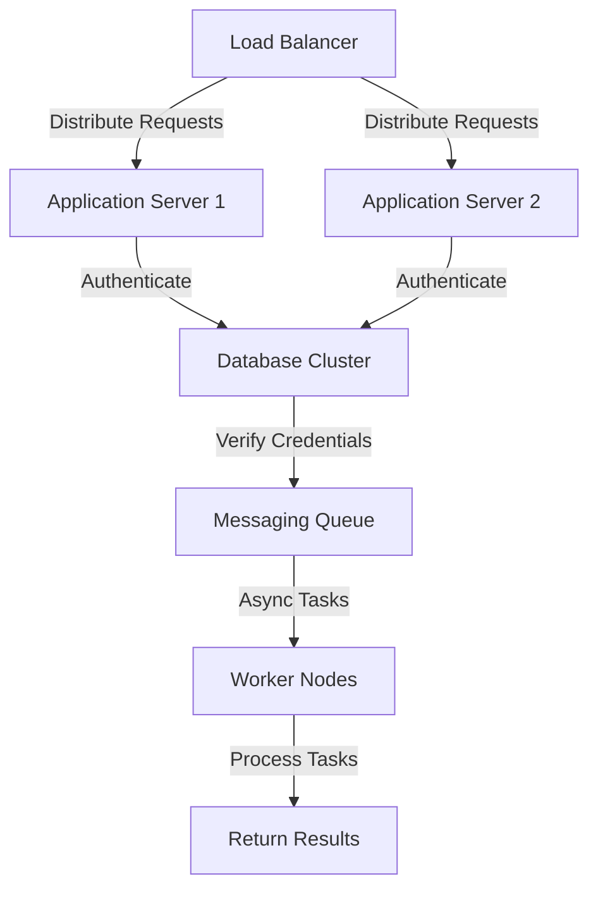
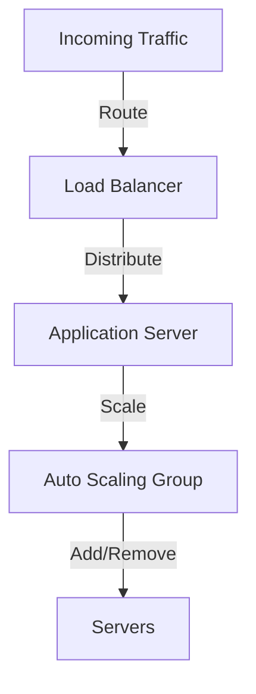

In the ever-evolving landscape of cybersecurity, the importance of robust authentication protocols cannot be overstated. As our platform grew to serve a vast user base, we faced the daunting task of scaling our authentication system to handle millions of requests without compromising on security or performance. This article delves into the strategies, architectures, and technologies we employed to achieve this monumental feat.

## Table of Contents
1. [Introduction to Scalable Authentication](#introduction-to-scalable-authentication)
2. [Architecture Overview](#architecture-overview)
3. [Implementing Load Balancing and Auto Scaling](#implementing-load-balancing-and-auto-scaling)
4. [Database Optimization for Authentication Data](#database-optimization-for-authentication-data)
5. [Security Considerations and Best Practices](#security-considerations-and-best-practices)
6. [Conclusion and Future Directions](#conclusion-and-future-directions)
7. [Visual Insights Gallery](#visual-insights-gallery)
8. [FAQ](#faq)

## Introduction to Scalable Authentication
Scalable authentication is the backbone of any secure and reliable online service. It ensures that only authorized users can access the system and its resources, without introducing bottlenecks that could hinder the user experience. Our journey to scaling our authentication protocol began with a thorough analysis of our existing infrastructure and identifying areas that could be optimized for better performance and security.

## Architecture Overview
Our authentication system's architecture is designed with scalability and security in mind. The core components include a load balancer, application servers, a database cluster for storing user credentials, and a messaging queue for handling asynchronous tasks. This setup allows us to distribute incoming requests efficiently across multiple servers, ensuring no single point of failure and enabling seamless horizontal scaling.

## Implementing Load Balancing and Auto Scaling
Load balancing and auto-scaling are crucial for handling fluctuating traffic and ensuring that our authentication system remains responsive under heavy loads. We utilize cloud providers' load balancing services, which offer advanced features like session persistence, SSL termination, and integration with auto-scaling groups. This allows us to dynamically adjust the number of application servers based on real-time traffic conditions.

## Database Optimization for Authentication Data
The database is a critical component of our authentication system, storing sensitive user credentials and authentication data. To optimize database performance, we employ several strategies, including indexing, query optimization, and regular backups. Additionally, we use a database cluster to ensure high availability and distribute read traffic efficiently.

> **Tip:** Regularly review and optimize database queries to reduce latency and improve overall system performance.

## Security Considerations and Best Practices
Security is paramount in authentication systems. We follow best practices such as encrypting data at rest and in transit, using secure password hashing algorithms, and implementing rate limiting to prevent brute-force attacks. Regular security audits and penetration testing help identify vulnerabilities before they can be exploited.

> **Warning:** Never store plaintext passwords or use weak hashing algorithms, as they can be easily compromised.

## Conclusion and Future Directions
Scaling our authentication protocol to support millions of requests has been a challenging yet rewarding journey. By leveraging scalable architectures, load balancing, auto-scaling, database optimization, and robust security practices, we have created a highly reliable and secure authentication system. As we continue to grow, we will explore new technologies and strategies to further enhance our system's performance and security.

## Visual Insights Gallery
### Architecture Diagrams

### Performance Metrics

## FAQ
1. **What is the primary goal of scalable authentication?**
   - The primary goal is to ensure that the authentication system can handle a large volume of requests without compromising on security or performance.
2. **How do you optimize database performance for authentication data?**
   - Strategies include indexing, query optimization, regular backups, and using a database cluster for high availability and efficient read traffic distribution.
3. **What security best practices should be followed in authentication systems?**
   - Best practices include encrypting data, using secure password hashing, implementing rate limiting, and conducting regular security audits and penetration testing.