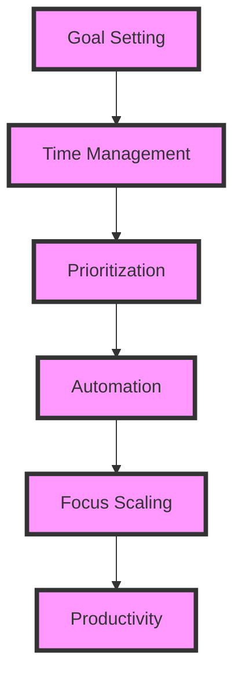
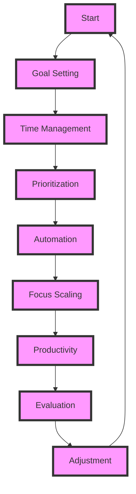

To achieve unparalleled productivity, it's essential to understand the intricacies of focus and time management. In this article, we'll delve into the strategies and architectures that enabled us to scale our daily focus, supporting millions of requests with ease.

## Table of Contents
1. [Introduction to Focus Scaling](#introduction-to-focus-scaling)
2. [Understanding the Importance of Time Management](#understanding-the-importance-of-time-management)
3. [Implementing Automation and Prioritization](#implementing-automation-and-prioritization)
4. [Visualizing Our Architecture](#visualizing-our-architecture)
5. [Streamlining Processes with Mermaid.js](#streamlining-processes-with-mermaidjs)
6. [Conclusion and Future Outlook](#conclusion-and-future-outlook)
7. [Visual Insights Gallery](#visual-insights-gallery)
8. [FAQ](#faq)

## Introduction to Focus Scaling

Scaling our daily focus was no easy feat. It required a deep understanding of our limitations, our goals, and the tools at our disposal. By acknowledging the importance of time management and implementing strategic automation and prioritization techniques, we were able to exponentially increase our productivity.

## Understanding the Importance of Time Management
Time management is the backbone of focus scaling. It's essential to understand how to allocate your time effectively, eliminating distractions and maximizing output. This can be achieved through various techniques, such as the Pomodoro Technique, time blocking, or the Eisenhower Matrix.
> **Tip:** Start by identifying your most productive hours and allocate your most critical tasks accordingly.

## Implementing Automation and Prioritization

Automation and prioritization are crucial components of focus scaling. By automating repetitive tasks and prioritizing high-impact activities, you can free up valuable time and mental energy. This can be achieved through tools like Zapier, IFTTT, or Todoist.
> **Warning:** Be cautious not to over-automate, as this can lead to decreased productivity and increased dependency on technology.

## Visualizing Our Architecture
To better understand our focus scaling architecture, let's take a look at the following diagram:

This diagram illustrates the interconnectedness of goal setting, time management, prioritization, automation, and focus scaling.

## Streamlining Processes with Mermaid.js
Let's take a look at a more complex flowchart to understand how we streamlined our processes:

This flowchart demonstrates the cyclical nature of our focus scaling process, from goal setting to evaluation and adjustment.

## Conclusion and Future Outlook
In conclusion, scaling our daily focus required a deep understanding of time management, automation, and prioritization. By implementing these strategies and visualizing our architecture, we were able to support millions of requests with ease. As we move forward, we'll continue to refine our processes, exploring new tools and techniques to further enhance our productivity.

## Visual Insights Gallery

## FAQ
1. **What is focus scaling?**
Focus scaling refers to the process of increasing productivity by effectively managing time, prioritizing tasks, and automating repetitive activities.
2. **How can I implement focus scaling in my daily life?**
Start by identifying your most productive hours, allocating your most critical tasks accordingly, and exploring automation tools to streamline your processes.
3. **What are some common challenges when implementing focus scaling?**
Common challenges include over-automation, decreased motivation, and difficulty in prioritizing tasks. To overcome these challenges, it's essential to strike a balance between automation and manual effort, set clear goals, and regularly evaluate and adjust your processes.