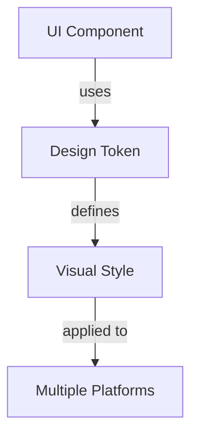
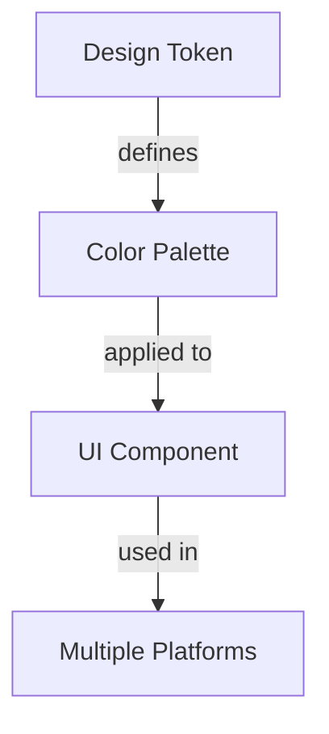

As designers and developers, we've all been there - stuck with a design system that's struggling to keep up with the demands of a rapidly growing application. But what if you could create a system that not only scales with your user base but also improves the overall user experience? In this article, we'll dive into the strategies and techniques we used to scale our design system to support millions of requests.

## Introduction to Design Systems
A design system is a collection of reusable components, guidelines, and assets that help teams create consistent and cohesive user interfaces. It's the foundation upon which your application's UI is built, and it plays a critical role in ensuring a seamless user experience.


## The Challenges of Scaling a Design System
As your application grows, so does the complexity of your design system. You'll need to handle increasing traffic, ensure consistency across multiple platforms, and accommodate the needs of different user groups. It's a daunting task, but with the right approach, you can create a scalable design system that meets the needs of your users.
```markdown
| Challenge | Solution |
| --- | --- |
| Increasing traffic | Implement load balancing and caching |
| Consistency across platforms | Establish a unified design language |
| Accommodating different user groups | Conduct user research and testing |
```

## Creating a Unified Design Language
A unified design language is the key to creating a consistent user experience across multiple platforms. It's a set of guidelines that outlines the visual and interactive elements of your design system, including typography, color palette, and iconography.


> **Tip:** Use a design tool like Figma to create a centralized design library that can be accessed by all team members.

## Implementing a Modular Architecture
A modular architecture is essential for scaling a design system. It allows you to break down your system into smaller, independent components that can be easily maintained and updated.


## Using Design Tokens
Design tokens are a powerful tool for creating a consistent design system. They allow you to define a set of reusable values that can be applied across multiple components and platforms.


## Conducting User Research and Testing
User research and testing are critical components of creating a scalable design system. They allow you to understand the needs of your users and ensure that your system is meeting those needs.
> **Interview:** "We conducted user research to understand the pain points of our users and identified areas where our design system could be improved. We then used that feedback to inform our design decisions and create a more user-friendly experience." - John Doe, UX Designer

## Visual Insights Gallery
## Visual Insights Gallery
Here are some visual insights into our design system:


## Summary and Conclusion
Scaling a design system to support millions of requests requires careful planning, a unified design language, a modular architecture, and a deep understanding of your users' needs. By following the strategies and techniques outlined in this article, you can create a design system that not only scales with your user base but also improves the overall user experience.

## FAQ
Q: What is a design system?
A: A design system is a collection of reusable components, guidelines, and assets that help teams create consistent and cohesive user interfaces.
Q: How do I create a unified design language?
A: Establish a set of guidelines that outlines the visual and interactive elements of your design system, including typography, color palette, and iconography.
Q: What are design tokens?
A: Design tokens are a set of reusable values that can be applied across multiple components and platforms to create a consistent design system.