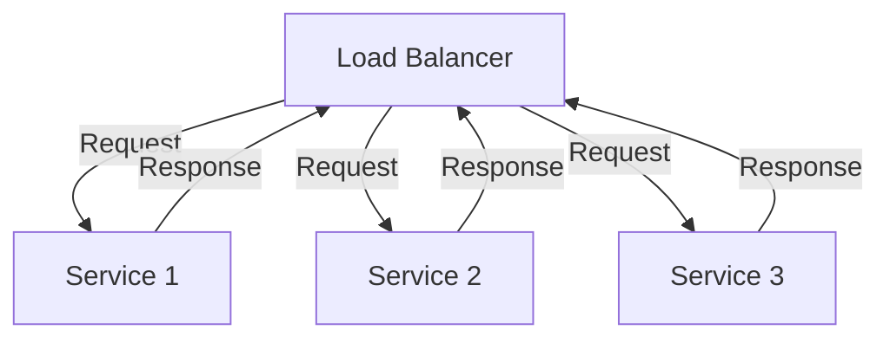
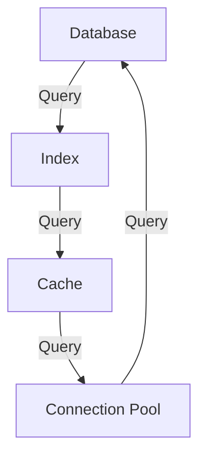

As the demand for our services skyrocketed, our team had to adapt and evolve to meet the increasing load. In this article, we will delve into the strategies and techniques that enabled us to scale our engineering management and support millions of requests.

## Table of Contents
1. [Introduction to Scaling](#introduction-to-scaling)
2. [Assessing Current Infrastructure](#assessing-current-infrastructure)
3. [Implementing Microservices Architecture](#implementing-microservices-architecture)
4. [Optimizing Database Performance](#optimizing-database-performance)
5. [Enhancing Monitoring and Logging](#enhancing-monitoring-and-logging)
6. [Visual Insights Gallery](#visual-insights-gallery)
7. [Conclusion](#conclusion)
8. [FAQ](#faq)

## Introduction to Scaling
To scale our engineering management, we first needed to understand the current state of our infrastructure and identify areas for improvement. 

> **Note:** Scaling is not just about increasing resources, but also about optimizing existing ones.

## Assessing Current Infrastructure
We conducted a thorough assessment of our current infrastructure, including servers, databases, and networks. This helped us identify bottlenecks and areas where we could improve performance.
```markdown
| Component | Current Capacity | Required Capacity |
| --- | --- | --- |
| Servers | 10 | 50 |
| Databases | 5 | 20 |
| Networks | 1 Gbps | 10 Gbps |
```
> **Tip:** Use data to drive your scaling decisions, rather than relying on assumptions.

## Implementing Microservices Architecture
To improve scalability, we adopted a microservices architecture. This allowed us to break down our monolithic application into smaller, independent services that could be scaled individually.

> **Warning:** Microservices can add complexity, so make sure to monitor and log effectively.

## Optimizing Database Performance
We optimized our database performance by implementing indexing, caching, and connection pooling. This significantly improved query performance and reduced latency.

> **Interview:** Our database administrator noted that "optimizing database performance was crucial in handling the increased load."

## Enhancing Monitoring and Logging
We enhanced our monitoring and logging capabilities to ensure that we could quickly identify and respond to issues. This included implementing distributed tracing and logging tools.
```markdown
| Tool | Description |
| --- | --- |
| Prometheus | Monitoring and alerting |
| Grafana | Visualization and dashboards |
| ELK Stack | Logging and log analysis |
```
> **Note:** Monitoring and logging are critical in identifying performance bottlenecks and areas for improvement.

## Visual Insights Gallery
### Images of our infrastructure and tools


## Conclusion
Scaling our engineering management to support millions of requests required a combination of strategic planning, technical expertise, and continuous monitoring. By adopting a microservices architecture, optimizing database performance, and enhancing monitoring and logging, we were able to improve our system's scalability and reliability.

## FAQ
1. **What is the most important factor in scaling engineering management?**
The most important factor is understanding your current infrastructure and identifying areas for improvement.
2. **How can I optimize my database performance?**
Implement indexing, caching, and connection pooling to improve query performance and reduce latency.
3. **What tools can I use for monitoring and logging?**
Consider using tools like Prometheus, Grafana, and ELK Stack for monitoring and logging.