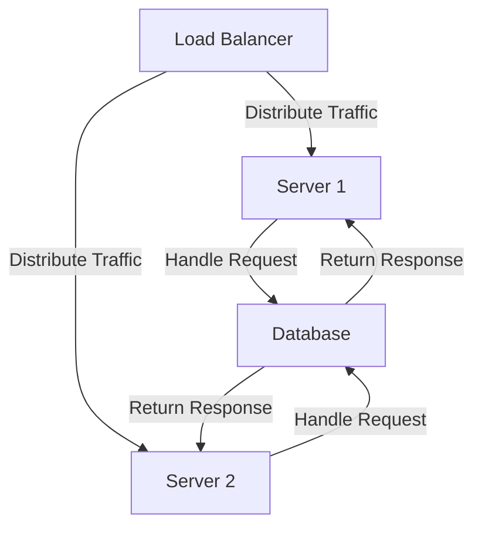
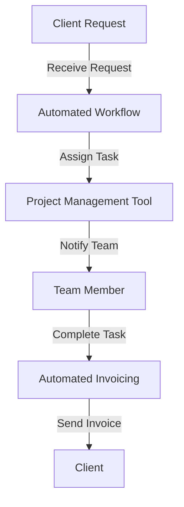

As freelancers, we often start with a simple setup, handling a few clients and projects at a time. However, as our businesses grow, so does the complexity of our operations. In this article, we'll explore how we scaled our freelance roadmap to support millions of requests, and provide actionable tips for you to do the same.

## Table of Contents
1. [Introduction to Scaling](#introduction-to-scaling)
2. [Assessing Current Infrastructure](#assessing-current-infrastructure)
3. [Designing a Scalable Architecture](#designing-a-scalable-architecture)
4. [Implementing Automation and Efficiency](#implementing-automation-and-efficiency)
5. [Monitoring and Optimization](#monitoring-and-optimization)
6. [Visual Insights Gallery](#visual-insights-gallery)
7. [Summary and Conclusion](#summary-and-conclusion)
8. [FAQ](#faq)

## Introduction to Scaling
Scaling a freelance business is not just about handling more clients or projects; it's about creating a system that can efficiently manage increased demand without compromising quality. To achieve this, we need to reassess our current infrastructure and identify areas for improvement.


## Assessing Current Infrastructure
Before we can scale, we need to understand our current setup. This includes evaluating our:
- Project management tools
- Communication channels
- Time tracking and invoicing systems
- Client onboarding process
By assessing these areas, we can identify bottlenecks and areas for improvement.
```markdown
| Tool/Process | Current State | Areas for Improvement |
| --- | --- | --- |
| Project Management | Manual tracking | Automate task assignments and deadlines |
| Communication | Email and phone | Implement a centralized messaging system |
| Time Tracking | Manual logging | Integrate automated time tracking with invoicing |
| Client Onboarding | Paper-based contracts | Digitalize contracts and onboarding process |
```

## Designing a Scalable Architecture
A scalable architecture is crucial for supporting millions of requests. This involves designing a system that can handle increased traffic and demand without breaking down. We can achieve this by:
- Implementing load balancing to distribute traffic across multiple servers
- Using cloud services for scalability and reliability
- Designing a microservices architecture for flexibility and maintainability


## Implementing Automation and Efficiency
Automation is key to scaling a freelance business. By automating repetitive tasks and implementing efficient processes, we can free up time to focus on high-value tasks.


## Implementing Automation and Efficiency
To further enhance our workflow, we can implement tools such as:
- Zapier for automating workflows between different apps
- Trello for visual project management
- Calendly for scheduling meetings and appointments
> **Tip:** Automate as much as possible, but don't forget to review and adjust your workflows regularly to ensure they're still efficient and effective.

## Monitoring and Optimization
Monitoring our systems and processes is crucial for identifying areas for improvement. By tracking key metrics such as:
- Response time
- Error rate
- Client satisfaction
We can optimize our systems and processes to ensure they're running smoothly and efficiently.
```markdown
| Metric | Current Value | Target Value |
| --- | --- | --- |
| Response Time | 2 seconds | 1 second |
| Error Rate | 5% | 1% |
| Client Satisfaction | 80% | 90% |
```

## Visual Insights Gallery
Here are some visual insights into our scaling journey:


## Summary and Conclusion
Scaling a freelance business to support millions of requests requires careful planning, execution, and monitoring. By assessing our current infrastructure, designing a scalable architecture, implementing automation and efficiency, and monitoring and optimizing our systems, we can create a freelance business that can handle increased demand without compromising quality.

## FAQ
Q: What are the key areas to focus on when scaling a freelance business?
A: The key areas to focus on when scaling a freelance business are project management, communication, time tracking and invoicing, and client onboarding.
Q: How can I automate my workflows?
A: You can automate your workflows using tools such as Zapier, Trello, and Calendly.
Q: What metrics should I track to optimize my systems and processes?
A: You should track metrics such as response time, error rate, and client satisfaction to optimize your systems and processes.