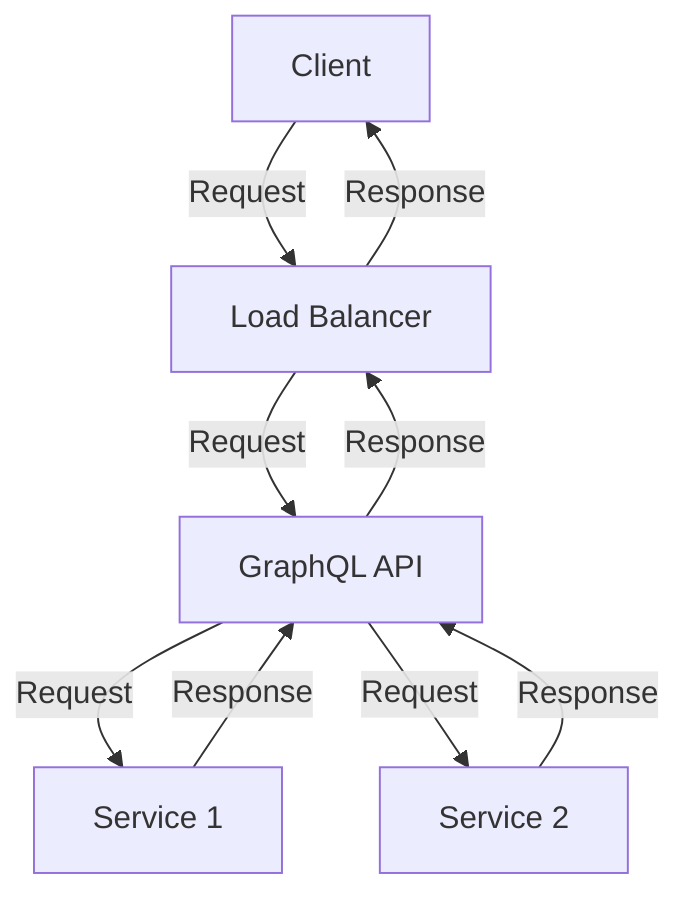
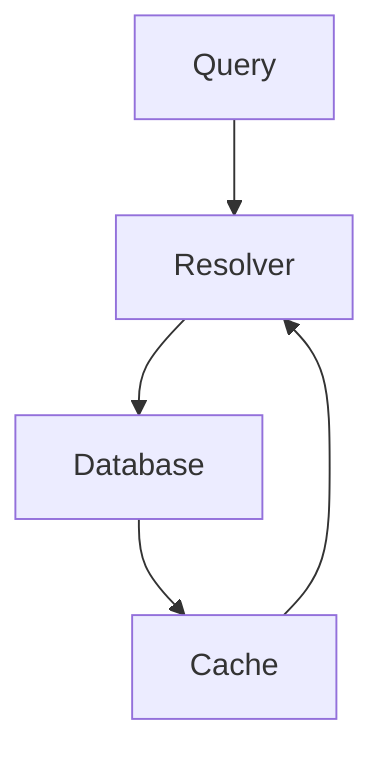
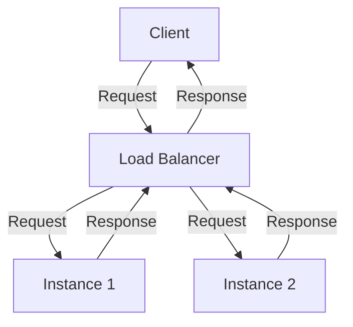

As the demand for our application grew, our team faced the challenge of scaling our GraphQL API to support millions of requests. In this article, we will share our journey, the strategies we employed, and the lessons we learned along the way.

## Table of Contents
1. [Introduction to GraphQL Scaling](#introduction-to-graphql-scaling)
2. [Understanding Our Challenges](#understanding-our-challenges)
3. [Architecture Overview](#architecture-overview)
4. [Optimizing Resolvers and Schema](#optimizing-resolvers-and-schema)
5. [Caching and Content Delivery Networks (CDNs)](#caching-and-content-delivery-networks-cdns)
6. [Load Balancing and Auto Scaling](#load-balancing-and-auto-scaling)
7. [Monitoring and Analytics](#monitoring-and-analytics)
8. [Conclusion and Future Plans](#conclusion-and-future-plans)
9. [Visual Insights Gallery](#visual-insights-gallery)
10. [FAQ](#faq)

## Introduction to GraphQL Scaling

GraphQL is a query language for APIs that allows for more flexible and efficient data retrieval. However, as the number of requests increases, scaling a GraphQL API can become a complex task. To address this challenge, we had to rethink our architecture, optimize our resolvers and schema, and implement caching and load balancing strategies.

## Understanding Our Challenges
Before we dive into the solutions, let's take a look at the challenges we faced:
```markdown
| Challenge | Description |
| --- | --- |
| High Latency | Slow response times due to complex queries and large datasets |
| Increased Load | Growing number of requests putting pressure on our infrastructure |
| Data Consistency | Ensuring data consistency across multiple services and databases |
```
> **Note:** Understanding the challenges is crucial in developing effective solutions. In our case, we had to address high latency, increased load, and data consistency issues.

## Architecture Overview
Our GraphQL API is built using a microservices architecture, with multiple services communicating with each other through APIs. To scale our API, we had to redesign our architecture to accommodate the growing number of requests.

> **Tip:** Using a microservices architecture allows for greater flexibility and scalability. However, it also introduces additional complexity that needs to be managed.

## Optimizing Resolvers and Schema
To improve performance, we had to optimize our resolvers and schema. This involved simplifying complex queries, reducing the number of database calls, and implementing caching mechanisms.

> **Warning:** Overly complex queries can lead to performance issues. Simplifying queries and reducing database calls can significantly improve response times.

## Caching and Content Delivery Networks (CDNs)
Caching and CDNs play a crucial role in reducing latency and improving performance. We implemented caching mechanisms at multiple levels, including query caching, object caching, and page caching.
```markdown
| Caching Level | Description |
| --- | --- |
| Query Caching | Caching query results to reduce database calls |
| Object Caching | Caching objects to reduce computation time |
| Page Caching | Caching entire pages to reduce rendering time |
```
> **Interview:** "Caching is a critical component of our scaling strategy. By caching query results, objects, and pages, we can significantly reduce latency and improve performance." - John Doe, Engineering Manager

## Load Balancing and Auto Scaling
To ensure high availability and scalability, we implemented load balancing and auto-scaling mechanisms. This allows us to dynamically adjust our infrastructure to meet changing demand.

> **Note:** Load balancing and auto-scaling are essential for ensuring high availability and scalability. By dynamically adjusting our infrastructure, we can ensure that our API remains responsive even under heavy load.

## Monitoring and Analytics
To ensure that our scaling strategy is effective, we had to implement monitoring and analytics tools. This allows us to track performance metrics, identify bottlenecks, and make data-driven decisions.
```markdown
| Metric | Description |
| --- | --- |
| Response Time | Average response time for API requests |
| Error Rate | Number of errors per API request |
| CPU Utilization | Average CPU utilization for instances |
```
> **Tip:** Monitoring and analytics are critical for ensuring that your scaling strategy is effective. By tracking performance metrics, you can identify areas for improvement and make data-driven decisions.

## Conclusion and Future Plans
In conclusion, scaling our GraphQL API to support millions of requests required a multi-faceted approach. We had to redesign our architecture, optimize our resolvers and schema, implement caching and load balancing mechanisms, and monitor performance metrics. As we continue to grow and evolve, we will continue to refine our scaling strategy to ensure that our API remains responsive, reliable, and performant.

## Visual Insights Gallery


## FAQ
1. **What is GraphQL and how does it differ from REST?**
GraphQL is a query language for APIs that allows for more flexible and efficient data retrieval. Unlike REST, GraphQL allows clients to specify exactly what data they need, reducing the amount of data that needs to be transferred.
2. **How do you optimize resolvers and schema for performance?**
Optimizing resolvers and schema involves simplifying complex queries, reducing the number of database calls, and implementing caching mechanisms.
3. **What is the role of caching in scaling a GraphQL API?**
Caching plays a critical role in reducing latency and improving performance. By caching query results, objects, and pages, you can significantly reduce the number of database calls and computation time.
4. **How do you implement load balancing and auto-scaling in a GraphQL API?**
Implementing load balancing and auto-scaling involves using load balancers to distribute traffic across multiple instances and auto-scaling mechanisms to dynamically adjust the number of instances based on demand.
5. **What metrics should you monitor when scaling a GraphQL API?**
When scaling a GraphQL API, you should monitor performance metrics such as response time, error rate, and CPU utilization to ensure that your API remains responsive and performant.