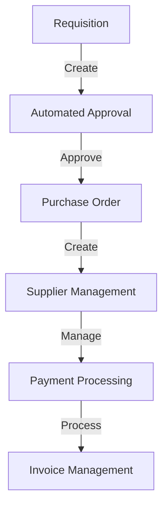
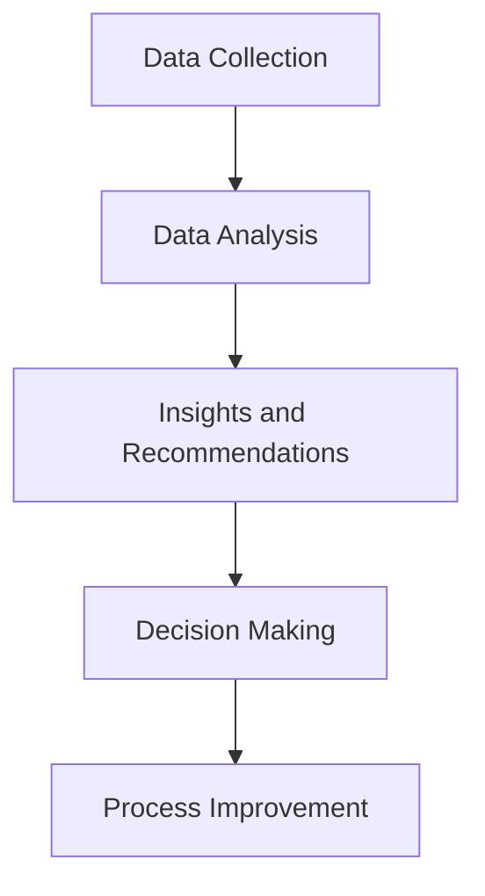

As a rapidly growing SaaS company, our procurement process was put to the test when we started receiving millions of requests. In this article, we'll delve into the strategies and technologies we used to scale our procurement process, ensuring seamless and efficient operations.

## Table of Contents
1. [Introduction to Procurement Scaling](#introduction-to-procurement-scaling)
2. [Identifying Bottlenecks in the Procurement Process](#identifying-bottlenecks-in-the-procurement-process)
3. [Implementing Automated Workflows](#implementing-automated-workflows)
4. [Data-Driven Decision Making](#data-driven-decision-making)
5. [Visual Insights Gallery](#visual-insights-gallery)
6. [Summary and Conclusion](#summary-and-conclusion)
7. [FAQ](#faq)

## Introduction to Procurement Scaling

When our company started experiencing rapid growth, our procurement process was faced with unprecedented challenges. We had to adapt quickly to support the increasing demand, ensuring that our operations remained efficient and scalable. This involved re-evaluating our existing workflows, identifying bottlenecks, and implementing new technologies to streamline our procurement process.

## Identifying Bottlenecks in the Procurement Process
To scale our procurement process effectively, we first needed to identify the bottlenecks that were hindering our operations. This involved analyzing our existing workflows, from requisition to payment, and pinpointing areas where manual intervention was causing delays.
```markdown
| Bottleneck | Description | Solution |
| --- | --- | --- |
| Manual Requisition | Manual creation of requisitions | Automated requisition workflow |
| Approval Delays | Delayed approvals from managers | Automated approval workflows |
| Supplier Management | Manual supplier management | Supplier relationship management (SRM) system |
```
By addressing these bottlenecks, we were able to reduce processing times, increase efficiency, and improve the overall procurement experience.

## Implementing Automated Workflows

To streamline our procurement process, we implemented automated workflows using a combination of tools and technologies. This included:

By automating these workflows, we were able to reduce manual errors, increase processing speeds, and improve the overall efficiency of our procurement process.

## Implementing Data-Driven Decision Making

To make informed decisions about our procurement process, we implemented a data-driven approach using analytics and reporting tools. This involved:

By leveraging data and analytics, we were able to identify areas for improvement, optimize our procurement process, and make informed decisions about our operations.

## Visual Insights Gallery
## Visual Insights Gallery


## Summary and Conclusion
In conclusion, scaling our procurement process to support millions of requests required a combination of strategic planning, technological innovation, and data-driven decision making. By identifying bottlenecks, implementing automated workflows, and leveraging data analytics, we were able to streamline our procurement process, improve efficiency, and support the growth of our business.

## FAQ
> **Q: What are the key challenges in scaling a procurement process?**
> A: The key challenges in scaling a procurement process include identifying bottlenecks, implementing automated workflows, and leveraging data analytics to inform decision making.
> **Q: How can automated workflows improve the procurement process?**
> A: Automated workflows can improve the procurement process by reducing manual errors, increasing processing speeds, and improving overall efficiency.
> **Q: What role does data analytics play in procurement scaling?**
> A: Data analytics plays a critical role in procurement scaling by providing insights and recommendations that inform decision making and drive process improvement.