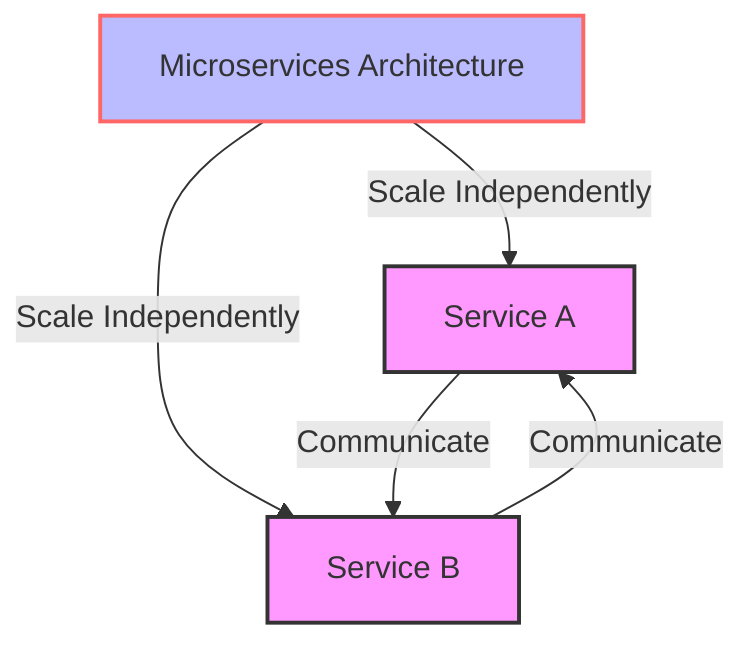
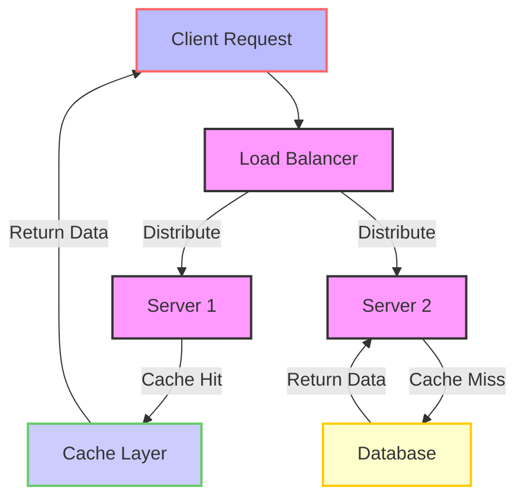

In the competitive landscape of startups and SaaS companies, achieving product-market fit is a significant milestone. However, the real challenge begins when this fit needs to scale to support millions of requests, ensuring that the growth is sustainable and the quality of service remains high. This article delves into the strategies, architectures, and decisions we made to scale our product-market fit, providing actionable insights for entrepreneurs and technical leaders facing similar challenges.

## Table of Contents
1. [Introduction to Scaling Product-Market Fit](#introduction-to-scaling-product-market-fit)
2. [Understanding the Challenges of Scaling](#understanding-the-challenges-of-scaling)
3. [Architectural Changes for Scalability](#architectural-changes-for-scalability)
4. [Implementing Efficient Data Management](#implementing-efficient-data-management)
5. [Optimizing for Performance](#optimizing-for-performance)
6. [Security and Compliance Considerations](#security-and-compliance-considerations)
7. [Visual Insights Gallery](#visual-insights-gallery)
8. [Summary and Conclusion](#summary-and-conclusion)
9. [FAQ](#faq)

## Introduction to Scaling Product-Market Fit
Achieving product-market fit is a crucial step for any startup or SaaS company, indicating that the product satisfies the needs of its target market. However, as the user base grows, the system must be able to handle increased traffic, data, and requests efficiently. 

## Understanding the Challenges of Scaling
Scaling is not just about handling more requests; it involves ensuring that the system remains reliable, secure, and performant under increased load. Key challenges include:
- **Horizontal Scaling**: The ability to add more resources (e.g., servers) as the load increases.
- **Vertical Scaling**: Increasing the power of existing resources (e.g., upgrading server hardware).
- **Data Management**: Efficiently handling the growth in data volume and complexity.
- **Security and Compliance**: Maintaining high security standards and compliance with relevant regulations as the system grows.

## Architectural Changes for Scalability
To scale our product-market fit, we adopted a microservices architecture, which allowed us to develop, deploy, and scale individual components of our application independently. This approach enabled us to:

## Implementing Efficient Data Management
Efficient data management is crucial for scalability. We implemented a distributed database system that could handle large volumes of data and scale horizontally as needed. Additionally, we used caching mechanisms to reduce the load on our databases and improve response times.

## Optimizing for Performance
Optimizing for performance involved several strategies, including:
- **Code Optimization**: Improving the efficiency of our codebase.
- **Resource Optimization**: Ensuring that resources such as CPU, memory, and network bandwidth are utilized efficiently.
- **Content Delivery Networks (CDNs)**: Using CDNs to reduce latency by caching content at edge locations closer to users.

## Security and Compliance Considerations
As we scaled, maintaining high security standards and ensuring compliance with relevant regulations was paramount. This included implementing robust security measures such as encryption, access controls, and regular security audits.

## Visual Insights Gallery
### System Architecture

### Data Flow

### Scalability Model

## Summary and Conclusion
Scaling a product-market fit to support millions of requests requires careful planning, strategic architectural decisions, and a focus on efficiency, security, and performance. By adopting a microservices architecture, implementing efficient data management, optimizing for performance, and prioritizing security and compliance, we were able to successfully scale our product to meet the growing demands of our user base.

## FAQ
1. **What is product-market fit?**
   - Product-market fit refers to the situation where a product satisfies the needs of its target market, indicating a potential for significant growth.
2. **Why is scaling a challenge?**
   - Scaling is challenging because it requires handling increased traffic, data, and requests efficiently while maintaining reliability, security, and performance.
3. **What is a microservices architecture?**
   - A microservices architecture is a software development technique that structures an application as a collection of small, independent services, each responsible for a specific business capability.