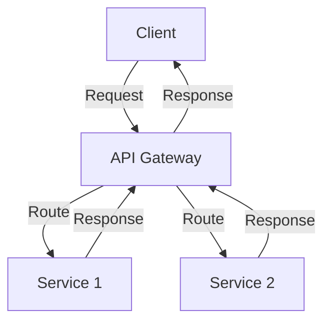
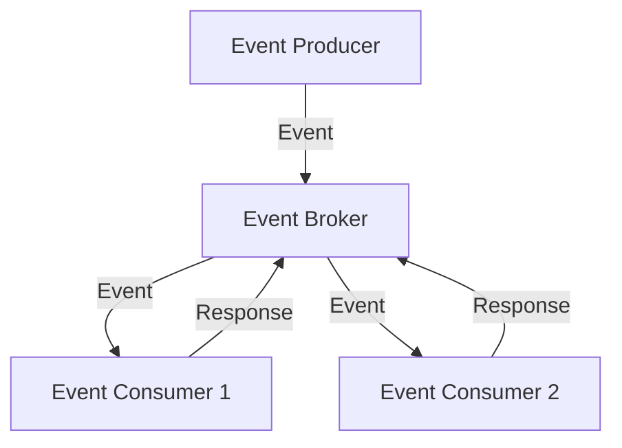

## Introduction to Advanced Scaling Strategies
In the first part of this series, we explored the foundational strategies and architectures for scaling product-market fit. However, as the complexity and scale of operations increase, so do the challenges. This article dives into advanced architectural patterns, edge cases, and deeper technical insights necessary for sustaining growth and ensuring high-quality service.

## Deep Dive into Microservices Architecture
A microservices architecture is a popular choice for scalable systems, allowing for the decomposition of a monolithic application into smaller, independent services. Each service is designed to perform a specific business capability and can be developed, tested, and deployed independently.

## Edge Cases in Distributed Systems
Distributed systems introduce a new set of challenges, including handling failures, managing consistency, and dealing with network partitions. Understanding and addressing these edge cases is crucial for building a robust and scalable system.

## Implementing Event-Driven Architecture
Event-driven architecture (EDA) is a design pattern that emphasizes producing, processing, and reacting to events. EDA can help improve scalability, flexibility, and maintainability by decoupling services and allowing for greater autonomy.

## Advanced Data Management Strategies
As data volumes increase, so does the need for efficient data management strategies. This includes implementing data caching, using data lakes, and applying data compression techniques to reduce storage costs and improve query performance.

## Optimizing for Performance at Scale
Optimizing for performance at scale requires a deep understanding of system bottlenecks, network latency, and resource utilization. Techniques such as load balancing, autoscaling, and database indexing can help improve system responsiveness and throughput.

## Security and Compliance in Scalable Systems
As systems scale, so does the attack surface. Implementing robust security measures, such as encryption, access controls, and monitoring, is essential for protecting sensitive data and ensuring compliance with regulatory requirements.

## Visual Insights Gallery
The following images provide additional visual insights into the concepts discussed in this article.

## Summary and Conclusion
Scaling product-market fit to support millions of requests requires a deep understanding of advanced architectural patterns, edge cases, and technical insights. By applying the strategies and techniques outlined in this article, entrepreneurs and technical leaders can build robust, scalable, and high-quality systems that meet the needs of their growing user base.

## FAQ
Q: What is the primary benefit of using a microservices architecture?
A: The primary benefit of using a microservices architecture is the ability to develop, test, and deploy services independently, allowing for greater flexibility and scalability.
Q: How can event-driven architecture improve system scalability?
A: Event-driven architecture can improve system scalability by decoupling services and allowing for greater autonomy, making it easier to add or remove services as needed.
Q: What is the importance of security and compliance in scalable systems?
A: Security and compliance are crucial in scalable systems to protect sensitive data and ensure adherence to regulatory requirements, reducing the risk of data breaches and reputational damage.