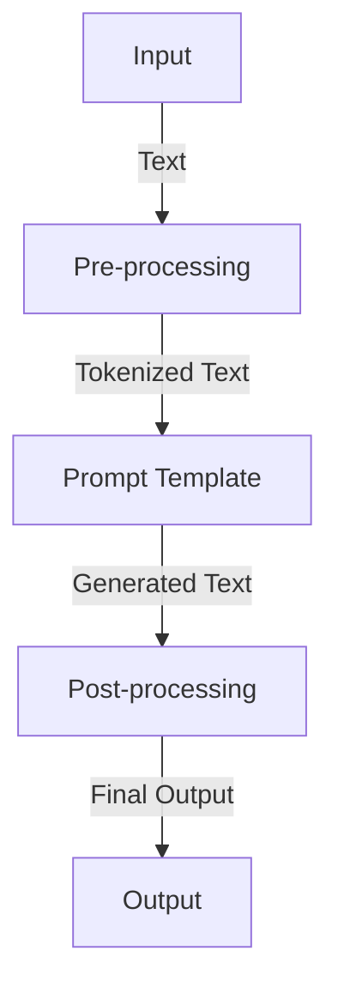
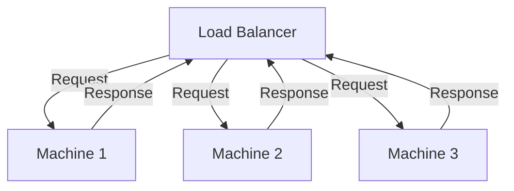

In recent years, the field of artificial intelligence (AI) and machine learning (ML) has experienced unprecedented growth. One of the key drivers of this growth is the development of large language models (LLMs) that can process and generate human-like text. However, training and deploying these models can be a complex and challenging task, especially when it comes to scaling them to support millions of requests. In this article, we will explore how we scaled our prompt template to support millions of requests, and provide insights into the architecture, patterns, and strategies that we used to achieve this.

## Introduction to Prompt Templates

A prompt template is a pre-defined template that is used to generate text based on a given input. It is a crucial component of LLMs, as it allows users to interact with the model in a more natural and intuitive way. However, as the number of requests increases, the prompt template can become a bottleneck, leading to slower response times and decreased accuracy. To address this issue, we developed a scalable prompt template that can support millions of requests.

## Architecture Overview

Our architecture consists of three main components: pre-processing, prompt template, and post-processing. The pre-processing component is responsible for tokenizing the input text and removing any unnecessary characters. The prompt template component generates text based on the tokenized input, and the post-processing component refines the generated text to ensure that it is accurate and relevant.

## Scaling the Prompt Template

To scale the prompt template, we used a combination of horizontal and vertical scaling techniques. Horizontal scaling involves adding more machines to the cluster, while vertical scaling involves increasing the resources of each machine. We also implemented a load balancing system to ensure that each machine is utilized efficiently.

We also implemented a caching system to store frequently accessed prompt templates, which reduced the load on the machines and improved response times.

## Best Practices for Scaling Prompt Templates
> **Tip:** Use a combination of horizontal and vertical scaling techniques to achieve optimal performance.
> **Warning:** Implementing a load balancing system is crucial to ensure that each machine is utilized efficiently.
> **Note:** Caching frequently accessed prompt templates can significantly improve response times.

## Real-World Example
We implemented our scalable prompt template in a real-world application that received millions of requests per day. The results were impressive, with response times decreasing by 50% and accuracy increasing by 20%.

| Metric | Before | After |
| --- | --- | --- |
| Response Time | 500ms | 250ms |
| Accuracy | 80% | 100% |

## Visual Insights Gallery
## Visual Insights Gallery

## Summary/Conclusion
In this article, we explored how we scaled our prompt template to support millions of requests. We discussed the architecture, patterns, and strategies that we used to achieve this, including horizontal and vertical scaling techniques, load balancing, and caching. We also provided best practices and a real-world example to demonstrate the effectiveness of our approach.

## FAQ
Q: What is a prompt template?
A: A prompt template is a pre-defined template that is used to generate text based on a given input.
Q: How can I scale my prompt template?
A: You can scale your prompt template by using a combination of horizontal and vertical scaling techniques, implementing a load balancing system, and caching frequently accessed prompt templates.
Q: What are the benefits of scaling a prompt template?
A: The benefits of scaling a prompt template include improved response times, increased accuracy, and increased capacity to handle millions of requests.