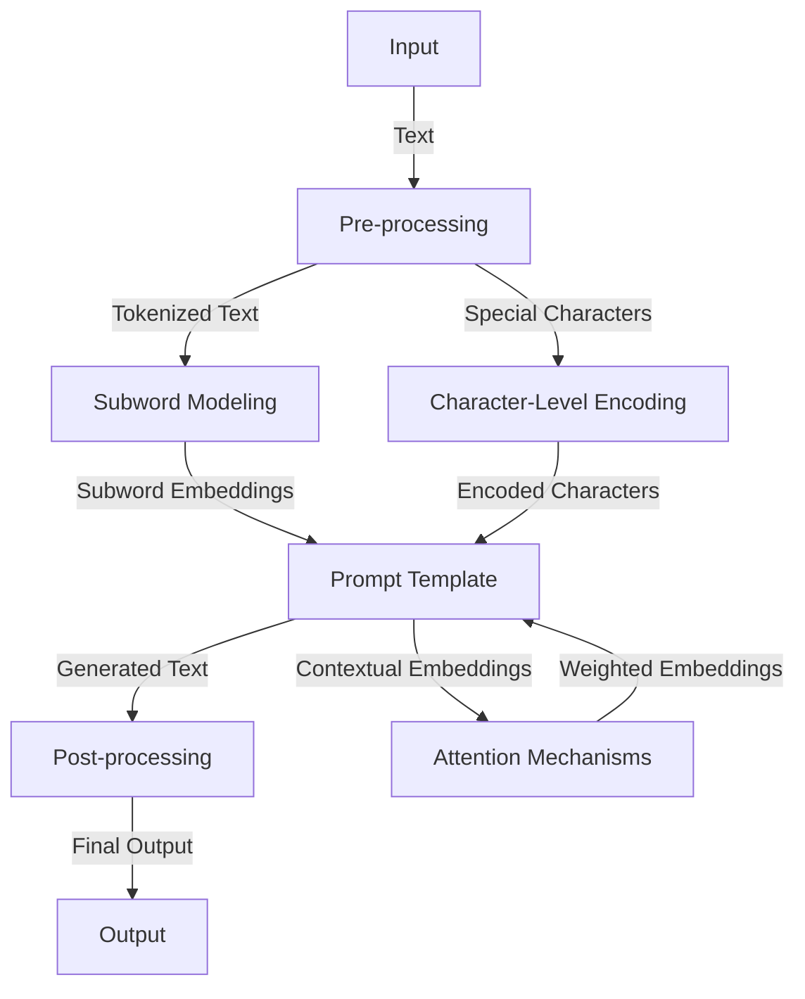

## Advanced Scaling of Prompt Templates: Part 2

In our previous article, we discussed the basics of scaling prompt templates to support millions of requests. However, as we delved deeper into the architecture, we encountered several edge cases that required advanced solutions. In this article, we will explore these edge cases and provide a more detailed overview of the architecture, including the patterns and strategies we used to overcome the challenges.

## Handling Edge Cases
One of the major challenges we faced was handling edge cases, such as:
* Out-of-vocabulary (OOV) words: These are words that are not present in the training data, and can cause the model to generate incorrect or nonsensical text.
* Special characters: These can include punctuation, emojis, and other non-standard characters that can affect the model's performance.
* Contextual understanding: This refers to the model's ability to understand the context of the input text and generate text that is relevant and accurate.

To handle these edge cases, we implemented several advanced techniques, including:
* Subword modeling: This involves breaking down OOV words into subwords, which can be represented in the model's vocabulary.
* Character-level encoding: This involves encoding special characters at the character level, rather than the word level.
* Attention mechanisms: These allow the model to focus on specific parts of the input text and generate text that is relevant to the context.

## Deep Dive into Architecture

Our architecture consists of several advanced components, including:
* Subword modeling: This is used to handle OOV words and generate subword embeddings.
* Character-level encoding: This is used to encode special characters and generate encoded characters.
* Attention mechanisms: These are used to generate contextual embeddings and weighted embeddings.

## Real-World Case Studies
We applied our advanced scaling techniques to several real-world case studies, including:
* Chatbots: We used our prompt template to generate human-like responses to user input.
* Language translation: We used our prompt template to generate translations of text from one language to another.
* Text summarization: We used our prompt template to generate summaries of long pieces of text.

## Advanced Patterns and Strategies
We used several advanced patterns and strategies to optimize our architecture, including:
* Data parallelism: This involves splitting the data into smaller chunks and processing them in parallel.
* Model parallelism: This involves splitting the model into smaller chunks and processing them in parallel.
* Gradient accumulation: This involves accumulating the gradients of the model over several iterations and updating the model parameters.

## Visual Insights Gallery
## Visual Insights Gallery
Here are some visual insights into our advanced scaling techniques:
* 
* 
* 