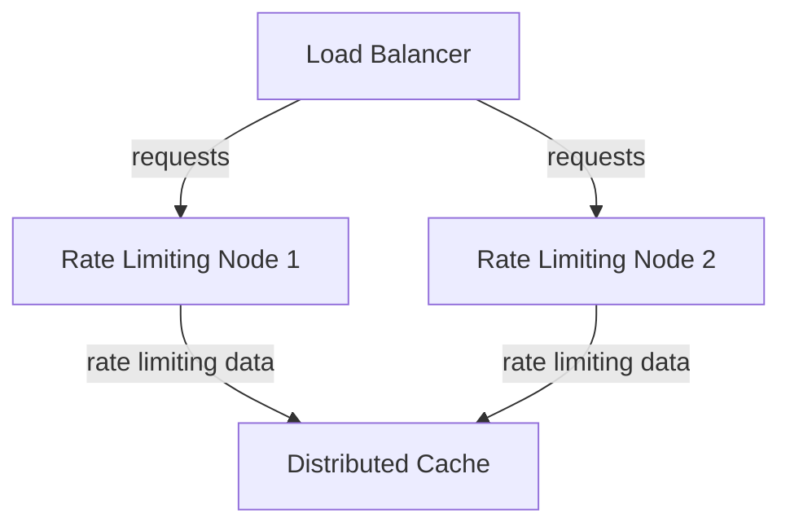
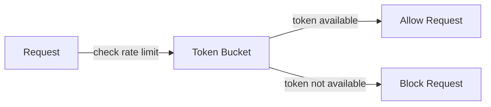

In the realm of software engineering, scalability is a critical aspect that determines the performance and reliability of a system. As our application grew in popularity, we faced a significant challenge: scaling our rate limiter to support millions of requests. In this article, we will delve into the architecture, patterns, and strategies we employed to achieve this feat.

## Introduction to Rate Limiting
Rate limiting is a crucial mechanism that prevents abuse and ensures fair usage of a system's resources. It involves limiting the number of requests that can be made within a specified time frame. Our initial rate limiter was designed to handle a few thousand requests per minute, but as our user base expanded, we needed to scale it to accommodate millions of requests.


## Understanding the Requirements
To scale our rate limiter, we first needed to understand the requirements. We identified the following key factors:
* **High throughput**: Our rate limiter needed to handle millions of requests per minute.
* **Low latency**: The rate limiter should not introduce significant latency, as this would impact the overall performance of our application.
* **High availability**: The rate limiter needed to be highly available, with minimal downtime and no single point of failure.

## Architecture Overview
Our scaled rate limiter architecture consists of the following components:
* **Load balancer**: Distributes incoming traffic across multiple nodes.
* **Rate limiting nodes**: Each node runs an instance of our rate limiting algorithm.
* **Distributed cache**: Stores rate limiting data, such as request counts and timestamps.

```markdown


## Rate Limiting Algorithm
Our rate limiting algorithm is based on the token bucket algorithm. Each user is assigned a bucket that can hold a certain number of tokens. When a user makes a request, a token is removed from their bucket. If the bucket is empty, the request is blocked until a token is added back to the bucket.

```markdown


## Distributed Cache
We use a distributed cache to store rate limiting data, such as request counts and timestamps. This allows us to scale our rate limiter horizontally, adding more nodes as needed.

| Cache | Description |
| --- | --- |
| Redis | In-memory data store with high performance and low latency |
| Memcached | Distributed memory object caching system |

## Implementation
We implemented our scaled rate limiter using a combination of technologies, including:
* **Node.js**: For building our rate limiting nodes.
* **Redis**: For our distributed cache.
* **Docker**: For containerizing our rate limiting nodes.

```javascript
// Example rate limiting code
const express = require('express');
const redis = require('redis');

const app = express();
const client = redis.createClient();

app.use((req, res, next) => {
  const ip = req.ip;
  client.get(ip, (err, reply) => {
    if (reply && parseInt(reply) >= 10) {
      res.status(429).send('Too many requests');
    } else {
      client.incr(ip);
      next();
    }
  });
});
```

## Visual Insights Gallery
## Visual Insights Gallery


## Summary and Conclusion
In this article, we explored the architecture, patterns, and strategies we employed to scale our rate limiter to support millions of requests. By using a combination of technologies, including Node.js, Redis, and Docker, we were able to build a highly scalable and performant rate limiter. We hope that our experience and insights will be helpful to others facing similar challenges.

## FAQ
* **Q: What is rate limiting?**
  A: Rate limiting is a mechanism that prevents abuse and ensures fair usage of a system's resources by limiting the number of requests that can be made within a specified time frame.
* **Q: How does the token bucket algorithm work?**
  A: The token bucket algorithm assigns each user a bucket that can hold a certain number of tokens. When a user makes a request, a token is removed from their bucket. If the bucket is empty, the request is blocked until a token is added back to the bucket.
* **Q: What is a distributed cache?**
  A: A distributed cache is a system that stores data across multiple nodes, allowing for horizontal scaling and high availability.