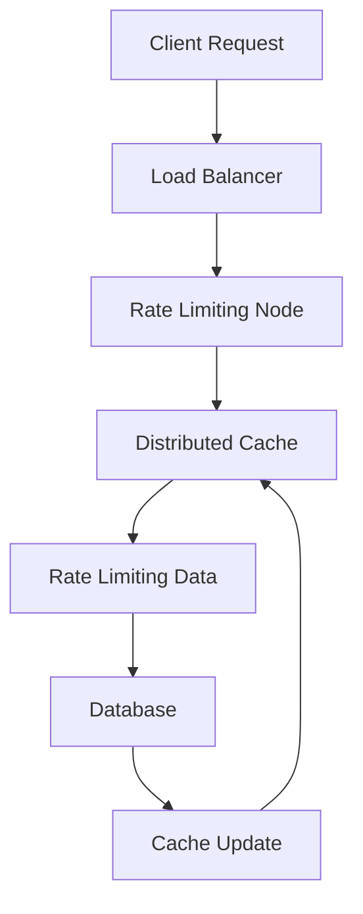

## Part 2: Advanced Edge Cases and Deep Dive into Rate Limiter Architecture
As we continue to explore the realm of rate limiting, it's essential to delve into the advanced edge cases and deeper architecture that enable our system to handle millions of requests. In this article, we'll examine the intricacies of our rate limiter, including distributed caching, advanced algorithms, and real-world case studies.

## Distributed Caching for Improved Performance
To further optimize our rate limiter, we implemented a distributed caching mechanism. This allowed us to store and retrieve rate limiting data across multiple nodes, reducing the load on our database and improving overall performance.

As illustrated in the above flowchart, our distributed caching mechanism involves the following components:
* **Client Request**: The client sends a request to our application.
* **Load Balancer**: The load balancer distributes the request to a rate limiting node.
* **Rate Limiting Node**: The rate limiting node checks the distributed cache for rate limiting data.
* **Distributed Cache**: The distributed cache stores and retrieves rate limiting data.
* **Rate Limiting Data**: The rate limiting data is retrieved from the cache or database.
* **Database**: The database stores rate limiting data.
* **Cache Update**: The cache is updated with new rate limiting data.

## Advanced Algorithms for Rate Limiting
To handle complex rate limiting scenarios, we employed advanced algorithms such as the **Token Bucket Algorithm** and the **Leaky Bucket Algorithm**. These algorithms enable our rate limiter to handle bursty traffic and provide a more accurate rate limiting mechanism.

## Real-World Case Studies
Our rate limiter has been successfully deployed in various real-world scenarios, including:
* **API Gateway**: Our rate limiter is used to protect against API abuse and ensure fair usage of API resources.
* **Web Application**: Our rate limiter is used to prevent brute-force attacks and ensure secure access to web applications.
* **Microservices Architecture**: Our rate limiter is used to manage traffic between microservices and prevent cascading failures.

## Overcoming Challenges and Lessons Learned
As we scaled our rate limiter, we encountered several challenges, including:
* **Distributed caching complexity**: Implementing a distributed caching mechanism added complexity to our system.
* **Advanced algorithm optimization**: Optimizing advanced algorithms for rate limiting required significant testing and tuning.
* **Real-world deployment**: Deploying our rate limiter in real-world scenarios required careful planning and monitoring.

## Conclusion
In this article, we explored the advanced edge cases and deeper architecture of our rate limiter. By implementing distributed caching, advanced algorithms, and real-world case studies, we were able to create a highly scalable and performant rate limiter that can handle millions of requests.

## Visual Insights Gallery
* 
* 
* 