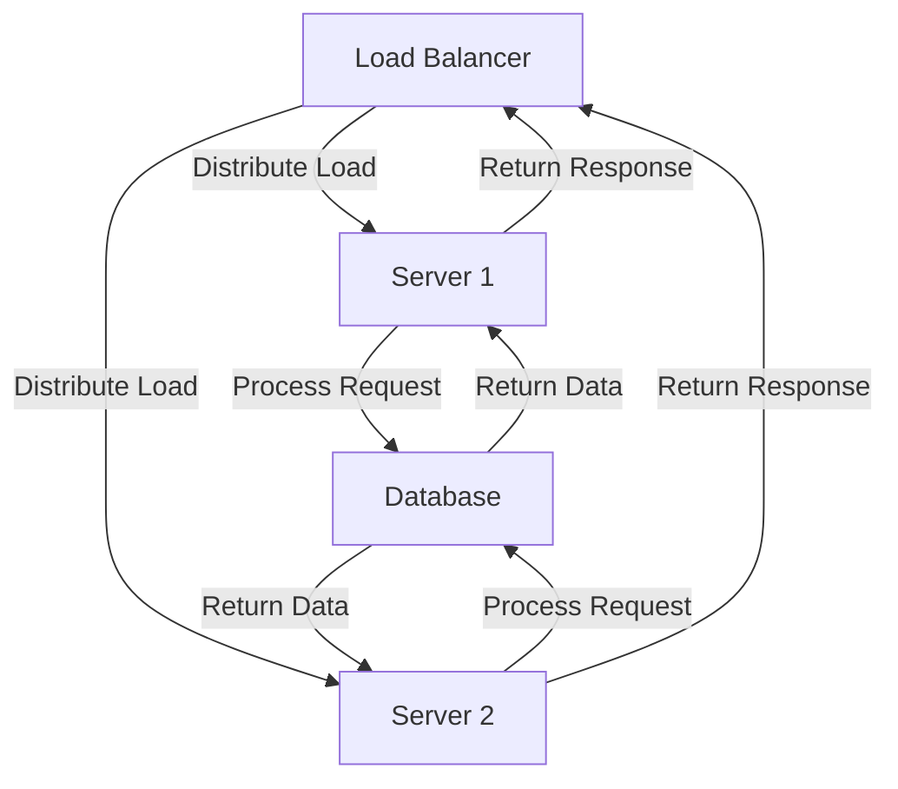
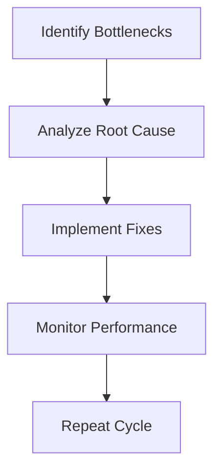

To scale our skill acquisition and support millions of requests, we had to undergo a significant transformation. This journey was not just about technological advancements but also about refining our approach to talent development and process optimization. In this article, we will delve into the strategies and architectures that enabled us to achieve this milestone.

## Introduction to Scalability Challenges

When dealing with millions of requests, the primary challenge is ensuring that your system can handle the load without compromising performance. This involves not only scaling your infrastructure but also streamlining your processes and enhancing your team's capabilities. Our journey began with identifying the bottlenecks in our current setup and devising a plan to address them.

## Architectural Overview

Our architectural approach involved setting up a load balancer to distribute incoming requests across multiple servers. This ensured that no single server was overwhelmed, thus preventing downtime and ensuring a smooth user experience. Each server was then connected to a database to process requests and return responses.

## Enhancing Team Skills
> **Tip:** Continuous learning is key to staying ahead in the tech industry. Encourage your team to participate in workshops, webinars, and online courses to enhance their skills.
To support millions of requests, it was crucial that our team had the necessary skills to manage and maintain our scaled system. We invested heavily in training programs, focusing on areas such as cloud computing, database management, and cybersecurity. This not only improved our team's capabilities but also boosted morale and job satisfaction.

## Process Optimization

Process optimization played a vital role in our scalability efforts. We implemented a continuous cycle of identifying bottlenecks, analyzing their root causes, implementing fixes, and monitoring performance. This iterative approach allowed us to refine our processes, reduce inefficiencies, and improve overall system performance.

## Leveraging Technology
> **Note:** Leveraging the right technology can significantly impact your ability to scale. Consider adopting cloud services, automation tools, and AI-powered solutions to streamline your operations.
We leveraged cutting-edge technology to support our scalability goals. Cloud services provided us with the flexibility to quickly scale up or down as needed, while automation tools helped reduce manual errors and increase efficiency. AI-powered solutions enabled us to predict and prepare for high-traffic periods, ensuring that our system remained stable under load.

## Conclusion
Scaling our skill acquisition to support millions of requests was a challenging yet rewarding journey. By focusing on architectural improvements, team skill enhancement, process optimization, and leveraging the right technology, we were able to achieve our goal. This experience has taught us the importance of continuous learning, innovation, and adaptability in the ever-evolving tech landscape.

## Visual Insights Gallery

## Frequently Asked Questions
- Q: What is the most critical factor in scaling a system to support millions of requests?
  A: The most critical factor is a combination of architectural design, team skillset, and process optimization.
- Q: How can I ensure my team is equipped to handle scalability challenges?
  A: Invest in continuous learning and training programs that focus on emerging technologies and best practices.
- Q: What role does technology play in scalability efforts?
  A: Technology, such as cloud services and automation tools, can significantly enhance your ability to scale by providing flexibility, efficiency, and predictive capabilities.