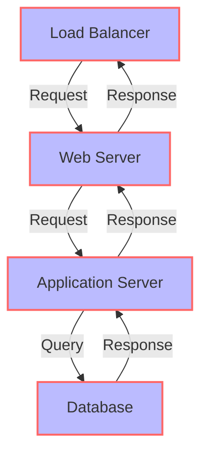
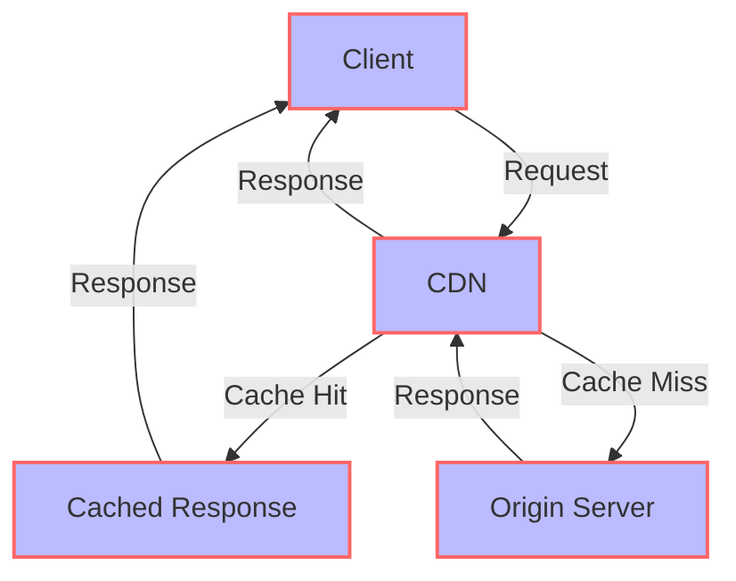

As the job market continues to evolve, having a strong online presence is crucial for professionals, especially those in the tech industry. A well-crafted technical resume can make all the difference in standing out from the competition. However, as our platform grew, we faced the challenge of scaling our technical resume infrastructure to support millions of requests. In this article, we'll delve into the strategies and technologies we employed to achieve this feat.

## Table of Contents
1. [Introduction to Scaling](#introduction-to-scaling)
2. [Architecture Overview](#architecture-overview)
3. [Database Optimization](#database-optimization)
4. [Caching and Content Delivery Networks](#caching-and-content-delivery-networks)
5. [Load Balancing and Auto Scaling](#load-balancing-and-auto-scaling)
6. [Visual Insights Gallery](#visual-insights-gallery)
7. [Summary and Conclusion](#summary-and-conclusion)
8. [FAQ](#faq)

## Introduction to Scaling

Scaling a technical resume platform to support millions of requests requires careful planning, strategic architecture, and the right technologies. Our journey began with understanding the current limitations of our infrastructure and identifying areas for improvement. We recognized the need for a scalable, reliable, and high-performance system that could handle increased traffic without compromising user experience.

## Architecture Overview

Our architecture consists of a load balancer, web servers, application servers, and a database. The load balancer distributes incoming traffic across multiple web servers, which then forward requests to the application servers. The application servers process the requests and query the database as needed. This distributed architecture allows us to scale individual components independently, ensuring that our system can handle increased traffic without becoming a bottleneck.

## Database Optimization

Database optimization played a critical role in our scaling efforts. We implemented indexing, partitioning, and query optimization to improve data retrieval and storage efficiency. Additionally, we adopted a master-slave replication strategy to ensure high availability and redundancy. This approach enabled us to distribute read traffic across multiple slave nodes, reducing the load on the master node and improving overall system performance.

## Caching and Content Delivery Networks

We leveraged caching and content delivery networks (CDNs) to reduce the load on our origin servers and improve response times. By caching frequently accessed resources at edge locations closer to users, we minimized the number of requests reaching our origin servers. This approach not only reduced latency but also lowered the load on our infrastructure, allowing us to handle more requests without sacrificing performance.

## Load Balancing and Auto Scaling
> **Note:** Load balancing and auto scaling are crucial components of a scalable infrastructure. By distributing traffic across multiple instances and dynamically adjusting capacity based on demand, we ensured that our system could handle sudden spikes in traffic without becoming overwhelmed.

We implemented load balancing and auto scaling to ensure that our system could adapt to changing traffic patterns. By monitoring traffic and resource utilization, our system can automatically add or remove instances as needed, maintaining optimal performance and minimizing downtime.

## Visual Insights Gallery
## Visual Insights Gallery

## Summary and Conclusion
In conclusion, scaling our technical resume platform to support millions of requests required a multifaceted approach. By implementing a distributed architecture, optimizing our database, leveraging caching and CDNs, and utilizing load balancing and auto scaling, we were able to create a scalable, reliable, and high-performance system. As the demand for online presence continues to grow, our platform is well-equipped to handle the increased traffic, providing a seamless experience for users.

## FAQ
* Q: What technologies did you use to scale your technical resume platform?
* A: We used a combination of load balancing, auto scaling, caching, and content delivery networks to scale our platform.
* Q: How did you optimize your database for high traffic?
* A: We implemented indexing, partitioning, and query optimization to improve data retrieval and storage efficiency.
* Q: What benefits did you see from using a distributed architecture?
* A: Our distributed architecture allowed us to scale individual components independently, ensuring that our system could handle increased traffic without becoming a bottleneck.