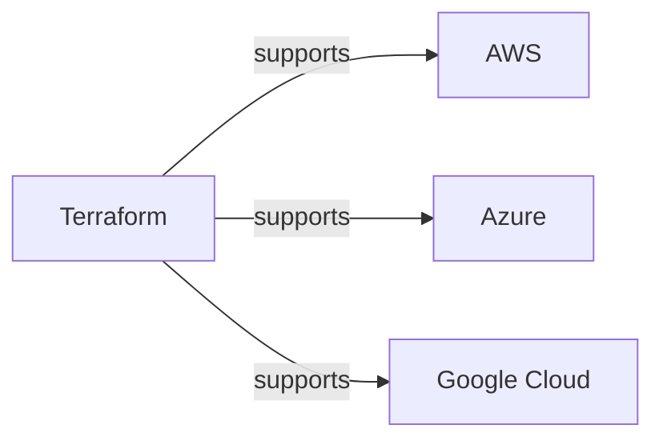
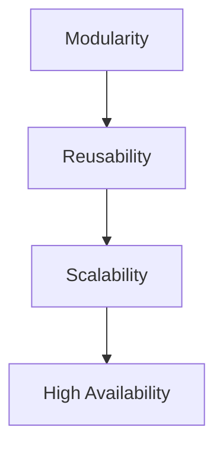
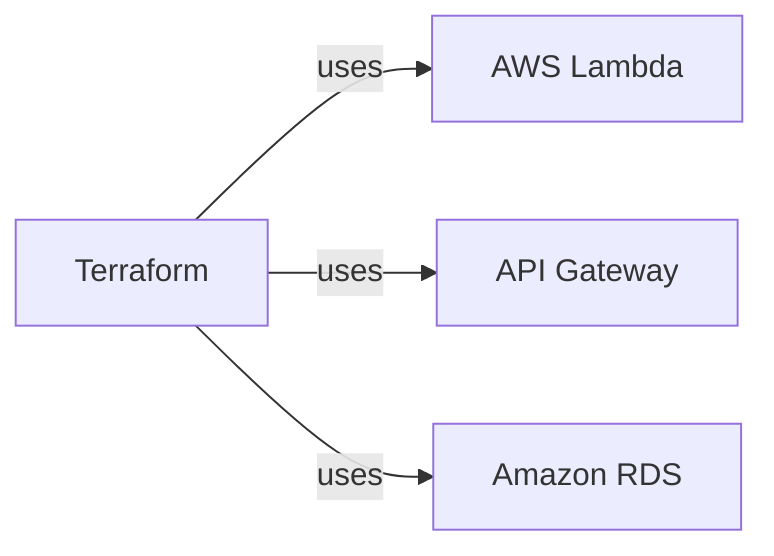

As organizations continue to move towards cloud-based infrastructure, the need for efficient and scalable solutions has become increasingly important. In this article, we will explore how we scaled our Terraform module to support millions of requests, and provide a comprehensive guide on how to achieve similar results.

## Table of Contents
1. [Introduction to Terraform](#introduction-to-terraform)
2. [Challenges of Scaling Terraform Modules](#challenges-of-scaling-terraform-modules)
3. [Designing a Scalable Terraform Module](#designing-a-scalable-terraform-module)
4. [Implementing a Scalable Terraform Module](#implementing-a-scalable-terraform-module)
5. [Testing and Validation](#testing-and-validation)
6. [Conclusion](#conclusion)

## Introduction to Terraform
Terraform is a popular infrastructure as code (IaC) tool that allows users to define and manage cloud-based infrastructure using human-readable configuration files. It supports a wide range of cloud providers, including AWS, Azure, and Google Cloud.

## Challenges of Scaling Terraform Modules
Scaling Terraform modules can be challenging, especially when dealing with large and complex infrastructure configurations. Some common challenges include:
* Managing state files and ensuring consistency across multiple environments
* Handling errors and debugging issues in large-scale deployments
* Optimizing performance and reducing deployment times
> **Note:** To overcome these challenges, it's essential to design a scalable Terraform module that can handle large volumes of requests and deployments.

## Designing a Scalable Terraform Module
To design a scalable Terraform module, we need to consider the following factors:
* Modularity: Break down the infrastructure configuration into smaller, reusable modules
* Reusability: Use modular components to reduce duplication and improve maintainability
* Scalability: Use load balancers, auto-scaling groups, and other scalable resources to handle large volumes of requests

## Implementing a Scalable Terraform Module
To implement a scalable Terraform module, we can use the following strategies:
* Use Terraform's built-in support for modular configurations
* Utilize AWS services such as AWS Lambda, API Gateway, and Amazon RDS to build scalable infrastructure
* Implement monitoring and logging using tools like Prometheus and Grafana

## Testing and Validation
To ensure that our scalable Terraform module is working correctly, we need to perform thorough testing and validation. This can include:
* Unit testing: Test individual components and modules
* Integration testing: Test how different components interact with each other
* Load testing: Test the module's performance under heavy loads
> **Tip:** Use tools like TerraTest and Terragrunt to simplify the testing and validation process.

## Conclusion
In this article, we explored how to scale a Terraform module to support millions of requests. By designing a modular and reusable configuration, using scalable resources, and implementing monitoring and logging, we can build a highly available and performant infrastructure. Remember to test and validate your module thoroughly to ensure it meets your requirements.

## Visual Insights Gallery

## FAQ
Q: What is Terraform, and how does it work?
A: Terraform is an infrastructure as code (IaC) tool that allows users to define and manage cloud-based infrastructure using human-readable configuration files.
Q: How can I scale my Terraform module to support large volumes of requests?
A: To scale your Terraform module, use modular and reusable configurations, scalable resources, and monitoring and logging tools.
Q: What are some common challenges when scaling Terraform modules?
A: Common challenges include managing state files, handling errors, and optimizing performance.