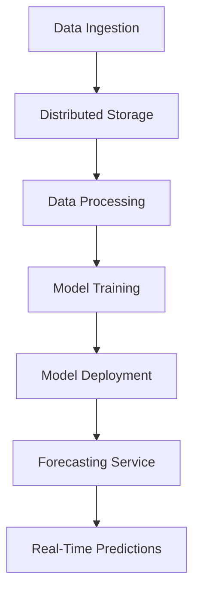
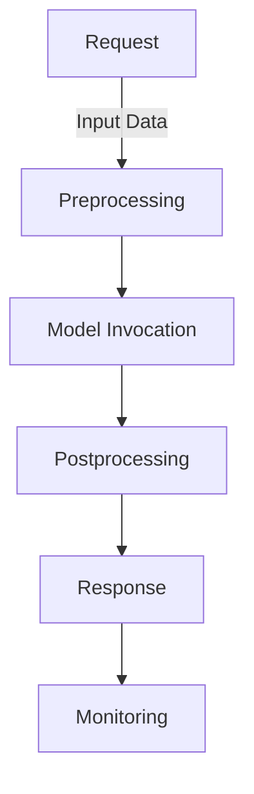

In the realm of data science and analytics, time-series forecasting is a crucial tool for predicting future trends based on historical data. However, as the volume of data and the number of requests increase, scaling these forecasting models to support millions of requests becomes a significant challenge. In this article, we will delve into the strategies and techniques we employed to scale our time-series forecast, enabling it to handle an enormous influx of requests efficiently.

## Table of Contents
1. [Introduction to Time-Series Forecasting](#introduction-to-time-series-forecasting)
2. [Challenges in Scaling Time-Series Forecasting](#challenges-in-scaling-time-series-forecasting)
3. [Architecture for Scalable Time-Series Forecasting](#architecture-for-scalable-time-series-forecasting)
4. [Implementation Details](#implementation-details)
5. [Visual Insights Gallery](#visual-insights-gallery)
6. [Summary and Conclusion](#summary-and-conclusion)
7. [FAQ](#faq)

## Introduction to Time-Series Forecasting
Time-series forecasting involves using historical data to predict future values. It is widely used in finance, weather forecasting, and demand prediction, among other areas. Traditional methods include ARIMA, SARIMA, and Exponential Smoothing. However, with the advent of deep learning, models like LSTM and Prophet have shown superior performance in many cases.

## Challenges in Scaling Time-Series Forecasting
Scaling time-series forecasting to support millions of requests poses several challenges:
- **Data Volume**: Handling large volumes of historical data for training and prediction.
- **Model Complexity**: Increasing model complexity to improve accuracy can lead to longer training and prediction times.
- **Real-Time Predictions**: Providing predictions in real-time without significant latency.
> **Note:** Addressing these challenges requires a combination of efficient data storage, distributed computing, and optimized model architectures.

## Architecture for Scalable Time-Series Forecasting
To overcome the scaling challenges, we designed an architecture that incorporates distributed data storage, parallel processing, and a microservices-based approach for forecasting.

This architecture allows for the handling of large data volumes, parallel processing of data and model training, and real-time forecasting through a scalable service.

## Implementation Details
The implementation involves several key components:
- **Distributed Data Storage**: We used a distributed database to store historical data, allowing for efficient querying and retrieval.
- **Parallel Data Processing**: A big data processing framework was utilized to process data in parallel, significantly reducing processing time.
- **Model Training and Deployment**: Models were trained using distributed machine learning frameworks and deployed as microservices for forecasting.
- **Real-Time Forecasting**: A real-time forecasting service was developed, leveraging the deployed models to provide predictions with minimal latency.

This flowchart illustrates the real-time forecasting process, from receiving a request to responding with a prediction, highlighting the efficiency and scalability of our approach.

## Visual Insights Gallery
Here are some visual insights into our scalable time-series forecasting system:

## Summary and Conclusion
Scaling time-series forecasting to support millions of requests requires a thoughtful approach to data storage, processing, model training, and deployment. By leveraging distributed architectures, parallel processing, and microservices, we were able to develop a highly scalable forecasting system. This system not only handles large volumes of data and requests but also provides real-time predictions with high accuracy.

## FAQ
- **Q: What are the key challenges in scaling time-series forecasting?**
  A: The key challenges include handling large data volumes, managing model complexity, and providing real-time predictions.
- **Q: How can distributed data storage help in scaling time-series forecasting?**
  A: Distributed data storage allows for efficient querying and retrieval of historical data, supporting the handling of large volumes of data.
- **Q: What role does parallel processing play in scalable time-series forecasting?**
  A: Parallel processing significantly reduces the time required for data processing and model training, enabling faster and more efficient forecasting.