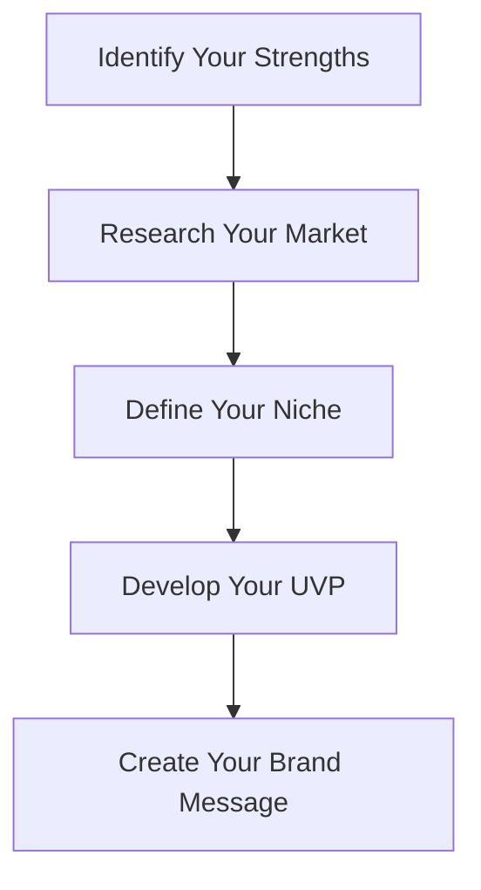
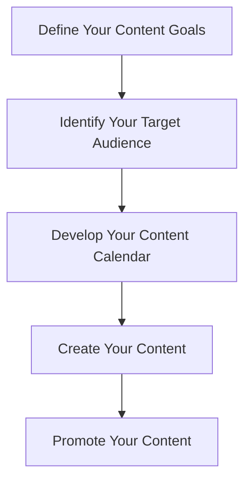

As a freelancer or independent professional, having a strong personal brand is crucial for attracting high-paying clients and standing out in a competitive market. In this article, we will explore the importance of building a personal brand and provide actionable strategies for creating a brand that showcases your expertise and attracts high-end clients.

## Table of Contents
1. [Introduction to Personal Branding](#introduction-to-personal-branding)
2. [Defining Your Niche and Unique Value Proposition](#defining-your-niche-and-unique-value-proposition)
3. [Creating a Professional Online Presence](#creating-a-professional-online-presence)
4. [Developing a Content Strategy](#developing-a-content-strategy)
5. [Building a Community and Networking](#building-a-community-and-networking)
6. [Visual Insights Gallery](#visual-insights-gallery)
7. [Conclusion and FAQ](#conclusion-and-faq)

## Introduction to Personal Branding
Building a personal brand is about creating a unique identity that showcases your skills, expertise, and values. It's about differentiating yourself from others in your industry and establishing a reputation as a trusted authority. 

To build a strong personal brand, you need to start by defining your niche and unique value proposition (UVP). Your niche is the specific area of expertise that you specialize in, and your UVP is the unique benefit that you offer to clients.

## Defining Your Niche and Unique Value Proposition
Defining your niche and UVP is critical for attracting high-paying clients. It helps you to stand out from the competition and establish a reputation as a specialist in your field. 

Here is a Mermaid.js diagram that illustrates the process of defining your niche and UVP:

## Creating a Professional Online Presence
Having a professional online presence is essential for building a personal brand. This includes having a website, social media profiles, and other online platforms that showcase your expertise and services. 

Here are some tips for creating a professional online presence:

| Platform | Description |
| --- | --- |
| Website | A central hub that showcases your services, portfolio, and brand message |
| Social Media | Platforms like LinkedIn, Twitter, and Facebook that help you to connect with clients and promote your services |
| Blog | A platform for sharing your expertise and showcasing your thought leadership |

## Developing a Content Strategy
Developing a content strategy is critical for building a personal brand. It involves creating and sharing valuable content that showcases your expertise and provides value to your target audience. 

Here is a Mermaid.js diagram that illustrates the process of developing a content strategy:

## Building a Community and Networking
Building a community and networking is essential for building a personal brand. It involves connecting with other professionals in your industry and building relationships that can help you to grow your business. 

Here are some tips for building a community and networking:

> **Note:** Attend industry events and conferences to connect with other professionals in your industry.
> **Tip:** Join online communities and forums to connect with other professionals and build relationships.
> **Warning:** Don't be afraid to reach out to other professionals in your industry and ask for advice or guidance.

## Visual Insights Gallery
Here are some visual insights that can help you to build a personal brand that attracts high-paying clients:

## Conclusion and FAQ
Building a personal brand that attracts high-paying clients takes time and effort. It involves defining your niche and UVP, creating a professional online presence, developing a content strategy, and building a community and networking. By following these strategies, you can establish a strong personal brand that showcases your expertise and attracts high-end clients.

### FAQ
Q: What is a personal brand?
A: A personal brand is a unique identity that showcases your skills, expertise, and values.
Q: How do I define my niche and UVP?
A: Define your niche and UVP by identifying your strengths, researching your market, and developing a brand message that showcases your unique benefit.
Q: What are some tips for creating a professional online presence?
A: Some tips for creating a professional online presence include having a website, social media profiles, and other online platforms that showcase your expertise and services.