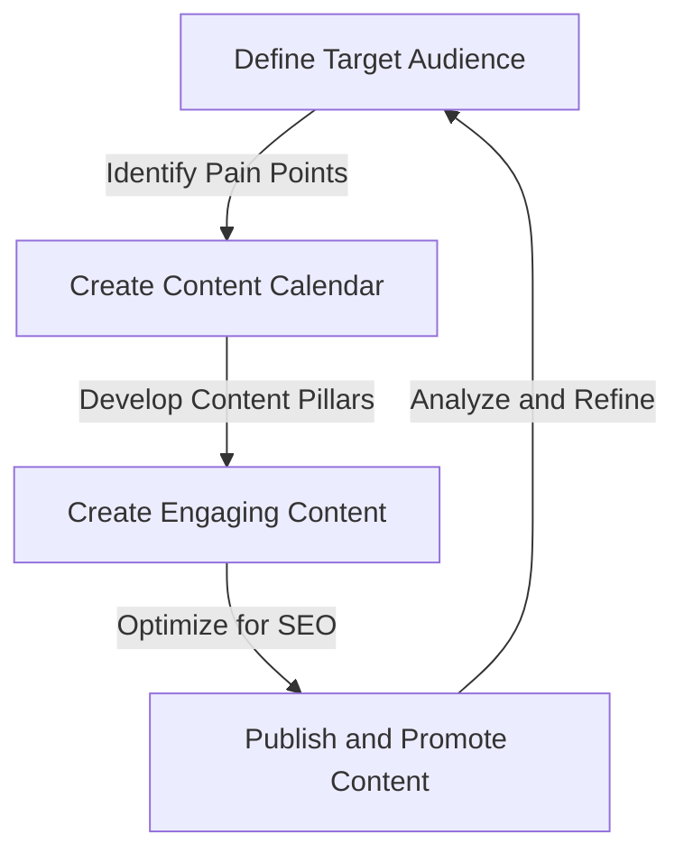
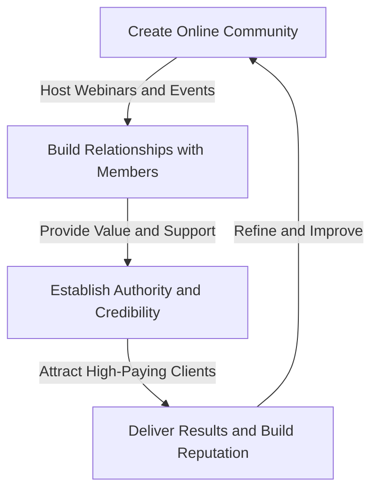

## Introduction to Advanced Personal Branding
In our previous article, we explored the fundamentals of building a personal brand that attracts high-paying clients. In this follow-up article, we will delve into advanced strategies for taking your personal brand to the next level. 

To create a truly compelling personal brand, you need to focus on developing a unique and authentic voice that resonates with your target audience. This involves creating a content strategy that showcases your expertise and provides value to your audience.

## Developing a Content Strategy
A well-crafted content strategy is critical for attracting high-paying clients and establishing your authority in your industry. This involves creating a mix of informative and engaging content that showcases your expertise and provides value to your audience.

In this flowchart, we can see the key steps involved in developing a content strategy. By defining your target audience and identifying their pain points, you can create a content calendar that provides value and showcases your expertise.

## Leveraging Social Media and Influencer Marketing
Social media and influencer marketing can be powerful tools for promoting your personal brand and attracting high-paying clients. By leveraging platforms like LinkedIn, Twitter, and Instagram, you can build a large following and establish yourself as a thought leader in your industry.

Influencer marketing involves partnering with other influencers or thought leaders in your industry to promote your personal brand and services. This can be a highly effective way to reach new audiences and build credibility.

## Building a Community and Networking
Building a community and networking with other professionals in your industry is critical for attracting high-paying clients and establishing your authority. This involves creating a space where people can connect with you and learn from your expertise.

In this flowchart, we can see the key steps involved in building a community and networking. By creating an online community and hosting webinars and events, you can build relationships with members and establish your authority and credibility.

## Measuring and Optimizing Your Personal Brand
Measuring and optimizing your personal brand is critical for attracting high-paying clients and establishing your authority. This involves tracking key metrics like website traffic, social media engagement, and lead generation.

By using tools like Google Analytics and social media insights, you can track your performance and refine your strategy to better meet the needs of your target audience.

## Visual Insights Gallery
Here are some additional visual insights to help you deepen your understanding of advanced personal branding strategies:
* [Image 1: Content Strategy](https://picsum.photos/seed/content-strategy/800/400)
* [Image 2: Social Media Marketing](https://picsum.photos/seed/social-media-marketing/800/400)
* [Image 3: Community Building](https://picsum.photos/seed/community-building/800/400)

## Conclusion
In conclusion, building a personal brand that attracts high-paying clients requires a deep understanding of advanced strategies and techniques. By developing a unique and authentic voice, creating a content strategy, leveraging social media and influencer marketing, building a community and networking, and measuring and optimizing your personal brand, you can establish yourself as a thought leader in your industry and attract high-paying clients.