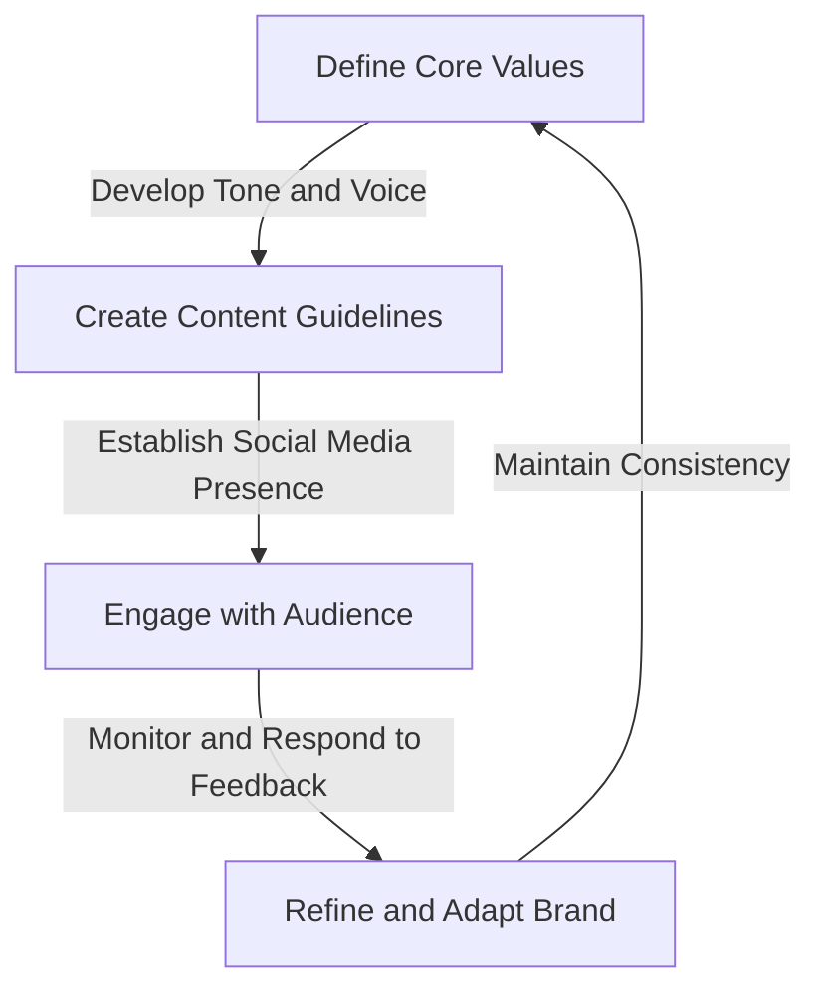
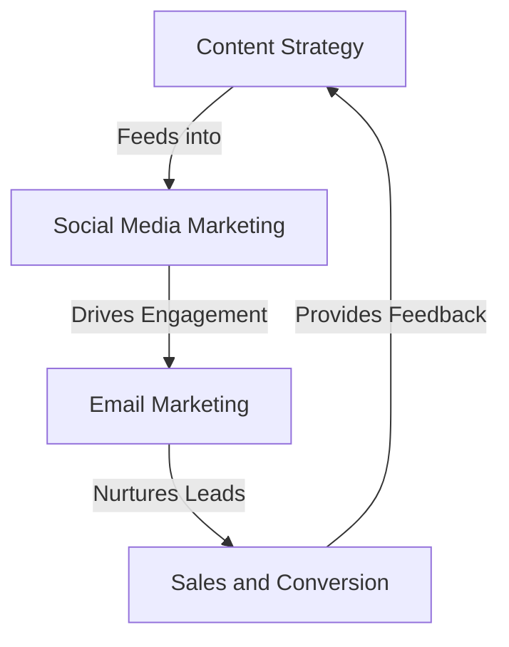

## Part 3: Mastering Advanced Edge-Cases and Architecture in Personal Branding
In our previous articles, we explored the fundamentals and advanced strategies for building a personal brand that attracts high-paying clients. In this comprehensive follow-up, we will delve into advanced edge-cases and deeper architecture for taking your personal brand to the next level.

To create a truly robust personal brand, you need to focus on developing a scalable and flexible architecture that can adapt to changing market conditions and audience needs. This involves creating a modular framework that integrates multiple components, including content strategy, social media marketing, and email marketing.

## Advanced Edge-Cases in Personal Branding
One of the key challenges in personal branding is navigating advanced edge-cases, such as managing multiple personas, handling criticism and negative feedback, and maintaining a consistent tone and voice across different platforms.

In this flowchart, we can see the key steps involved in navigating advanced edge-cases in personal branding. By defining your core values and developing a tone and voice, you can create content guidelines that ensure consistency across different platforms.

## Deep Dive into Personal Branding Architecture
A well-designed personal branding architecture involves integrating multiple components, including content strategy, social media marketing, and email marketing. This requires a deep understanding of how each component interacts with others and how they contribute to the overall brand ecosystem.

In this flowchart, we can see the key components of a personal branding architecture and how they interact with each other. By integrating these components, you can create a robust and scalable brand ecosystem that drives engagement, nurtures leads, and converts sales.

## Advanced Technologies for Personal Branding
One of the key trends in personal branding is the use of advanced technologies, such as artificial intelligence, machine learning, and data analytics. These technologies can help you optimize your content strategy, personalize your marketing efforts, and gain deeper insights into your audience.

For example, you can use natural language processing (NLP) to analyze your audience's language patterns and develop a more effective tone and voice. You can also use machine learning algorithms to optimize your content calendar and predict which topics will resonate with your audience.

## Conclusion
In conclusion, mastering advanced edge-cases and architecture in personal branding requires a deep understanding of the complex interactions between different components and a willingness to adapt to changing market conditions and audience needs. By integrating advanced technologies and developing a modular framework, you can create a robust and scalable personal brand that drives engagement, nurtures leads, and converts sales.

## Visual Insights Gallery
* [Personal Branding Framework](https://picsum.photos/seed/personal-branding-framework/800/400)
* [Content Strategy Matrix](https://picsum.photos/seed/content-strategy-matrix/800/400)
* [Social Media Marketing Funnel](https://picsum.photos/seed/social-media-marketing-funnel/800/400)
* [Email Marketing Automation](https://picsum.photos/seed/email-marketing-automation/800/400)
* [AI-Powered Content Calendar](https://picsum.photos/seed/ai-powered-content-calendar/800/400)