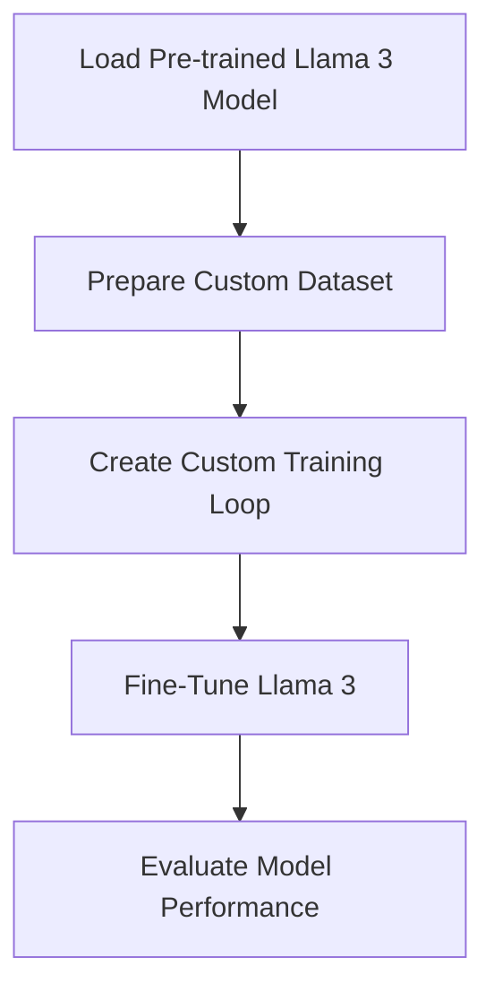
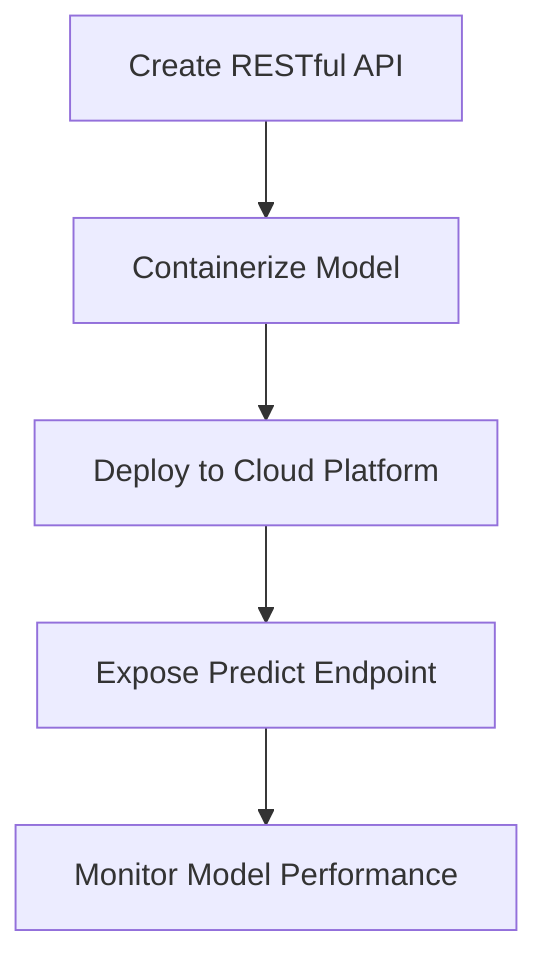

# How to Fine-Tune Llama 3 for Specific Business Use-Cases
[IMAGE: A futuristic, high-tech laboratory with researchers fine-tuning AI models on large, interactive screens]
As the world of artificial intelligence continues to evolve, the importance of fine-tuning AI models for specific business use-cases has never been more critical. Llama 3, an open-source AI model, has gained significant attention in recent years due to its exceptional performance and versatility. In this article, we will delve into the process of fine-tuning Llama 3 for specific business use-cases, providing you with a comprehensive guide on how to unlock its full potential.

## Table of Contents
1. [Introduction to Llama 3](#introduction-to-llama-3)
2. [Preparing Your Dataset](#preparing-your-dataset)
3. [Fine-Tuning Llama 3](#fine-tuning-llama-3)
4. [Deploying Your Fine-Tuned Model](#deploying-your-fine-tuned-model)
5. [Visual Insights Gallery](#visual-insights-gallery)
6. [Summary and Conclusion](#summary-and-conclusion)
7. [FAQ](#faq)

## Introduction to Llama 3
[IMAGE: A detailed, technical diagram of the Llama 3 architecture, highlighting its key components and interactions]
Llama 3 is a state-of-the-art, open-source AI model that has been widely adopted in various industries due to its exceptional performance and flexibility. Its architecture is based on a transformer model, which allows it to handle complex, sequential data with ease. To fine-tune Llama 3 for specific business use-cases, it is essential to understand its architecture and how it can be adapted to meet your specific needs.

```markdown
# Example use-cases for Llama 3
* Text classification
* Sentiment analysis
* Named entity recognition
* Machine translation
```

## Preparing Your Dataset
[IMAGE: A screenshot of a data preprocessing pipeline, with various tools and techniques used to clean, transform, and split the data]
Preparing your dataset is a critical step in fine-tuning Llama 3. Your dataset should be relevant to your specific business use-case and should be preprocessed to ensure that it is in a suitable format for training. This includes tokenizing your text data, removing stop words, and splitting your data into training and validation sets.

```python
# Example data preprocessing code
import pandas as pd
import torch
from transformers import AutoTokenizer

# Load your dataset
df = pd.read_csv('your_dataset.csv')

# Tokenize your text data
tokenizer = AutoTokenizer.from_pretrained('llama-3')
tokenized_data = df['text'].apply(lambda x: tokenizer.encode(x, return_tensors='pt'))
```

## Fine-Tuning Llama 3
[IMAGE: A Mermaid.js diagram illustrating the fine-tuning process, with arrows representing the flow of data and models]
Fine-tuning Llama 3 involves adjusting its weights to fit your specific dataset. This can be done using various techniques, including transfer learning and few-shot learning. To fine-tune Llama 3, you will need to create a custom training loop that incorporates your dataset and the Llama 3 model.



## Deploying Your Fine-Tuned Model
[IMAGE: A Mermaid.js diagram showing the deployment architecture, with containers and APIs used to serve the model]
Once you have fine-tuned Llama 3, you will need to deploy it in a production-ready environment. This can be done using various deployment strategies, including containerization and serverless computing. To deploy your fine-tuned model, you will need to create a RESTful API that exposes the model's predict endpoint.



## Visual Insights Gallery
[IMAGE: A futuristic, high-tech control room with large screens displaying various visualizations and metrics]
[IMAGE: A detailed, technical diagram of the Llama 3 architecture, highlighting its key components and interactions]
[IMAGE: A screenshot of a data preprocessing pipeline, with various tools and techniques used to clean, transform, and split the data]

## Summary and Conclusion
Fine-tuning Llama 3 for specific business use-cases requires a deep understanding of the model's architecture and the ability to adapt it to meet your specific needs. By following the steps outlined in this article, you can unlock the full potential of Llama 3 and achieve exceptional results in your business applications.

## FAQ
Q: What is Llama 3?
A: Llama 3 is a state-of-the-art, open-source AI model that has been widely adopted in various industries due to its exceptional performance and flexibility.
Q: How do I fine-tune Llama 3?
A: Fine-tuning Llama 3 involves adjusting its weights to fit your specific dataset. This can be done using various techniques, including transfer learning and few-shot learning.
Q: How do I deploy my fine-tuned model?
A: Once you have fine-tuned Llama 3, you will need to deploy it in a production-ready environment. This can be done using various deployment strategies, including containerization and serverless computing.