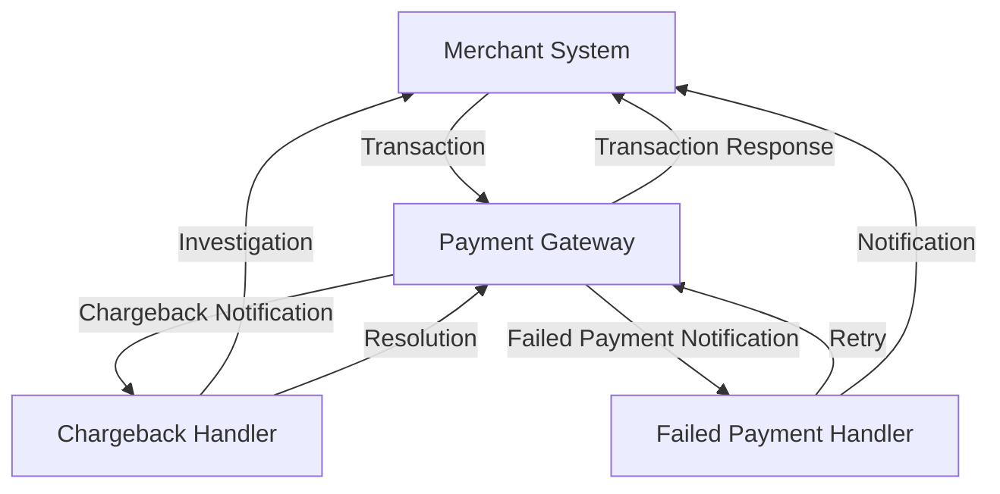
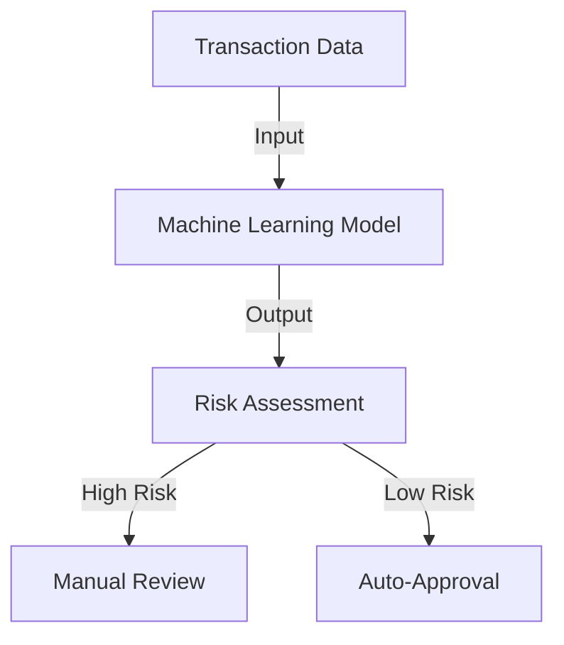

In the world of fintech and e-commerce, handling chargebacks and failed payments is a crucial aspect of maintaining a healthy and compliant financial ecosystem. As the digital payment landscape continues to evolve, the need for efficient and automated solutions to manage these issues has never been more pressing. In this article, we will delve into the complexities of chargebacks and failed payments, exploring the strategies, architectures, and technologies that can be leveraged to handle them programmatically.

## Understanding Chargebacks and Failed Payments
Chargebacks occur when a customer disputes a transaction with their bank, often due to unauthorized transactions, unsatisfactory products or services, or clerical errors. Failed payments, on the other hand, refer to transactions that are declined due to insufficient funds, expired cards, or other issues. Both chargebacks and failed payments can result in significant revenue loss and damage to a merchant's reputation if not handled promptly and effectively.


## Architecting a Chargeback and Failed Payment Management System
To develop an efficient chargeback and failed payment management system, it is essential to design a robust architecture that integrates with existing payment gateways, banks, and merchant systems. The following Mermaid.js diagram illustrates a high-level architecture for such a system:

This architecture enables seamless communication between the merchant system, payment gateway, chargeback handler, and failed payment handler, ensuring that chargebacks and failed payments are handled in a timely and efficient manner.

## Implementing Chargeback and Failed Payment Handling Logic
When implementing chargeback and failed payment handling logic, it is crucial to consider factors such as transaction type, customer information, and payment method. The following code snippet demonstrates a basic example of how to handle chargebacks and failed payments using a programming language like Python:
```python
import datetime

class ChargebackHandler:
    def __init__(self, transaction):
        self.transaction = transaction

    def investigate(self):
        # Investigate the chargeback
        if self.transaction.amount > 100:
            # Escalate to manual review
            return "Manual Review"
        else:
            # Auto-resolve
            return "Auto-Resolved"

class FailedPaymentHandler:
    def __init__(self, transaction):
        self.transaction = transaction

    def retry(self):
        # Retry the payment
        if self.transaction.attempts < 3:
            # Retry payment
            return "Retry"
        else:
            # Notify customer
            return "Notify Customer"
```
## Best Practices for Chargeback and Failed Payment Management
To minimize the risk of chargebacks and failed payments, merchants should adhere to best practices such as:
| Best Practice | Description |
| --- | --- |
| Clear Transaction Descriptions | Provide clear and concise transaction descriptions to avoid customer confusion |
| Secure Payment Processing | Implement robust security measures to prevent unauthorized transactions |
| Timely Refunds | Process refunds in a timely manner to avoid customer dissatisfaction |
| Effective Communication | Maintain open communication with customers to resolve issues promptly |

## Handling Chargebacks and Failed Payments with Machine Learning
Machine learning algorithms can be leveraged to predict and prevent chargebacks and failed payments. By analyzing transaction data, merchant behavior, and customer information, machine learning models can identify high-risk transactions and flag them for review.

## Visual Insights Gallery
The following images provide visual insights into the chargeback and failed payment management process:


## Summary and Conclusion
In conclusion, handling chargebacks and failed payments programmatically requires a deep understanding of the underlying complexities and a robust architecture that integrates with existing payment systems. By implementing best practices, leveraging machine learning algorithms, and designing efficient chargeback and failed payment management systems, merchants can minimize revenue loss and maintain a healthy and compliant financial ecosystem.

## FAQ
Q: What is the difference between a chargeback and a failed payment?
A: A chargeback occurs when a customer disputes a transaction with their bank, while a failed payment refers to a transaction that is declined due to insufficient funds, expired cards, or other issues.
Q: How can merchants prevent chargebacks and failed payments?
A: Merchants can prevent chargebacks and failed payments by implementing clear transaction descriptions, secure payment processing, timely refunds, and effective communication with customers.
Q: Can machine learning algorithms be used to predict and prevent chargebacks and failed payments?
A: Yes, machine learning algorithms can be used to analyze transaction data, merchant behavior, and customer information to predict and prevent chargebacks and failed payments.