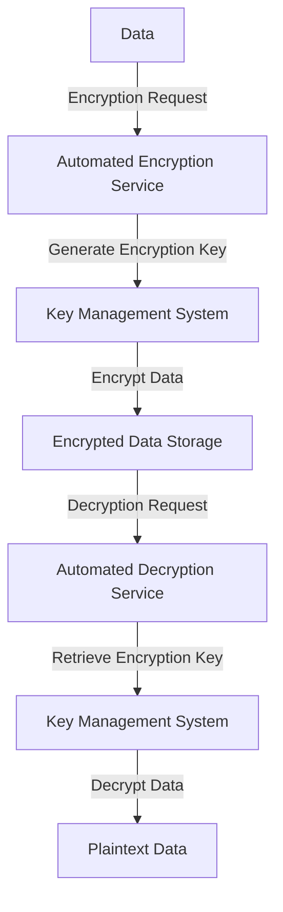
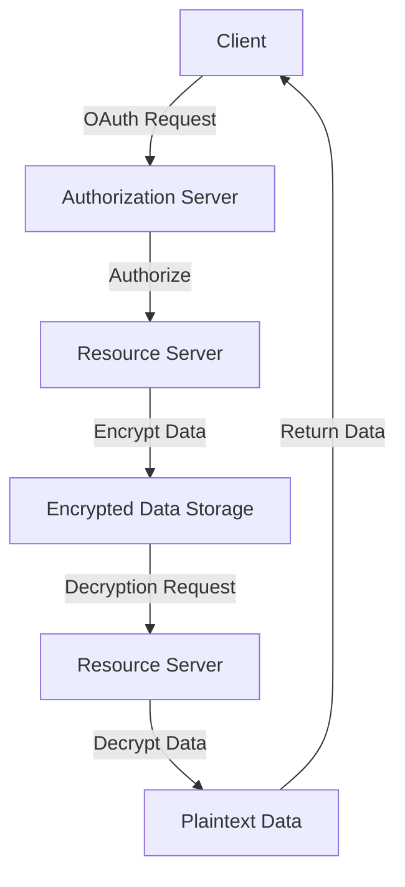

In today's digital landscape, data security is of paramount importance. As the amount of sensitive information continues to grow, so does the need for robust protection measures. One crucial aspect of data security is encryption, which ensures that even if data falls into the wrong hands, it remains unreadable without the decryption key. Integrating automated data encryption into existing workflows is a complex task that requires careful planning, execution, and maintenance. In this article, we will delve into the world of automated data encryption, exploring its benefits, challenges, and providing a step-by-step guide on how to seamlessly integrate it into your existing workflows.

## Introduction to Automated Data Encryption
Automated data encryption is the process of using algorithms to convert plaintext data into unreadable ciphertext, which can only be deciphered with the correct decryption key. This process is automated, meaning it occurs without human intervention, ensuring that data is always protected, whether it's in transit or at rest. 


## Benefits of Automated Data Encryption
The benefits of automated data encryption are multifaceted, ranging from enhanced security and compliance to improved operational efficiency. Some of the key advantages include:
- **Enhanced Security**: Automated encryption ensures that data is always protected, reducing the risk of data breaches and cyber attacks.
- **Compliance**: Many regulatory bodies require the encryption of sensitive data. Automated encryption helps organizations comply with these regulations.
- **Operational Efficiency**: By automating the encryption process, organizations can save time and resources that would otherwise be spent on manual encryption processes.

## Challenges of Integrating Automated Data Encryption
While the benefits of automated data encryption are clear, the integration process itself poses several challenges. These include:
- **Complexity**: Automated encryption systems can be complex, requiring significant technical expertise to set up and manage.
- **Compatibility**: Ensuring that automated encryption solutions are compatible with existing systems and workflows can be a challenge.
- **Key Management**: Managing encryption keys is crucial for the effectiveness of automated encryption. Losing or compromising these keys can render the encrypted data useless or vulnerable.

## Step-by-Step Guide to Integration
Integrating automated data encryption into existing workflows involves several key steps:
1. **Assessment**: Conduct a thorough assessment of your current data workflows to identify where encryption is needed.
2. **Solution Selection**: Choose an automated encryption solution that fits your organization's needs, considering factors like compatibility, scalability, and ease of use.
3. **Implementation**: Implement the chosen solution, ensuring that it is properly configured and integrated with existing systems.
4. **Key Management**: Establish a robust key management system to securely generate, distribute, and manage encryption keys.
5. **Testing and Monitoring**: Thoroughly test the encryption process to ensure it is working correctly and continuously monitor its performance.

```markdown
### Example of Automated Encryption Workflow


## Advanced Integration Scenarios
For more complex workflows, integrating automated data encryption may require advanced strategies, such as:
- **OAuth Integration**: Using OAuth for secure authentication and authorization of encryption services.
- **DevSecOps Practices**: Incorporating security into every stage of the development lifecycle to ensure that encryption is always considered.

```markdown
### OAuth Integration Example


## Visual Insights Gallery
The following images provide further insights into the process and importance of automated data encryption:


## Summary/Conclusion
Integrating automated data encryption into existing workflows is a critical step in enhancing data security and compliance. While it presents several challenges, the benefits far outweigh the costs. By following the steps outlined in this guide and considering advanced integration scenarios, organizations can effectively protect their sensitive data from unauthorized access.

## FAQ
- **Q: What is automated data encryption?**
  A: Automated data encryption is the process of using algorithms to automatically convert plaintext data into unreadable ciphertext.
- **Q: Why is automated data encryption important?**
  A: It enhances security, ensures compliance with regulatory requirements, and improves operational efficiency.
- **Q: What are the challenges of integrating automated data encryption?**
  A: Challenges include complexity, compatibility issues, and key management.
- **Q: How do I choose the right automated encryption solution?**
  A: Consider factors like compatibility, scalability, ease of use, and the specific security needs of your organization.