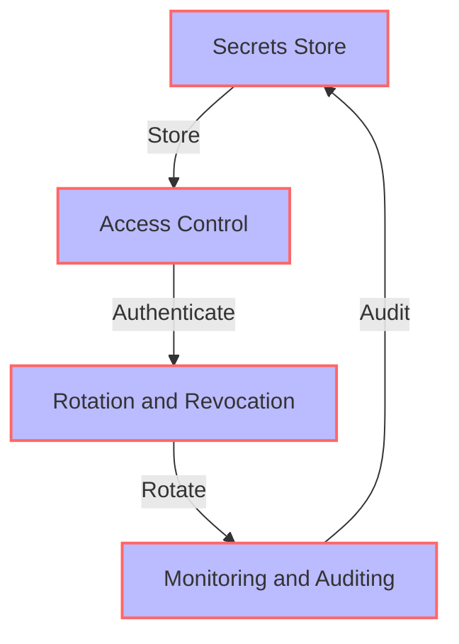
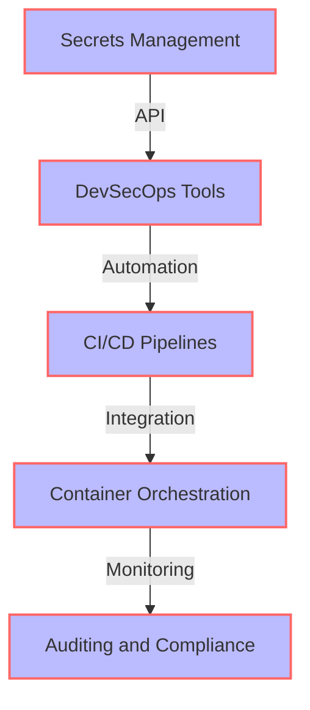

In the era of digital transformation, managing secrets securely is crucial for protecting sensitive information and preventing cyber attacks. As organizations adopt DevSecOps practices, integrating compliant secrets management into existing workflows is essential for maintaining the security and integrity of their systems. In this article, we will explore the importance of secrets management, the challenges of integrating it into existing workflows, and provide a comprehensive guide on how to do it effectively.

## Introduction to Secrets Management
Secrets management refers to the practices and tools used to securely store, manage, and rotate sensitive information such as passwords, API keys, and certificates. Effective secrets management is critical for preventing unauthorized access to sensitive data and systems. 


## Challenges of Integrating Secrets Management into Existing Workflows
Integrating secrets management into existing workflows can be challenging due to the complexity of modern systems and the need to balance security with agility. Some of the common challenges include:
* Legacy system integration
* Limited resources and budget
* Lack of standardization and automation
* Insufficient training and awareness
> **Note:** Addressing these challenges requires a strategic approach that takes into account the organization's specific needs and requirements.

## Architecture for Compliant Secrets Management
A compliant secrets management architecture should include the following components:
* **Secrets Store**: A secure repository for storing sensitive information
* **Access Control**: Mechanisms for controlling access to secrets, such as authentication and authorization
* **Rotation and Revocation**: Processes for rotating and revoking secrets regularly
* **Monitoring and Auditing**: Tools for monitoring and auditing secrets usage and access
```markdown

## Implementing Compliant Secrets Management
Implementing compliant secrets management requires a structured approach that includes:
1. **Assessing Current State**: Evaluating the organization's current secrets management practices and identifying gaps and vulnerabilities
2. **Defining Requirements**: Defining the requirements for compliant secrets management, including security, scalability, and usability
3. **Selecting Tools and Technologies**: Selecting tools and technologies that meet the defined requirements, such as secrets management platforms and access control systems
4. **Designing and Implementing Architecture**: Designing and implementing the compliant secrets management architecture, including secrets store, access control, rotation and revocation, and monitoring and auditing
5. **Testing and Validation**: Testing and validating the implemented architecture to ensure it meets the defined requirements and is secure and compliant
> **Tip:** Using agile methodologies and iterative approaches can help organizations implement compliant secrets management more efficiently and effectively.

## Integrating Secrets Management into DevSecOps Workflows
Integrating secrets management into DevSecOps workflows requires automating and integrating secrets management processes with existing DevSecOps tools and pipelines. This can be achieved by:
* **Using APIs and Integrations**: Using APIs and integrations to connect secrets management tools with DevSecOps tools, such as CI/CD pipelines and container orchestration systems
* **Implementing Automation**: Implementing automation scripts and workflows to automate secrets management processes, such as rotation and revocation
* **Monitoring and Auditing**: Monitoring and auditing secrets usage and access to ensure compliance and security

## Best Practices for Compliant Secrets Management
Best practices for compliant secrets management include:
| Best Practice | Description |
| --- | --- |
| Use a centralized secrets store | Store all sensitive information in a centralized and secure repository |
| Implement access control and authentication | Control access to secrets using authentication and authorization mechanisms |
| Rotate and revoke secrets regularly | Rotate and revoke secrets regularly to prevent unauthorized access |
| Monitor and audit secrets usage | Monitor and audit secrets usage to ensure compliance and security |
> **Warning:** Failing to implement best practices for compliant secrets management can result in security breaches and non-compliance.

## Visual Insights Gallery


## Summary and Conclusion
Integrating compliant secrets management into existing workflows is essential for protecting sensitive information and preventing cyber attacks. By following the guidelines and best practices outlined in this article, organizations can implement compliant secrets management and ensure the security and integrity of their systems. Remember to assess current state, define requirements, select tools and technologies, design and implement architecture, test and validate, and integrate secrets management into DevSecOps workflows.

## FAQ
Q: What is secrets management?
A: Secrets management refers to the practices and tools used to securely store, manage, and rotate sensitive information.
Q: Why is compliant secrets management important?
A: Compliant secrets management is essential for protecting sensitive information and preventing cyber attacks.
Q: How can I integrate secrets management into my DevSecOps workflow?
A: You can integrate secrets management into your DevSecOps workflow by using APIs and integrations, implementing automation, and monitoring and auditing secrets usage and access.