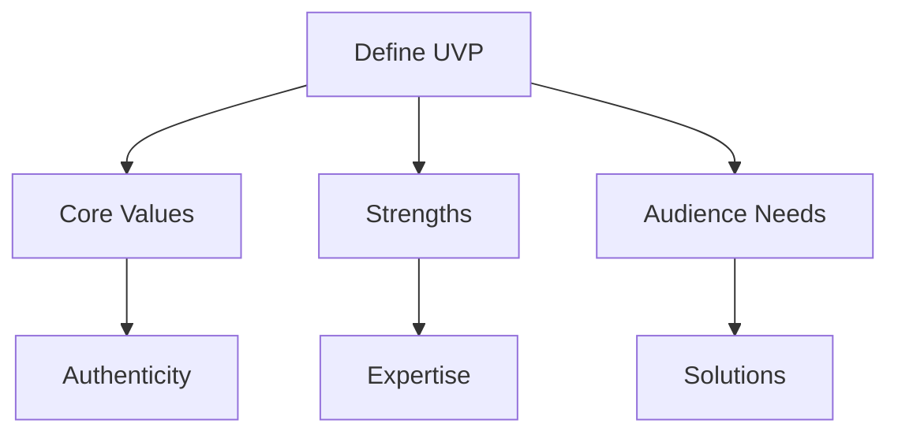
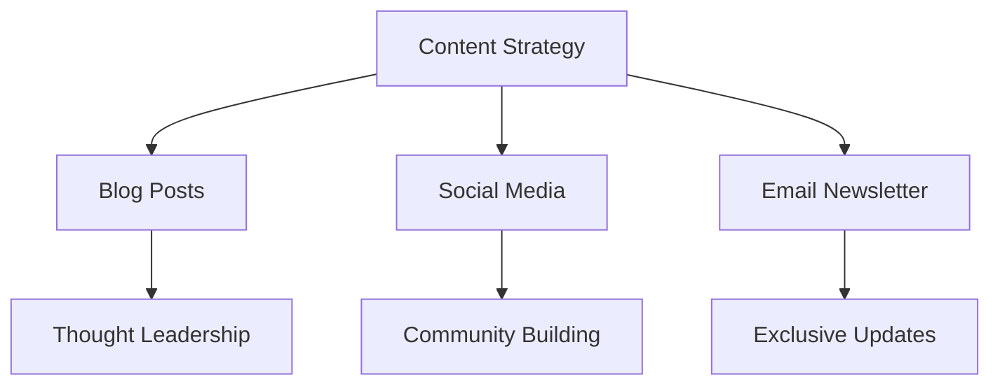

As professionals, we often underestimate the power of a strong personal brand in advancing our careers and increasing our influence in the industry. A well-crafted personal brand can open doors to new opportunities, establish us as thought leaders, and differentiate us from the competition. In this article, we will explore the importance of integrating a focused personal brand into existing workflows and provide actionable strategies for doing so.

## Table of Contents
1. [Introduction to Personal Branding](#introduction-to-personal-branding)
2. [Assessing Your Current Brand](#assessing-your-current-brand)
3. [Defining Your Unique Value Proposition](#defining-your-unique-value-proposition)
4. [Integrating Your Personal Brand into Workflows](#integrating-your-personal-brand-into-workflows)
5. [Measuring Success and Adjusting Your Strategy](#measuring-success-and-adjusting-your-strategy)
6. [Visual Insights Gallery](#visual-insights-gallery)
7. [Summary and Conclusion](#summary-and-conclusion)
8. [FAQ](#faq)

## Introduction to Personal Branding
Personal branding is the process of creating and maintaining a unique image, reputation, and set of values that differentiate you from others in your industry. It's about showcasing your skills, expertise, and personality in a way that resonates with your target audience. A strong personal brand can help you:
> **Note:** Establish credibility and trust with your audience
> **Tip:** Increase your visibility and recognition in the industry
> **Warning:** Failure to develop a personal brand can lead to being overlooked for opportunities and struggling to stand out in a crowded market


## Assessing Your Current Brand
Before you can integrate your personal brand into your existing workflows, you need to assess your current brand. This involves:
* Evaluating your online presence, including your website, social media profiles, and other digital platforms
* Identifying your strengths, weaknesses, opportunities, and threats (SWOT analysis)
* Gathering feedback from colleagues, friends, and mentors to gain insights into how others perceive you

```markdown
| Category | Current Brand | Desired Brand |
| --- | --- | --- |
| Website | Basic information | Professional portfolio |
| Social Media | Limited engagement | Active community building |
| Networking | Local events | Industry conferences |
```

## Defining Your Unique Value Proposition
Your unique value proposition (UVP) is the unique benefit that you offer to your audience. It's what sets you apart from others and makes you valuable to your industry. To define your UVP, ask yourself:
* What are my core values and strengths?
* What problems do I solve for my audience?
* What makes me unique and different from others?



## Integrating Your Personal Brand into Workflows
Once you have defined your UVP, you can start integrating your personal brand into your existing workflows. This involves:
* Developing a content strategy that showcases your expertise and values
* Creating a consistent visual brand that reflects your personality and style
* Engaging with your audience and building relationships through social media and other channels



## Measuring Success and Adjusting Your Strategy
To ensure the success of your personal brand integration, you need to measure your progress and adjust your strategy accordingly. This involves:
* Tracking your website analytics and social media metrics
* Gathering feedback from your audience and making adjustments to your content and engagement strategy
* Continuously evaluating and refining your UVP to ensure it remains relevant and effective

## Visual Insights Gallery
Here are some visual insights to help you integrate your personal brand into your existing workflows:


## Summary and Conclusion
Integrating a focused personal brand into your existing workflows is a powerful way to advance your career and increase your influence in the industry. By assessing your current brand, defining your unique value proposition, and developing a content strategy, you can establish yourself as a thought leader and build a loyal audience. Remember to continuously measure your progress and adjust your strategy to ensure the long-term success of your personal brand.

## FAQ
Q: What is personal branding?
A: Personal branding is the process of creating and maintaining a unique image, reputation, and set of values that differentiate you from others in your industry.
Q: Why is personal branding important?
A: Personal branding is important because it helps establish credibility and trust with your audience, increases your visibility and recognition in the industry, and differentiates you from others.
Q: How do I define my unique value proposition?
A: To define your unique value proposition, ask yourself what your core values and strengths are, what problems you solve for your audience, and what makes you unique and different from others.