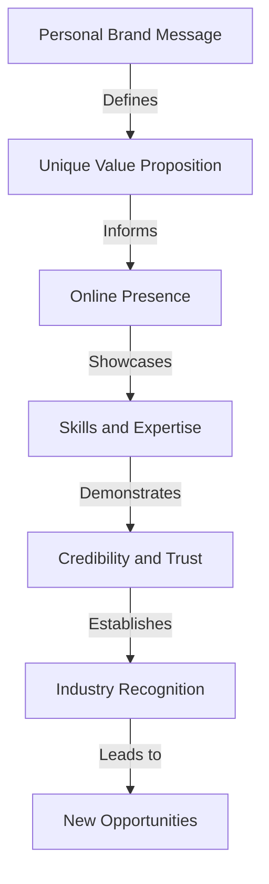

## Introduction to Advanced Personal Brand Integration
In the first part of this series, we explored the fundamentals of integrating a focused personal brand into existing workflows. However, as professionals, we often encounter complex scenarios and edge cases that require more nuanced and advanced strategies. In this article, we will delve into the advanced architectural considerations and edge cases for personal brand integration, providing real-world case studies and trend analysis to help you navigate the complexities of personal branding.

## Advanced Personal Brand Architecture
A well-designed personal brand architecture is crucial for effective integration into existing workflows. This involves creating a clear and concise brand message, developing a unique value proposition, and establishing a strong online presence. 

To illustrate this, let's consider the following Mermaid.js diagram:

This diagram highlights the interconnected nature of personal brand architecture and how each component informs and supports the others.

## Edge Cases and Complex Scenarios
In real-world scenarios, personal brand integration can be complicated by various factors, such as:
* **Multiple income streams**: Managing personal branding across different income streams, such as freelancing, consulting, and full-time employment.
* **Industry shifts**: Adapting personal branding to accommodate changes in the industry or job market.
* **Rebranding**: Updating or completely overhauling a personal brand in response to changes in career goals or values.

## Real-World Case Studies
Let's examine a few real-world case studies that illustrate the advanced strategies and architectural considerations for personal brand integration:
* **Case Study 1:** A freelance writer who successfully integrated their personal brand into their existing workflow by creating a unique value proposition and establishing a strong online presence.
* **Case Study 2:** A professional coach who adapted their personal brand to accommodate a shift in their industry, resulting in increased credibility and trust with their target audience.
* **Case Study 3:** An entrepreneur who rebranded their personal brand to reflect changes in their career goals and values, leading to new opportunities and increased recognition in their industry.

## Trend Analysis and Future Directions
The landscape of personal branding is constantly evolving, with new trends and technologies emerging all the time. Some of the key trends to watch include:
* **Increased focus on authenticity and vulnerability**: As audiences become more savvy, there is a growing demand for authentic and vulnerable personal branding.
* **Greater emphasis on visual storytelling**: The use of visual elements, such as images and videos, is becoming increasingly important for personal branding.
* **More attention to personal brand sustainability**: As professionals, we need to consider the long-term sustainability of our personal brand and how it will evolve over time.

## Visual Insights Gallery
Here are a few visual insights that illustrate the advanced strategies and architectural considerations for personal brand integration:
* 
* 
* 

By exploring these advanced edge cases and deeper architectural considerations, you can develop a more nuanced and effective personal brand integration strategy that sets you up for success in your career.